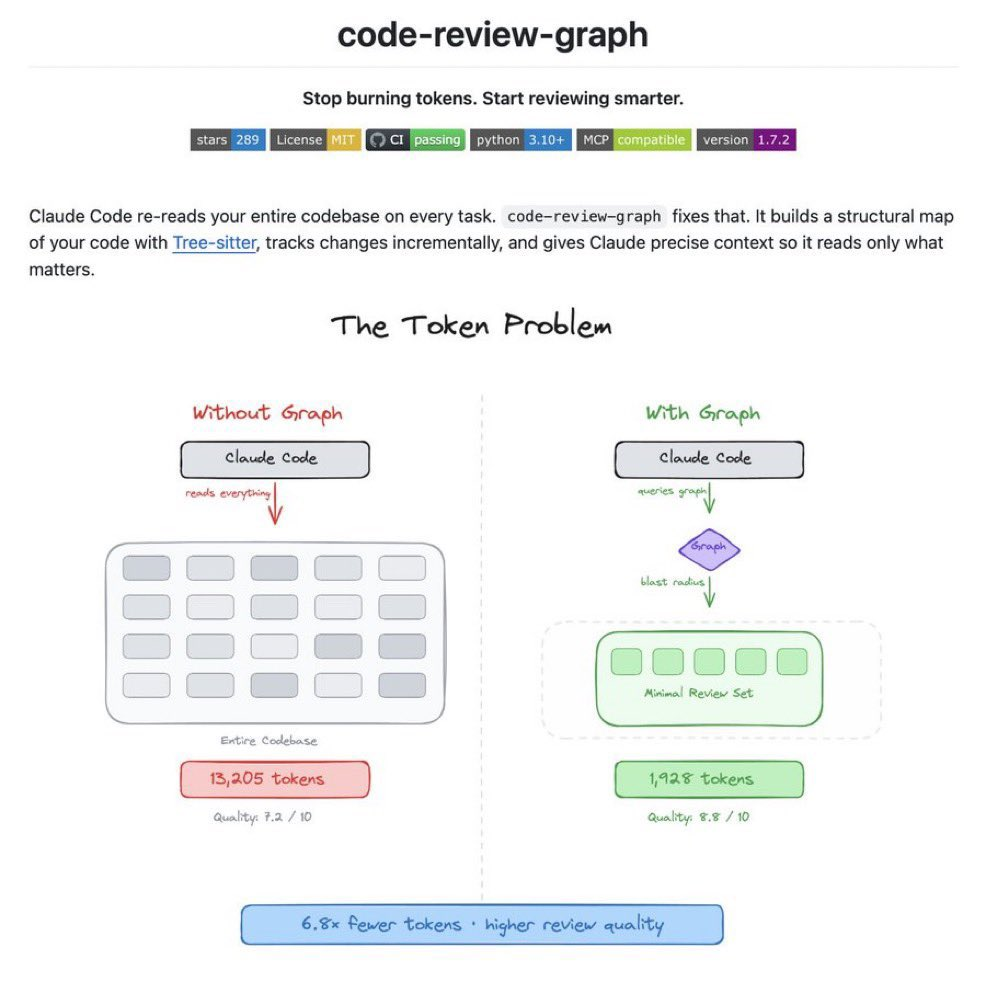

兄弟们，Claude Code 终于有「全代码库视觉地图」了！

全新开源工具 Code-review-graph直接本地生成项目完整关系图：

✅ 100% 本地运行，零云端  
✅ 自动映射整个仓库文件依赖  
✅ Claude 瞬间看懂每个文件怎么连在一起  
✅ 大幅减少 hallucination，上下文精准到爆  

再也不用手动喂一堆文件描述了，Claude Code 终于有“全局视野”了

### 🖼️ Attached Media

## 💬 Replies

### 1 @berryxia (Berryxia.AI) (Author)

*Sat Apr 11 22:15:06 +0000 2026*

GitHub 直达👉[github.com/tirth8205/code…](https://github.com/tirth8205/code-review-graph)l

### 2 @crazyox (Crazyox🌶️（微微辣版）)

*Sun Apr 12 02:24:48 +0000 2026*

@berryxia 本地跑没有数据泄露风险这点太戳我了，可以把公司项目也丢进去分析了

### 3 @QiSun157242 (Qi Sun)

*Sun Apr 12 02:22:21 +0000 2026*

@berryxia 一般，我的更有用，不过还没push到github，这种帮助不大

### 4 @elifdemir_t (Elif Demir)

*Sun Apr 12 06:16:30 +0000 2026*

@berryxia Nice..
[x.com/i/status/20431…](https://x.com/i/status/2043102696928940463)

### 5 @yuki__shu1224 (ゆうき＠カッコよくて売れるデザイン)

*Sun Apr 12 10:30:03 +0000 2026*

@berryxia ファーストビューが命だけど、  
その前にUSPの見極めが超重要。

USPとは  
「競合と差別化できる独自性」のこと。

それをはっきり示すだけで  
視覚的インパクトと説得力が両立する。

LPは料理の盛り付けじゃなくて、  
味の前提となる土台作りなんだと思う。

### 6 @creativebiglee (creativebiglee)

*Sun Apr 12 02:43:17 +0000 2026*

@berryxia Nice

### 7 @Liqui_Sniper (Liquidity Sniper)

*Sun Apr 12 06:28:08 +0000 2026*

@berryxia Hell yes, a full local visual map of the repo? This will save so much time and keep things private. Big props to the team!

### 8 @isdaonono (daonono)

*Mon Apr 13 05:17:35 +0000 2026*

@berryxia 你试用过吗就推

