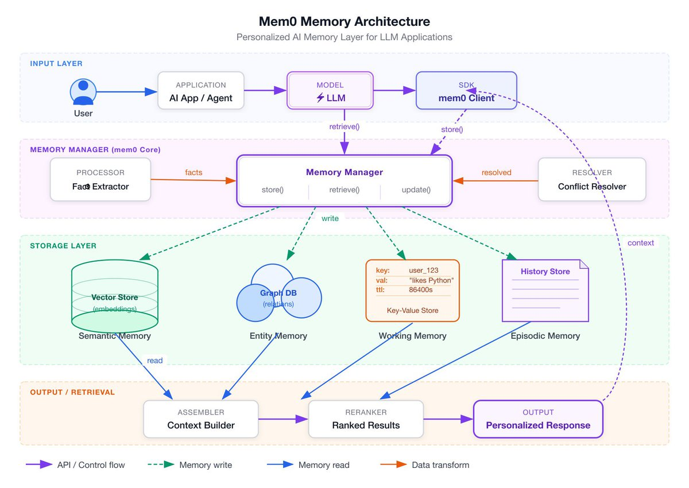
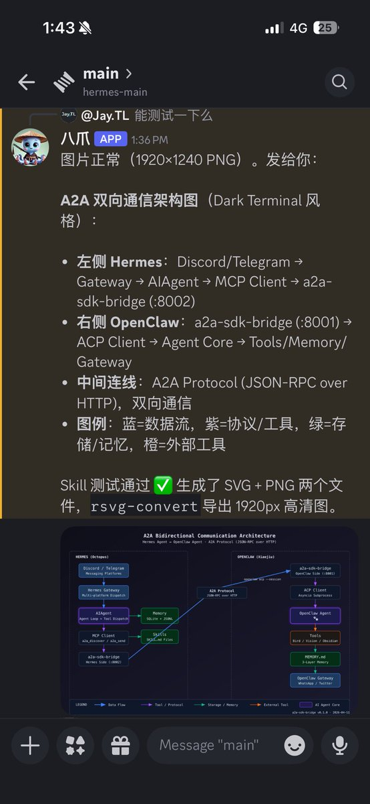

兄弟们，技术架构图终于有救了！ 🤯

以前画 Multi-Agent、RAG、Tool Call 这些架构，diagrams. net 里永远对不齐、颜色土、导出还模糊……画一次头秃一次

烟花直接放大招！开源了个超级神器 fireworks-tech-graph —— 专为 Claude Code 打造的技术图生成 Skill！

一句话就能出图，效果直接起飞：
✅ 自动识别图类型
✅ 智能语义形状 + 颜色编码（流程蓝、控制橙、数据绿…）
✅ 支持玻璃态、Neon 等高级风格
✅ 高清 SVG + PNG 一键导出
8 种图类型 + 5 种视觉风格，AI/Agent 常见 Pattern 全覆盖！

从此再也不用为画图焦虑了，太丝滑了

生产力直接拉满！
快去 star 支持烟花老师～ 

开源链接我放评论区👇

### 🖼️ Attached Media

## 💬 Replies

### 1 @berryxia (Berryxia.AI) (Author)

*Sat Apr 11 00:12:18 +0000 2026*

地址：[github.com/yizhiyanhua-ai…](https://github.com/yizhiyanhua-ai/fireworks-tech-graph)

### 2 @teach_fireworks (烟花老师)

*Sat Apr 11 00:12:50 +0000 2026*

@berryxia 哇哦，感谢神佬！

### 3 @JayTL00 (Jay.TL)

*Sat Apr 11 03:50:43 +0000 2026*

@berryxia 我用 hermes bot 调用了一下，画图效果出奇的好！八爪 直接把 Agent 通信的原理给绘制出来了！感谢分享！关注我，分享更多 hermes agent 使用案例。 

### 4 @smartaiflow (lucky_ai)

*Sat Apr 11 03:00:34 +0000 2026*

@berryxia 不支持windows。。。

### 5 @flypigz (LittleFish)

*Sun Apr 12 04:20:50 +0000 2026*

@berryxia 支持二次编辑吗？这个也很重要，有时候需要微调。

### 6 @JieyueXing (JieyueXing)

*Sat Apr 11 00:52:19 +0000 2026*

@berryxia mark 一下

### 7 @Rbullrun (RJR)

*Sat Apr 11 05:29:38 +0000 2026*

@berryxia @yuanhao

YOYO: a self-envolving agent. 🐙

BHS8LHW11NKxzxyCtqz9NJbTkh3h94WqeMVYgTY5pump

### 8 @fulore (Mako)

*Sat Apr 11 06:42:00 +0000 2026*

@berryxia おぉ、これはすごいですね。早速試して見ます。ありがとう！

### 9 @kleon_ai (Kleon)

*Sun May 03 01:16:56 +0000 2026*

@berryxia 架构图工具一直是个痛点，[diagrams.net](http://diagrams.net)导出确实模糊。这种专为AI架构设计的工具如果支持从代码描述直接生成就更好了

### 10 @elifdemir_t (Elif Demir)

*Sat Apr 11 07:26:07 +0000 2026*

@berryxia Nice..
[x.com/i/status/20428…](https://x.com/i/status/2042864177178415338)

### 11 @tttt1813802 (文字入力に疲れた人 (tttt..))

*Sat Apr 11 05:49:20 +0000 2026*

@berryxia これで一番助かるの、図を貼った瞬間に『設計もちゃんとしてます』顔できるところなんですよね。

### 12 @Liqui_Sniper (Liquidity Sniper)

*Sat Apr 11 02:00:52 +0000 2026*

@berryxia Bro, that feeling is priceless, congrats, enjoy the clean, sharp diagrams and party on, you earned it!

### 13 @fidloges6582553 (DankMemer 😂)

*Sat Apr 11 17:14:04 +0000 2026*

@berryxia Finally saved that diagram after fighting with the tool.

### 14 @Markovvxow (Misha | Gobare.dev)

*Mon Jun 29 11:18:46 +0000 2026*

@berryxia 开源一个支持二次编辑&amp;2.5d立体等距图&amp;agent调用的绘图工具：[github.com/MarkovWangRR/i…](https://github.com/MarkovWangRR/iso-topology)

### 15 @AIcaptain666 (lin wang)

*Sat Apr 18 13:55:04 +0000 2026*

@berryxia Incredible AI topology generator for IT engineers! Chat naturally to create professional 3D network topograms in seconds.
This heartfelt project was built by a teen with CodeX to help his father save valuable working hours.
Try it 👉 \[https: //topoai. cc\]

