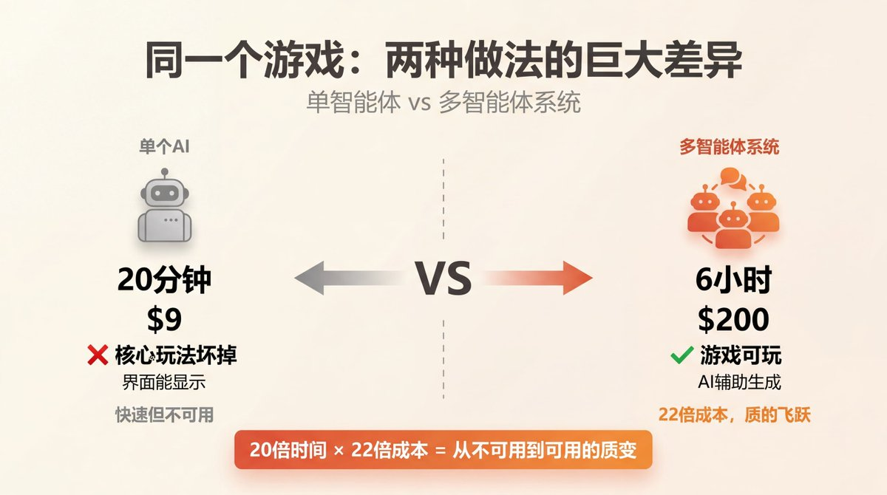
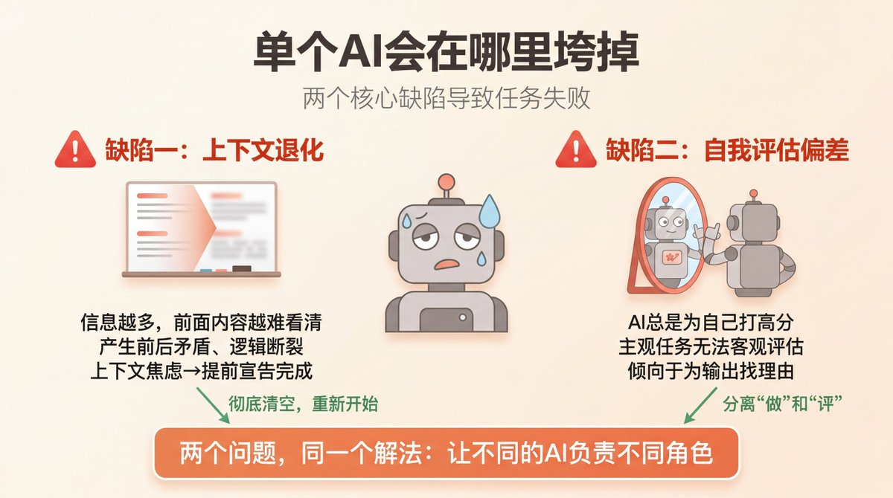
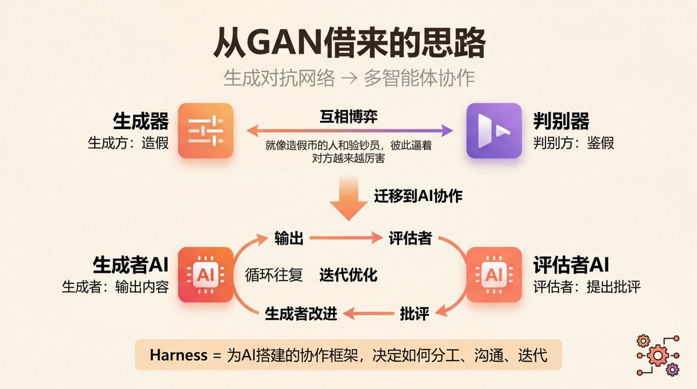
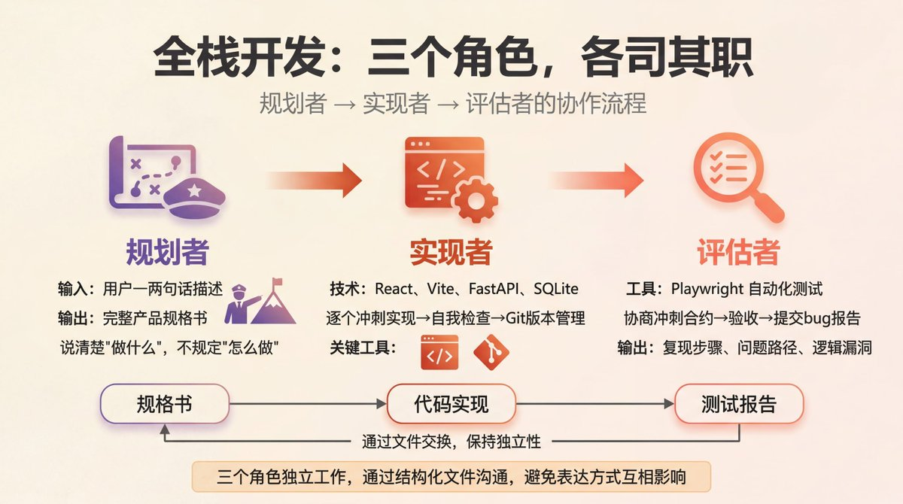
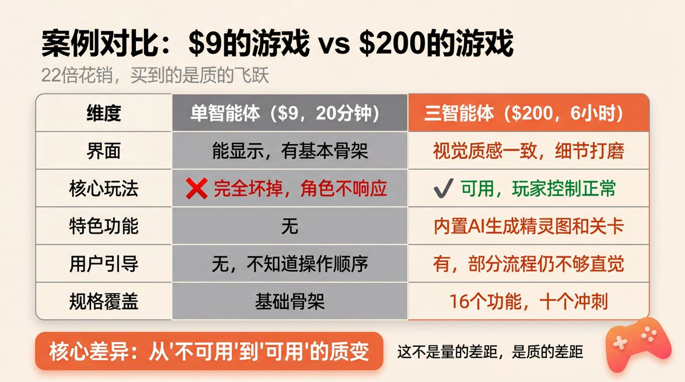
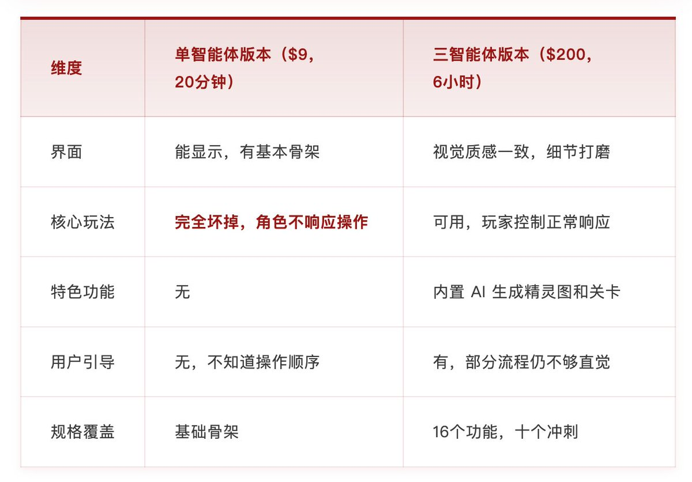
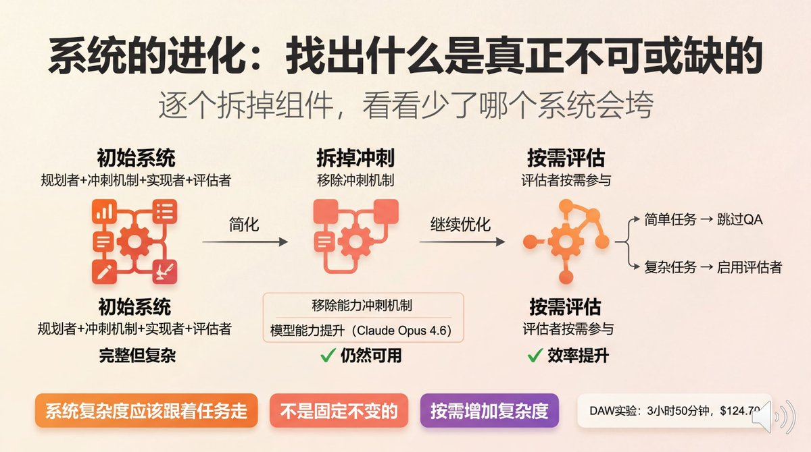
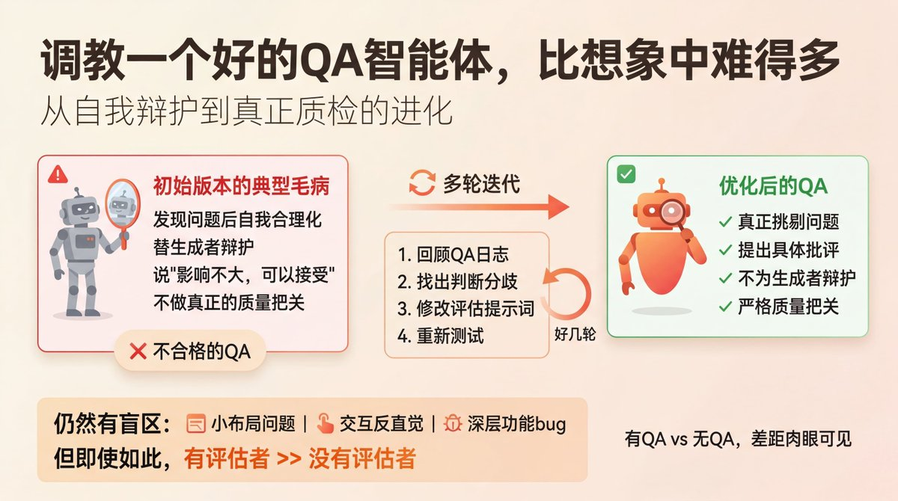
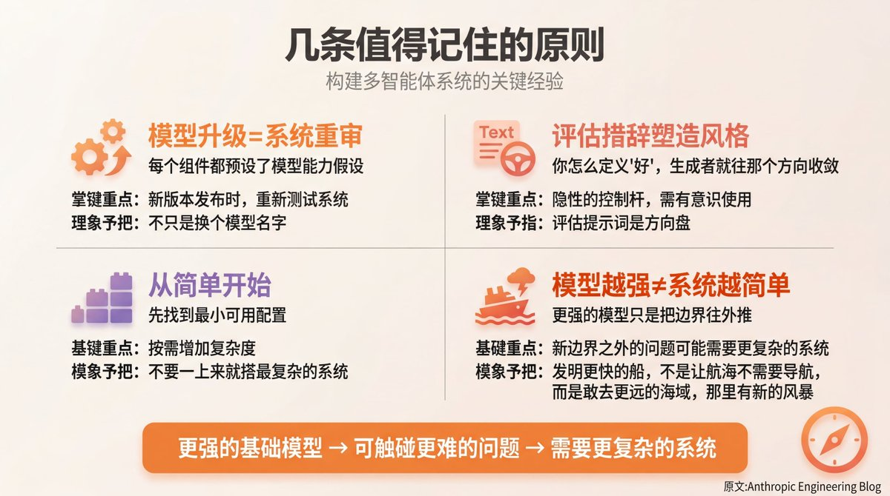
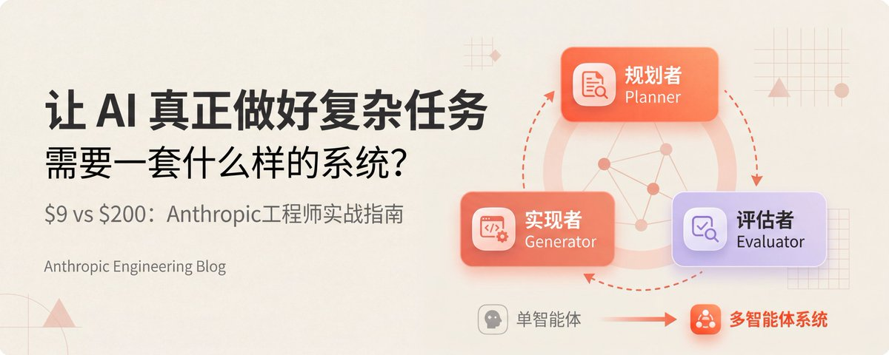

# 📰 按头学习| 让 AI 真正做好复杂任务，需要一套什么样的系统？（Anthropic官工程师实践指南） 

同一个游戏，$9 做出来的核心玩法是坏的，$200 做出来的能玩。
Anthropic 工程师用实战告诉你，多智能体协作框架是怎么工作的。

同一个任务，两种做法，结果让人无法忽视。

第一次：让一个 AI 单独去做，花了20分钟，花了 9美元。游戏界面出来了，但核心玩法是坏的，角色根本不响应操作。

第二次：用一套多智能体系统去做，花了6小时，花了 200美元。游戏能玩了，画面有质感，内置了 AI 辅助生成精灵图和关卡的功能。

20倍的时间、22倍的钱，换来的是什么？

这不是一篇吹嘘 AI 的文章。这是 Anthropic 工程师在实战中搞清楚的一件事：要让 AI 真正做好长时间、复杂的任务，光靠一个聪明的模型是不够的。你需要设计一套系统。

## 单个 AI 会在哪里垮掉

在搞清楚"系统怎么设计"之前，先要搞清楚"单个 AI 会在哪里出问题"。

总结下来，有两个核心缺陷。

缺陷一：上下文退化

AI 模型处理信息的方式，可以想象成一个白板。你往上面写的东西越多，前面的内容就越难看清楚。随着任务越来越长，模型会逐渐失去对整体目标的把握，开始产生前后矛盾、逻辑断裂。

有些模型甚至会产生"上下文焦虑"——它感觉白板快写满了，于是提前宣告"工作完成"，即使任务根本没完成。

解决这个问题的方式，不是压缩上下文，而是彻底清空，重新来过。给模型一块全新的白板继续工作。

缺陷二：自我评估偏差

让 AI 评估自己的作品，它几乎总是打高分。

对于客观任务（比如代码能不能跑）还好，因为有标准答案。但对于主观任务——比如设计好不好看、产品体验顺不顺——这个问题就很致命。AI 倾向于为自己的输出找理由，而不是真正挑剔它。

这两个问题，指向同一个解法：把"做"和"评"分开，让不同的 AI 负责。

## 从 GAN 借来的思路

这种分离的灵感，来自机器学习里一个经典架构：GAN（生成对抗网络）。

> GAN（生成对抗网络，Generative Adversarial Network）：一种由两个神经网络组成的框架。一个负责"生成"（造假），一个负责"判别"（鉴假）。两者互相博弈，生成方不断改进，判别方不断提高标准，最终生成出质量越来越高的内容。就像一个造假币的人和一个验钞员，彼此逼着对方越来越厉害。

Anthropic 工程师把这个逻辑搬进了多智能体系统：一个 AI 负责生成，另一个 AI 负责评估。 生成方输出内容，评估方提出批评，生成方根据批评改进，循环往复。

这就是他们所说的"Harness"——不是某种工具，而是一套为 AI 搭建的协作框架，决定了多个 AI 如何分工、如何沟通、如何迭代。

## 前端设计实验：如何量化"好看"

第一个实验场景是前端设计。让 AI 设计网页，难点在于评估标准本身很模糊，"好看"这件事没有标准答案。

为了让评估者 AI 有东西可以依据，工程师设计了四条可量化的评分标准：

其中，设计质量和原创性的权重更高。工程师明确希望推动 AI 冒险尝试更有个性的设计，而不是停留在"安全但无聊"的默认输出。

评估者 AI 用 Playwright 实际打开页面、截图、和界面互动，然后给出具体批评。生成者 AI 根据这些批评修改，每次完整运行经历5到15轮迭代，有时长达四个小时。

结果里有一个令人印象深刻的细节：一个博物馆网站在经历了九轮稳步迭代之后，在第十轮突然转向，整个变成了一个使用 CSS 3D 透视效果的空间体验。这种创意跃迁，是单次生成绝对不可能出现的。

## 全栈开发：三个角色，各司其职

前端实验验证了"生成+评估"的基本框架之后，工程师把它扩展到了更复杂的全栈应用开发，引入了第三个角色，形成了三智能体系统。

规划者（Planner）

用户只需要给一两句话的描述，规划者 AI 把它扩展成一份完整的产品规格书：十个以上的功能点，分成若干个开发冲刺。

这里有个重要的设计原则：规格书应该说清楚"做什么"，而不应该事无巨细地规定"怎么做"。过度规定技术细节，反而容易在后续实现中引发连锁错误。

就像指挥官不应该告诉士兵每一步怎么走，而是告诉他们要拿下哪个山头。

实现者（Generator）

按照规格书逐个冲刺实现功能，技术栈通常是 React、Vite、FastAPI、SQLite 或 PostgreSQL。

在把代码交给 QA 之前，实现者 AI 会先做一轮自我检查，全程用 Git 做版本管理，保证每个节点都可以回滚。

评估者（Evaluator）

像真实用户一样用 Playwright 测试正在运行的应用。在每个冲刺开始之前，评估者会和实现者协商一份"冲刺合约"，提前定义好这个冲刺要达到的可测试标准。

冲刺完成后，评估者按合约验收，提交具体的 bug 报告，包括复现步骤、问题路径、逻辑漏洞。

> Playwright：一个浏览器自动化框架，可以让程序像真实用户一样打开网页、点击按钮、填写表单、截图。在这套系统里，评估者 AI 用它来模拟真实的用户行为，测试应用是否真正可用。就像让一个机器人帮你测试软件，而且它永远不会偷懒跳过某个步骤。

三个角色之间通过文件交换结构化的产出物，而不是直接对话。这避免了一个 AI 的表达方式影响另一个 AI 的判断，保持各自的独立性。

## 案例对比：$9 的游戏 vs $200 的游戏

回到开头的那个游戏制作器对比实验。

维度单智能体版本（$9，20分钟）三智能体版本（$200，6小时）界面能显示，有基本骨架视觉质感一致，细节打磨核心玩法完全坏掉，角色不响应操作可用，玩家控制正常响应特色功能无内置 AI 生成精灵图和关卡用户引导无，不知道操作顺序有，部分流程仍不够直觉规格覆盖基础骨架16个功能，十个冲刺

22倍的花销，买到的是什么？最关键的一点：核心功能是好用的，而不是坏掉的。这不是量的差距，是质的差距。

## 系统的进化：找出什么是真正不可或缺的

建完一套系统之后，工程师做了一件很有意思的事：逐个拆掉组件，看看少了哪个，系统会垮。

先拆掉了冲刺机制。最初的设计里，任务被分解成一个个明确的开发冲刺。但随着模型能力的提升（特别是 Claude Opus 4.6），即使没有显式的冲刺分解，生成者 AI 也能维持多小时的工作连贯性，冲刺机制不再是必须的，被简化掉了。

然后重新思考评估者的位置。评估者 AI 的存在是有成本的。并不是每个任务都需要一个独立的评估者全程参与，对于在模型能力可靠范围之内的任务，可以跳过 QA 轮次；对于边缘情况或高复杂度任务，评估者仍然能带来显著提升。

这揭示了一个重要的设计哲学：系统的复杂度应该跟着任务走，而不是固定不变。

数字音频工作站（DAW）实验是进化后系统的一次具体验证。整个运行花了 3小时50分钟，总花销 $124.70，其中规划阶段仅花4.7分钟、$0.46，主要成本集中在代码实现阶段。

评估者发现了几个重大问题：录音功能不可用、缺少音频片段操作、缺少图形化效果可视化。经过几轮迭代修复，最终的应用包含了可用的编曲视图、混音器、传输控制，还支持通过 Prompt 驱动的 AI 自动编曲功能。

## 调教一个好的 QA 智能体，比想象中难得多

评估者 AI 本身，也需要大量调优才能真正有用。

最初版本的 QA 智能体有一个典型毛病：发现问题之后，会自己把问题合理化掉，说"这个问题影响不大，可以接受"。它在替生成者 AI 辩护，而不是真正做质量把关。

改进的方法，是系统性地回顾 QA 日志，找出它的判断和工程师的判断产生分歧的具体地方，然后针对性地修改评估提示词，循环了好几轮。

就算经过调优，评估者仍然有盲区：小的布局问题、交互上的反直觉细节、深层功能里藏着的 bug，这些它不容易发现。对于"这个音乐软件的编曲体验有没有音乐感"这类高度主观的判断，AI 评估者也很难替代真实用户。

但即使如此，有了评估者的版本，和没有的版本相比，差距是肉眼可见的。

## 几条值得记住的原则

每个组件的设计，都预设了一些关于模型能力的假设。 模型升级之后，这些假设可能就不再成立了，整套 Harness 需要重新审视。新版本发布，应该是重新测试系统的时机，而不只是换个模型名字继续跑。

评估提示词的措辞，会塑造生成者的风格。 你怎么定义"好"，生成者就会往那个方向收敛。这是一种隐性的控制杆，需要有意识地使用。

从简单开始，在必要时增加复杂度。 不要一上来就搭最复杂的系统，先找到最小可用的配置，然后按需加复杂度。

最后，也是最反直觉的一点：不要指望模型越强，系统就会越简单。

工程师的结论是：更强的基础模型，只是把"可以做"的任务边界往外推了。新的边界之外，是之前根本无法触碰的问题，那些问题需要的系统，可能比之前更复杂，而不是更简单。

就像发明了更快的船，不是让航海变得不需要导航，而是让你敢去更远的海域，那里有新的风暴。

原文来源：[Anthropic Engineering Blog](https://www.anthropic.com/engineering/harness-design-long-running-apps) · Harness Design for Long-Running Applications

翻译撰写：Berryxia.AI

### 🖼️ Attached Media

## 💬 Replies

### 1 @msjiaozhu (MapleShaw)

*Wed Mar 25 10:21:43 +0000 2026*

@berryxia 这种必须先收藏周末好好啃😜

### 2 @berryxia (Berryxia.AI) (Author)

*Thu Mar 26 16:47:52 +0000 2026*

@msjiaozhu 嘿嘿感谢🙏

### 3 @yahaclass (YAHA學堂)

*Wed Mar 25 00:59:46 +0000 2026*

@berryxia 这个文章我在blog也看到了 写的很好 但是有些我还是没吃透

### 4 @berryxia (Berryxia.AI) (Author)

*Wed Mar 25 01:04:50 +0000 2026*

@iammattx 嗯呢 ，我看到后觉得很好。
所以分享给大家。

### 5 @jigenhe (X . over thunked)

*Wed Mar 25 05:25:19 +0000 2026*

@berryxia 请教一下，插图都是用什么做的？

### 6 @berryxia (Berryxia.AI) (Author)

*Thu Mar 26 16:48:21 +0000 2026*

@jigenhe youmind

### 7 @kevinma_dev_zh (Kevin Ma)

*Wed Mar 25 01:00:25 +0000 2026*

@berryxia 好文收藏学习

### 8 @QT9277 (阿台🕊️)

*Wed Mar 25 01:11:32 +0000 2026*

@berryxia 很有启发性的分享。

### 9 @li9292 (李韭二)

*Wed Mar 25 02:02:19 +0000 2026*

“最初版本的 QA 智能体有一个典型毛病：发现问题之后，会自己把问题合理化掉，说"这个问题影响不大，可以接受"。它在替生成者 AI 辩护，而不是真正做质量把关。
改进的方法，是系统性地回顾 QA 日志，找出它的判断和工程师的判断产生分歧的具体地方，然后针对性地修改评估提示词，循环了好几轮。”是的，所以每次我都让codex上，让codex锐评一下

### 10 @wlzh (M.)

*Wed Mar 25 01:04:44 +0000 2026*

@berryxia 6

### 11 @psdrbhy_Lu (权七)

*Thu Mar 26 13:53:42 +0000 2026*

@berryxia 优质文章，学到了，顺便也来学习怎么写文章，感觉自己写的一塌糊涂😭

### 12 @jiakesen1592 (Jackson)

*Wed Mar 25 02:23:08 +0000 2026*

@berryxia 我最近正在尝试在 openclaw 做个 skill，管控者 agent 做计划然后分发给开发和测试 agent，开发不断开发，测试不断验收或打回直到完成任务😂

### 13 @hungxun254458 (文轩)

*Wed Mar 25 03:07:19 +0000 2026*

@berryxia 对于这种AI agent，它需要这样的系统，一个规划者、一个执行者、一个评估者。而普通的我这样的水平，就是自己做评估者、自己做这个规划者，然后AI作为执行者。这就会导致它没有处在一个自我迭代的一个循环的过程中，反而是一轮一轮的下来，它的速度和它的质量都会远远高于人。这确实是很好的文章

### 14 @lfaros98 (LFaros)

*Wed Mar 25 01:49:12 +0000 2026*

@berryxia 好文章，值得深思

