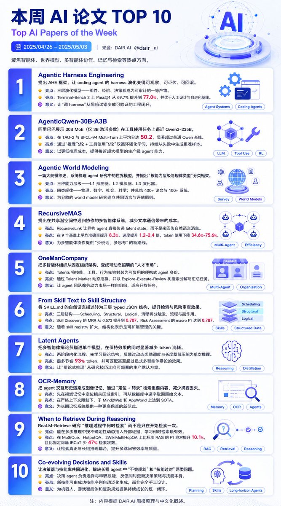

本周AI agent领域悄然发生了一个有意思的现象。

DeepMind、Anthropic、Alibaba等顶级实验室的最新论文集体指向同一个方向：智能体不再是简单调用工具的“聊天机器人”，而是正在变成可工程化、可审计、可规模化的真正生产力系统。

先看Agentic Harness Engineering——它把目前最头疼的“智能体支架”从手工调优、试错进化的黑箱，变成了可观测、可证伪的工程闭环。

系统被拆成三层：可版本回滚的组件文件、从百万轨迹token中提炼的结构化经验证据、以及可验证的决策预测。

每一次修改都变成可审计的契约。

结果？

Terminal-Bench Pass@1从69.7%提升到77.0%，超越人类设计的Codex-CLI，还节省12% token。

更重要的是，这个框架的优化能跨模型迁移，证明它抓到了结构本质而非特定模型的过拟合。

再看Alibaba的AgenticQwen-30B-A3B—一个只有30B参数的MoE模型，激活参数仅3B，却在真实工具使用任务上接近235B级别的Qwen3表现。

秘诀是两个并行强化学习飞轮：一个从自身失败中挖掘更难的推理问题，另一个用模拟用户不断制造误导场景来进化多分支行为树。

这套方法让开源实验室第一次在极低激活参数下实现了高性能工具使用，成本曲线被彻底改变。

还有RecursiveMAS，它直接挑战了多智能体通信的传统方式：不再让每个agent用文本消息互相喊话，而是通过潜在空间的递归计算传递状态。

结果是token消耗降低34.6%-75.6%，推理速度提升1.2-2.4倍，同时准确率平均提高8.3%。

OneManCompany则把多智能体团队从固定组织图，变成了动态“人才市场”：每个agent都是可招聘的Talent，任务时实时匹配，最优组合，失败后还能自动迭代。

这些论文共同勾勒出一个清晰趋势：agent系统正在从“实验玩具”走向“生产级工程”。

当我们还在讨论模型参数谁更大的时候，真正决定落地胜负的，可能已经是“谁先把智能体工程化”这件事。

你觉得agent工程会成为下一波AI红利的主战场吗？

### 🖼️ Attached Media

## 💬 Replies

### 1 @QuantumTransf (Yuu💖)

*Mon May 04 08:43:29 +0000 2026*

@berryxia 这链接都点不开，以及 terminal bench 77% 并不高吧

### 2 @berryxia (Berryxia.AI) (Author)

*Mon May 04 09:50:30 +0000 2026*

@QuantumTransf 等我更新 复制过来有问题了吗

### 3 @RAY10168 (PAYNE 佩恩 🚴🏽‍♀️)

*Mon May 04 01:07:27 +0000 2026*

@berryxia 纯聊天的套壳红利确实没了 下半场赚钱的全在卷Agent基建和自动化工作流

### 4 @aias_0 (Coffee fans)

*Mon May 04 06:35:03 +0000 2026*

@berryxia The bottleneck isn't architecture. It's making agent failures reproducible and auditable in prod.

### 5 @AIxGeeeek (AIxGeek)

*Mon May 04 08:41:29 +0000 2026*

@berryxia mark

