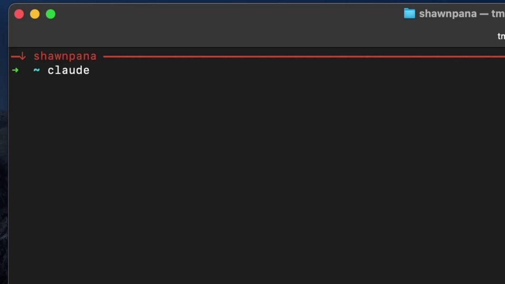

🔥 Browser Use CLI真香！终端操控真实Chrome的神器来了！

• 登录状态 + Cookies 完整保留  
• 持久守护进程，延迟仅 \~50ms  
• 本地浏览器 + 云浏览器无缝切换  
• AI Agent 专属（Cursor / Claude Code 丝滑体验）

一键安装：
\`curl -fsSL[browser-use.com/cli/install.sh](https://browser-use.com/cli/install.sh)6 \| bash\`

基础命令示例：
\- \`browser-use open[x.com](https://x.com)Q\`
\- \`browser-use state\`（显示可点击元素）
\- \`browser-use click 0\`

自动化 & AI 玩家必装！强烈安利！

### 🖼️ Attached Media

## 💬 Replies

### 1 @berryxia (Berryxia.AI) (Author)

*Sat Mar 21 16:42:40 +0000 2026*

📖 完整文档[docs.browser-use.com/open-source/br…](https://docs.browser-use.com/open-source/browser-use-cli)D  
⭐ GitHub[github.com/browser-use/br…](https://github.com/browser-use/browser-use)j

### 2 @HuiLin0715 (Hui Lin)

*Sun Mar 22 04:10:49 +0000 2026*

@berryxia 规律，自媒体第一句带感叹号的，可以直接忽略不看了

### 3 @ross_TNTT (贰万)

*Sun Mar 22 01:22:58 +0000 2026*

@berryxia 你这个介绍太空洞了，能力边界介绍的一点不清楚想毫无信息量

### 4 @larryzheng4 (larry zheng)

*Sun Mar 22 00:37:48 +0000 2026*

@berryxia browser-use本质上还是调用API，如果是调用API有很多选择，还不如使用playwright呢

### 5 @jerrywu185 (jerrywu185)

*Sun Mar 22 00:21:09 +0000 2026*

@berryxia 和chrome devtools mcp 没啥区别

### 6 @mylifcc (lifcc)

*Mon Mar 23 08:01:08 +0000 2026*

@berryxia 复用Chrome登录态太对了 不用配API key不用搞OAuth agent直接能用 这个思路和twitter-cli一样

### 7 @jeff_liz (Li Zhen)

*Sun Mar 22 00:52:04 +0000 2026*

@berryxia 这个和直接用webmcp啥区别

### 8 @Coda_521 (Coda)

*Mon Mar 23 00:57:24 +0000 2026*

@berryxia 安全性如何？

### 9 @harrysoog (𝚑𝚞𝚠𝚎𝚒𝚜𝚘𝚘𝚐)

*Sun Mar 22 10:49:17 +0000 2026*

@berryxia token 免费吗？这么用

### 10 @YouhaiX86370 (Youhai)

*Sat Mar 21 21:20:54 +0000 2026*

@berryxia [github.com/Youhai020616/s…](https://github.com/Youhai020616/stealth-cli) 可以试试反爬浏览器cli 绕过各种认证

### 11 @xingzhi2020 (行止)

*Mon Mar 23 03:27:41 +0000 2026*

@berryxia @grok 结合评论区的另外几种工具，做一个对比

### 12 @George_Guitar88 (DogeLover)

*Sat Mar 21 23:39:36 +0000 2026*

@berryxia 有种脱裤子放屁的感觉

### 13 @stupigz (stupigz)

*Mon Mar 23 02:32:43 +0000 2026*

@berryxia playwright秒了

### 14 @vNarcommafh (Brocuusa🐐)

*Sat Mar 21 22:29:59 +0000 2026*

@berryxia 会话和 Cookies 能保住之后，Agent 才真能接进实盘流程。SimianX 做实时协同盯盘会很顺手。

### 15 @Grease_ai (Grease)

*Mon Mar 23 04:02:44 +0000 2026*

@berryxia Great tool! For those needing more control and isolation for enterprise use cases, Grease ([grease.dev](http://grease.dev)) provides a headless browser built specifically for AI agents with session isolation and reliability. Both great options for different needs 🚀

### 16 @quangdigiaz (Quang Digi)

*Sun Mar 22 06:14:29 +0000 2026*

@berryxia 这个工具听起来很强，浏览器与本地/云端切换的确很方便。求演示视频！

### 17 @koffuxu (koffuxu)

*Sun Mar 22 01:10:59 +0000 2026*

@berryxia 现在来看cli成为agent控制其他应用的最佳接口了

### 18 @hashmasterking (Hash王金)

*Sun Mar 22 13:58:26 +0000 2026*

@berryxia 这技术栈，有点意思。

