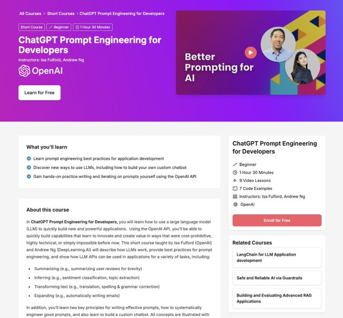

🔥兄弟们！手里的OpenClaw龙虾可以先放一放了！
先把基础功练扎实了，才能玩的更溜！

今天分享这个Prompt Engineering （提示词工程简直是宝典！）让玩转AI 更加方便了！

今天刷到 @heygurisingh 这个宝藏贴，直接心动到不行！
Prompt Engineering 不要被神话，而是你需要掌握“结构化思考”的超级实用技能啊～

我赶紧帮大家整理好这10个顶级资源，照着学，绝对起飞！🔥

1️⃣ Anthropic Prompting Guide  

最推荐的官方系统指南，先看这个就对了！
  [platform.claude.com/docs/en/build-…](https://platform.claude.com/docs/en/build-with-claude/prompt-engineering/overview)p4

2️⃣ OpenAI Prompting Guide

OpenAI 官方提示词工程指南  [developers.openai.com/api/docs/guide…](https://developers.openai.com/api/docs/guides/prompt-engineering)GM

3️⃣ Prompt Engineering Guide (GitHub)  

最全面的开源 Prompt 宝藏  
[github.com/dair-ai/Prompt…](https://github.com/dair-ai/Prompt-Engineering-Guide)Fd

4️⃣ Learn Prompting

从零到高手的系统学习神站  
[learnprompting.org](https://learnprompting.org)kR

5️⃣ OpenAI Cookbook 
实用案例合集，抄作业首选  
[cookbook.openai.com](https://cookbook.openai.com)hj

6️⃣ Hugging Face Prompting Guide

开源模型提示词技巧  [huggingface.co/docs/transform…](https://huggingface.co/docs/transformers/tasks/prompting)tN

7️⃣ FlowGPT Prompt Library  

海量优质 Prompt 模板库，直接拿来用  
[flowgpt.com](https://flowgpt.com)qt

8️⃣ PromptBase Prompt Marketplace 

买卖 Prompt 的市场，灵感+变现两不误  [promptbase.com](https://promptbase.com)nQ

9️⃣ DeepLearningAI Prompt Engineering Course 
Andrew Ng 的 Prompt Engineering 课程（强烈安利！）  
[deeplearning.ai/short-courses/…](https://www.deeplearning.ai/short-courses/chatgpt-prompt-engineering-for-developers)fip

🔟 Stanford Prompt Engineering Lecture 
斯坦福大学提示词工程讲座  
（原帖链接戳进去看～）

最后那句话我太认可了：

“Prompt engineering isn't magic.
 It's structured thinking. 

Constraints + iteration + testing. 
Study examples. Break prompts. 
Rebuild them better.”

对对对！！！
就是“多拆多练多迭代”！

～我自己每次写提示词都是这样搞的，迭代个 N 版才满意😂

### 🖼️ Attached Media

## 💬 Replies

### 1 @Pixelxzen (紫苏子ACG)

*Mon Mar 09 15:50:05 +0000 2026*

@berryxia @heygurisingh 神佬，不要偷懒。等你的飞书龙虾群组教程呢。😄

### 2 @berryxia (Berryxia.AI) (Author)

*Mon Mar 09 15:59:26 +0000 2026*

@Pixelxzen @heygurisingh 👌

### 3 @AgiRay1015 (AI磊叔)

*Tue Mar 10 00:40:11 +0000 2026*

@berryxia @heygurisingh 咦，把这些知识提炼提炼，做成个skill，后续和ai吹水的时候，用这个skill去优化我的废话，岂不快哉！

### 4 @berryxia (Berryxia.AI) (Author)

*Tue Mar 10 01:38:56 +0000 2026*

@AgiRay1015 @heygurisingh nice

### 5 @BruceYa78824479 (Bruce Yang)

*Tue Mar 10 16:07:29 +0000 2026*

@berryxia @heygurisingh 我直接发给龙虾让它自己去学

### 6 @sevenoma1 (sevenoma)

*Tue Mar 10 16:31:48 +0000 2026*

@berryxia @heygurisingh @grok 整理好发给我

