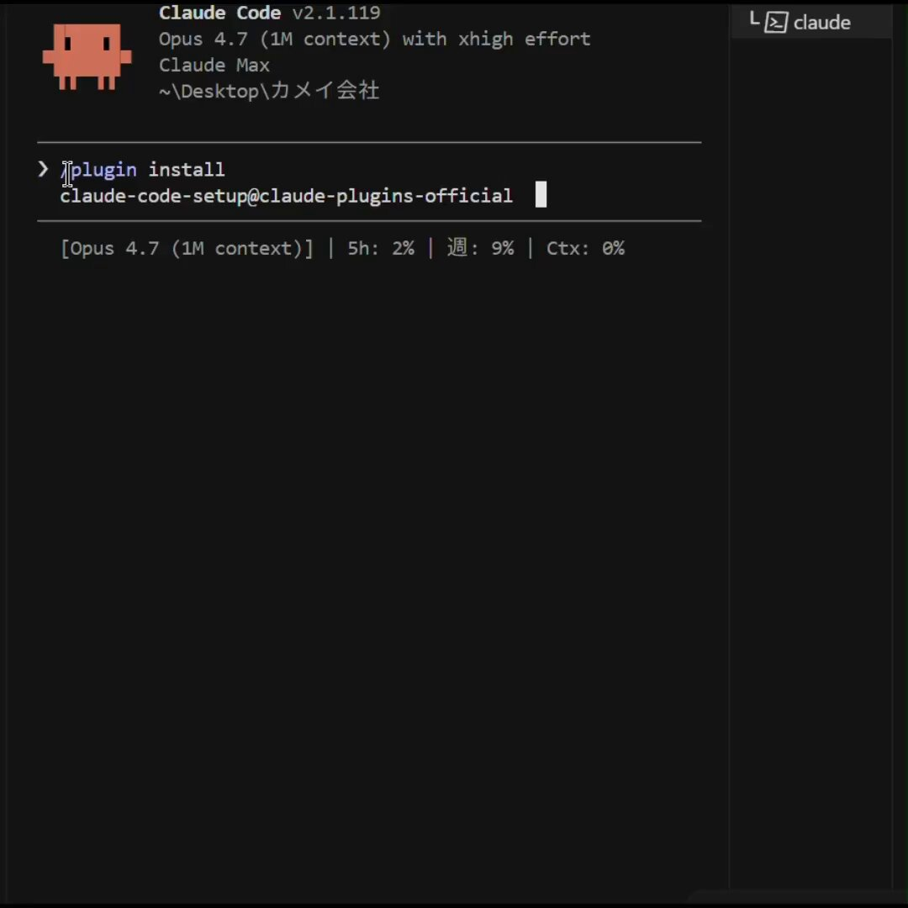
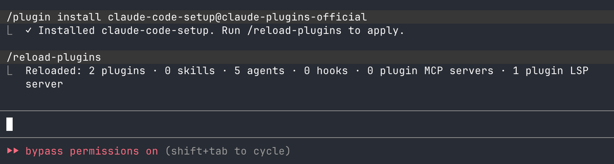

Claude Code 一团糟。直到你安装了这个。有一个名为 claude-code-setup 的 Anthropic 官方插件。它会告诉你可以设置哪些自动化功能（钩子、技能、MCP 服务器、子代理……）以及如何逐步进行配置。基本上，它会分析你的项目并推荐激活哪些功能。

安装方法：/plugin install claude-code-setup@claude-plugins-official

收藏这条帖子，以免找不到。

### 🖼️ Attached Media

## 💬 Replies

### 1 @cheuk_baby (Jason傑森 🇭🇰 | 🛠️)

*Sat Apr 25 18:26:12 +0000 2026*

@billtheinvestor 折腾了一圈终于搭好了火人刚过来推里的家原计划冲雪峰现在不知道该不该

### 2 @798_eth (798.eth 🍌🌍☮️ ｜链上新资产原语)

*Sun Apr 26 02:19:51 +0000 2026*

@billtheinvestor 回去就装

### 3 @lawrence_mzw (Ziwei Ma)

*Sun Apr 26 01:07:37 +0000 2026*

@billtheinvestor 补充一个：fathom-mode-for-claude，让Claude在执行前先和你对齐意图，把你想要什么、为什么、规划好再执行。Claude Opus 4.7 黑客松项目，刚开源：[github.com/ma-ziwei/fatho…](http://github.com/ma-ziwei/fathom-mode-for-claude)

### 4 @justlikemaki (何夕2077 (个板马版))

*Sat Apr 25 20:53:30 +0000 2026*

@billtheinvestor 对，Claude Code 真不是模型不行，是默认态太夹生。hooks、MCP、subagents 不配齐，它就像给你一把好刀偏偏不磨。

### 5 @Keji715 (柯基是只猫)

*Sun Apr 26 08:22:03 +0000 2026*

@billtheinvestor 感觉不管是什么样的管理方式，核心还是需要控制好自己使用的 MCP skills 的数量

### 6 @vanessafreerr (小自在喵)

*Sun Apr 26 00:12:26 +0000 2026*

@billtheinvestor @grok 说说这个插件的价值，以及我可以具体怎么用？

### 7 @3jianwang3 (ozuka)

*Sun Apr 26 02:13:11 +0000 2026*

@billtheinvestor @grok 核实，如果为真，怎么安装使用

### 8 @Rayor_y (Rayor)

*Sun Apr 26 01:30:29 +0000 2026*

@billtheinvestor @grok 分析一下，这个怎么用

### 9 @weiyangxin (Jinyu)

*Sun Apr 26 01:31:19 +0000 2026*

@billtheinvestor 已经在安装了

### 10 @morgan_defi (Morgan | Alpha Hunter)

*Sat Apr 25 17:19:33 +0000 2026*

@billtheinvestor lowkey wild that an installer plugin understood claude code better than half the devs using it

### 11 @guangtoutianbo1 (Stokis Tian)

*Sun Apr 26 17:02:37 +0000 2026*

@billtheinvestor 不错

### 12 @lu6999761957762 (sylvia)

*Sun Apr 26 09:46:34 +0000 2026*

@billtheinvestor @grok  说说怎么用，我已经安装了

### 13 @madang__ (Madang)

*Mon Apr 27 01:21:19 +0000 2026*

@billtheinvestor The "Claude Code is a mess Until you install this There s an official Anthropic plugin called claude code setup It will tell " part probably needs a simpler answer. There is context there, but it is better slowed down than overexplained.

### 14 @TGold_C (TGoldC)

*Sun Apr 26 06:50:25 +0000 2026*

@billtheinvestor @grok 这个plugin能干嘛

### 15 @LewisWeldtech (That AI Guy)

*Sun Apr 26 12:38:35 +0000 2026*

@billtheinvestor [x.com/i/status/20483…](https://x.com/i/status/2048367224558387622)

### 16 @lisenkk (kk k)

*Tue May 05 03:31:25 +0000 2026*

@billtheinvestor @grok 这个插件的主要作用是什么

### 17 @IPunDaddy (I Pun Daddy)

*Sun Apr 26 05:14:58 +0000 2026*

@billtheinvestor So, the first step to using Claude Code is installing a plugin that tells you how to use Claude Code. Seamless.

### 18 @SalahBoussettah (Salah Eddine Boussettah)

*Sun Apr 26 11:10:20 +0000 2026*

@billtheinvestor Worth noting it's read-only. Suggests top 1-2 per category, doesn't configure anything. Useful as a checklist on a brownfield repo.

### 19 @lu6999761957762 (sylvia)

*Sun Apr 26 09:46:10 +0000 2026*

@billtheinvestor 

### 20 @liemgin (Liemgin)

*Sat Apr 25 23:35:20 +0000 2026*

@billtheinvestor …

