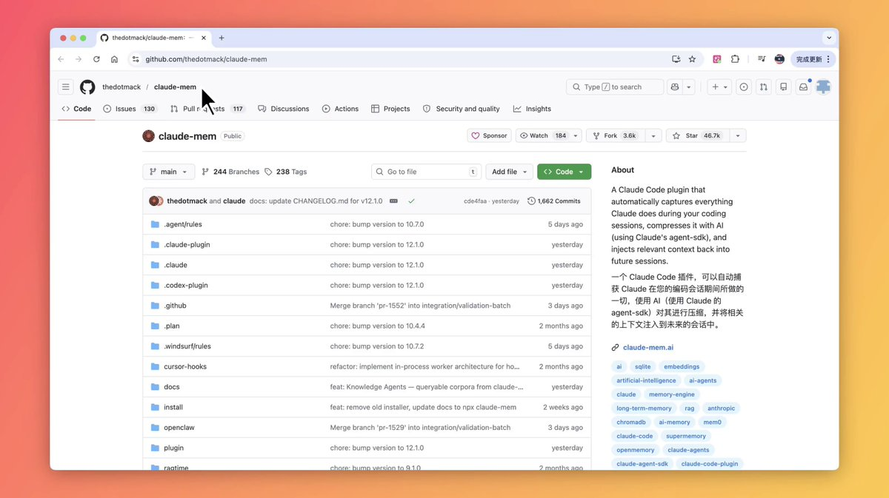

有人为 Claude Code 提供了永久记忆功能，它在 48 小时内获得了 4.6 万颗星。单次会话的 Token 消耗减少了 95%。永不触及上下文限制。能够完全衔接你上次中断的地方。一键安装。完全免费。 

## 💬 Replies

### 1 @billtheinvestor (Bill The Investor) (Author)

*Sun Apr 12 23:27:28 +0000 2026*

库地址： [github.com/thedotmack/cla…](https://github.com/thedotmack/claude-mem)

### 2 @totally2024 (林不火)

*Sun Apr 12 16:23:51 +0000 2026*

@billtheinvestor 这个claude-mem我装了，另外一个项目mem-palace我还没有试过。不知道有没有人对比过

### 3 @billtheinvestor (Bill The Investor) (Author)

*Sun Apr 12 16:39:19 +0000 2026*

@totally2024 mem-palace 现在的索引逻辑和 claude-mem 完全不是一个维度的，如果不看数据对比，很容易觉得它在浪费资源。

### 4 @ghumare64 (Rohit Ghumare)

*Mon Apr 13 07:32:43 +0000 2026*

@billtheinvestor claude-mem is a solid start for session persistence. But if you want actual extended memory architecture, cross-agent, portable, not locked to a particular agent, check out agentmemory: [github.com/rohitg00/agent…](http://github.com/rohitg00/agentmemory)

It's designed as a decoupled memory layer that works across harnesses

### 5 @0xmaggie5 (Maggie)

*Tue Apr 14 03:54:40 +0000 2026*

@billtheinvestor 我也装来试一试

### 6 @SiaChow (Siachow 💋)

*Sun Apr 12 22:53:36 +0000 2026*

@billtheinvestor Cái này cháy quá rồi, giờ ai còn code tay nữa đâu

### 7 @fanqieBTC (Code Meow)

*Sun Apr 12 18:02:03 +0000 2026*

@billtheinvestor [github.com/thedotmack/cla…](http://github.com/thedotmack/claude-mem) 是给 Claude Code开发的持久记忆系统。每次自动把你和 Claude 的编码会话内容捕捉、AI 压缩成语义摘要，存下来。下次继续时自动注入相关上下文，永不触达上下文长度限制，单次会话 Token 消耗能减少 95% 左右。

### 8 @GravityFlux6 (FreeWill 启蒙哥)

*Sun Apr 12 17:12:20 +0000 2026*

@billtheinvestor 你他妈每次发的时候 能不能把链接发不出来 你是不是做博主的

### 9 @blanplan (BlanPlan)

*Sun Apr 12 22:38:46 +0000 2026*

@billtheinvestor 记忆的难点从来不是存，是忘。Token减少95%说明之前95%的上下文都是噪音。真正值钱的不是记住所有东西，是知道什么该丢掉。Compaction做得好，等于给模型装了一个注意力过滤器。

### 10 @UhrsNix (xhjsk🌍)

*Mon Apr 13 00:13:24 +0000 2026*

@billtheinvestor 官方的不就自带memory?

### 11 @ryzesme1 (ag lee)

*Mon Apr 13 02:42:40 +0000 2026*

@billtheinvestor 这个项目很久了,你一说感觉像今天才出来的一样.
而且这个项目很重:需要 Bun + uv(Python) + ChromaDB，会在本地跑一个 worker 服务（port 37777）
项目的作者还在项目中搞币子,你说你敢用?

### 12 @cdexsta (炎朗 Gavin)

*Mon Apr 13 04:11:43 +0000 2026*

@billtheinvestor 先刷了下评论区，对于比较重的东西不想安装

### 13 @dnuunb (Jun)

*Sun Apr 12 16:46:31 +0000 2026*

@billtheinvestor @YuLin807 看到这个就想起你，你最近不是在折腾Claude的记忆嘛

### 14 @ZTProspector (挖掘机TweetsDigger)

*Mon Apr 13 00:50:05 +0000 2026*

@billtheinvestor claude code本身就支持memory了呀

### 15 @leyu37829 (乐鱼Joyfish)

*Mon Apr 13 15:25:15 +0000 2026*

@billtheinvestor claude 是2026年最值得学的一个AI能力[x.com/leyu37829/stat…](https://x.com/leyu37829/status/2043048951096709449?s=20)

### 16 @IM_schwarzen (Matheus Cardoso)

*Mon Apr 13 01:05:45 +0000 2026*

@billtheinvestor Eu vejo vários post desse e nunca consigo instala isso no claude code, tem nenhum vídeo tutorial não?

### 17 @UniYacine (Yacine)

*Mon Apr 13 00:06:48 +0000 2026*

@billtheinvestor i tried it, haven't felt a difference, tokens were draining as fast

### 18 @pW51yCWwTXC6FNV (游維哲)

*Tue Apr 14 05:21:20 +0000 2026*

@billtheinvestor 不會真有白癡相信這個吧

### 19 @xai001287403 (xai001)

*Mon Apr 13 01:08:50 +0000 2026*

@billtheinvestor 你真用过吗  这一坨大便

### 20 @Laurakenny_M (Laura Kenny ❤️)

*Tue Apr 14 03:03:35 +0000 2026*

@billtheinvestor 标记一下，用的时候就找的到了

### 21 @panchunlei7 (xyz)

*Mon Apr 13 05:23:45 +0000 2026*

@billtheinvestor 自己把自己喂进去的垃圾拿掉🤩

### 22 @tujiao (arden)

*Mon Apr 13 15:01:23 +0000 2026*

@billtheinvestor 这些玩意感觉很有可能反而会让Claude Code降智。

### 23 @nilaogong4 (nilaogong)

*Mon Apr 13 08:22:42 +0000 2026*

@billtheinvestor 你用过没有

### 24 @XEvrenAksel (擎天柱)

*Mon Apr 13 21:52:19 +0000 2026*

@billtheinvestor 所有模型都订200U以上的，就不用折腾这些了

### 25 @justlikemaki (何夕2077 (个板马版))

*Tue Apr 14 11:34:51 +0000 2026*

@billtheinvestor 永久记忆这事，表面看是在省 token，实质是在改 Agent 的工作方式。

没有记忆，Claude Code 每一轮都像短工，干完就失忆；有了长期记忆，才开始像真正的同事：知道你项目的脾气、约定和历史坑。

上下文窗口变大只是堆成本，记忆层才是在改生产关系。

### 26 @Neilweb3builder (Neo)

*Mon Apr 13 08:51:40 +0000 2026*

@billtheinvestor codex行不行啊

### 27 @PietroMontaldo (Pietro Montaldo)

*Mon Apr 13 12:45:53 +0000 2026*

@billtheinvestor Permanent memory + no context limits = huge shift

### 28 @AI_EC_Hacker (EC専門エンジニア)

*Sun Apr 12 22:07:12 +0000 2026*

これ、実は「機能の目新しさ」よりもコスト構造の逆転が刺さってますよね。

セッションあたりのトークン95%削減は、API課金で稼ぐ側の時間軸を崩す一手で、
使い続けるほど運用コストがボトルネックだった現場で即効的にROIが見える形。

レジ待ちがゼロになるみたいに、導入ハードルが消えて拡大スピードが出る構図です。

### 29 @kill_all_zhina (图支英雄永垂不朽)

*Mon Apr 13 03:34:17 +0000 2026*

@billtheinvestor 垃圾玩意

### 30 @rickddup (Rick)

*Mon Apr 13 14:58:29 +0000 2026*

@billtheinvestor 会导致本地内存越来愈多吗

### 31 @Neroo_xbt (Nero)

*Mon Apr 13 21:41:14 +0000 2026*

@billtheinvestor what a game changer for productivity
whats the craziest thing uve done with it so far

### 32 @szhBigdreamer0 (Clark)

*Mon Apr 13 01:00:24 +0000 2026*

@billtheinvestor 这条路一旦跑通，AI coding 的体验会直接从“工具”变成“环境”。你不是每次重新喂上下文，而是在一个持续演化的工作台里接着干。  
真正值钱的，开始是记忆层，不只是模型层。

### 33 @001Ayun (笑傲江湖)

*Sun Apr 12 21:05:29 +0000 2026*

@billtheinvestor 如何开启永久记忆

### 34 @bubble202603 (Bubble)

*Tue Apr 14 00:37:49 +0000 2026*

@billtheinvestor 这太棒了！Claude Code 确实改变了 AI 编程的方式，期待更多功能

### 35 @imsongsong (song)

*Mon Apr 13 03:01:14 +0000 2026*

@billtheinvestor 这种方向确实很有吸引力，既省 token，又能把连续性补上。这种方向确实很有吸引力，既省 token，又能把连续性补上。

