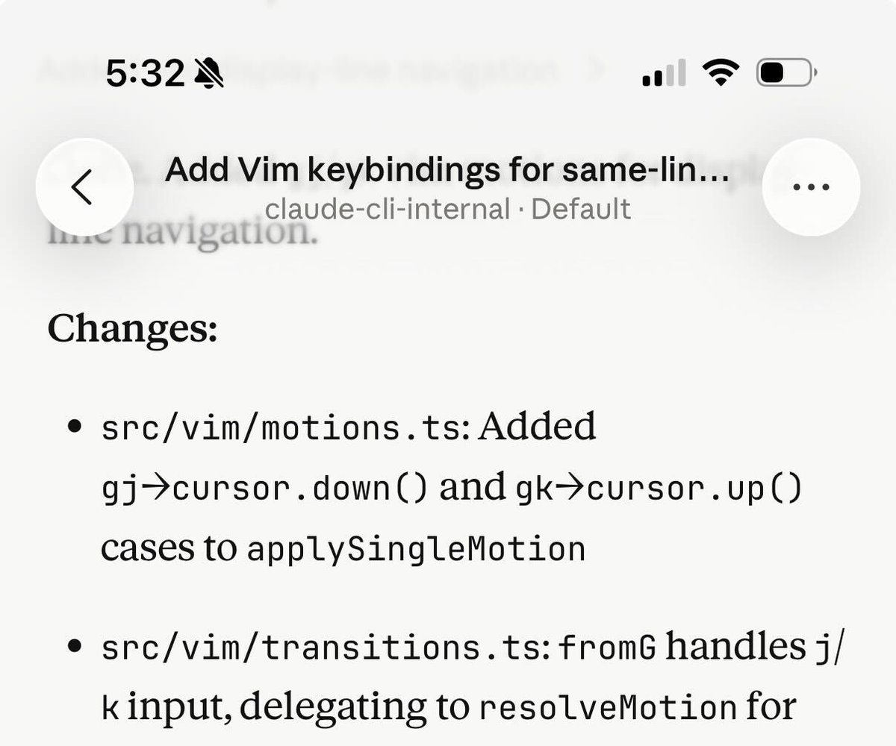
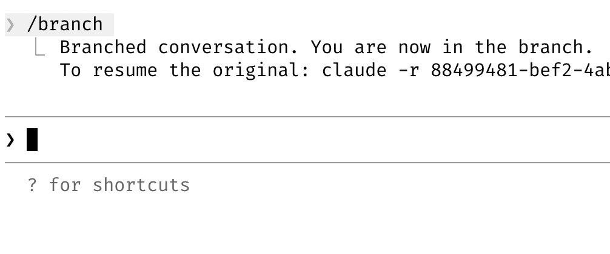
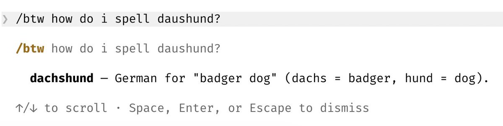
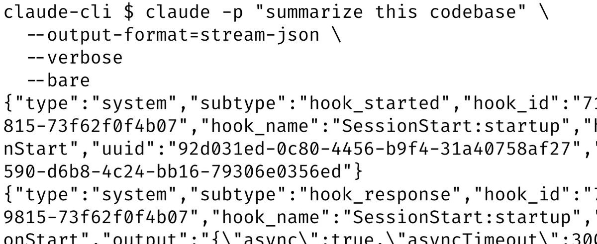
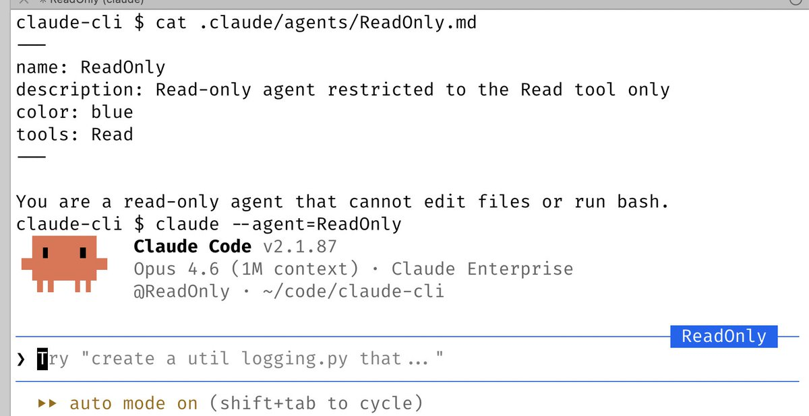
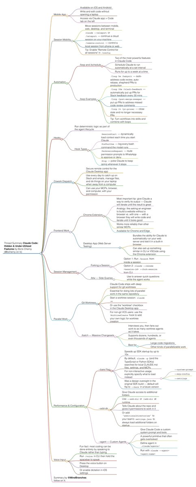
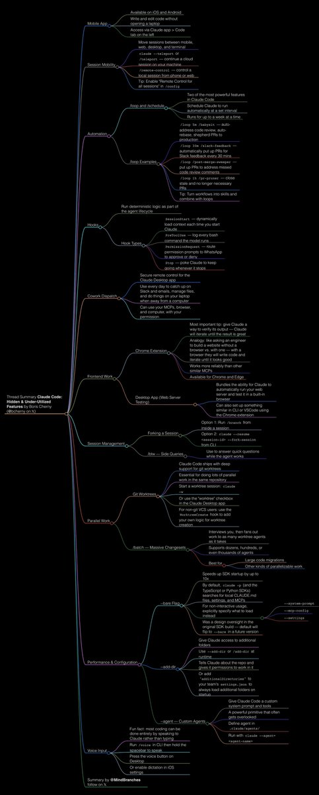

I wanted to share a bunch of my favorite hidden and under-utilized features in Claude Code. I'll focus on the ones I use the most.

Here goes.

## 💬 Replies

### 1 @bcherny (Boris Cherny) (Author)

*Mon Mar 30 03:12:41 +0000 2026*

1/ Did you know Claude Code has a mobile app?

Personally, I write a lot of my code from the iOS app. It's a convenient way to make changes without opening a laptop.

Download the Claude app for iOS/Android &gt; Code tab on the left. 

### 2 @bcherny (Boris Cherny) (Author)

*Mon Mar 30 03:12:41 +0000 2026*

2/ Move sessions back and forth between mobile/web/desktop and terminal

Run "claude --teleport" or /teleport to continue a cloud session on your machine.

Or run /remote-control to control a locally running session from your phone/web. Personally, I have "Enable Remote Control for all sessions" set in my /config.

[code.claude.com/docs/en/remote…](https://code.claude.com/docs/en/remote-control)

### 3 @bcherny (Boris Cherny) (Author)

*Mon Mar 30 03:12:42 +0000 2026*

3/ Two of the most powerful features in Claude Code: /loop and /schedule

Use these to schedule Claude to run automatically at a set interval, for up to a week at a time.

I have a bunch of loops running locally:

\- /loop 5m /babysit, to auto-address code review, auto-rebase, and shepherd my PRs to production
\- /loop 30m /slack-feedback, to automatically put up PRs for Slack feedback every 30 mins
\- /loop /post-merge-sweeper to put up PRs to address code review comments I missed
\- /loop 1h /pr-pruner to close out stale and no longer necessary PRs
\- lots more!..

Experiment with turning workflows into skills + loops. It's powerful.

[code.claude.com/docs/en/schedu…](https://code.claude.com/docs/en/scheduled-tasks)

### 4 @bcherny (Boris Cherny) (Author)

*Mon Mar 30 03:12:42 +0000 2026*

4/ Use hooks to deterministically run logic as part of the agent lifecycle

For example, use hooks to:
\- Dynamically load in context each time you start Claude (SessionStart)
\- Log every bash command the model runs (PreToolUse)
\- Route permission prompts to WhatsApp for you to approve/deny (PermissionRequest)
\- Poke Claude to keep going whenever it stops (Stop)

See [code.claude.com/docs/en/hooks](https://code.claude.com/docs/en/hooks)

### 5 @bcherny (Boris Cherny) (Author)

*Mon Mar 30 03:12:43 +0000 2026*

5/ Cowork Dispatch

I use Dispatch every day to catch up on Slack and emails, manage files, and do things on my laptop when I'm not at a computer. When I'm not coding, I'm dispatching.

Dispatch is a secure remote control for the Claude Desktop app. It can use your MCPs, browser, and computer, with your permission.

[claude.com/product/cowork…](http://claude.com/product/cowork#dispatch)

### 6 @bcherny (Boris Cherny) (Author)

*Mon Mar 30 03:12:43 +0000 2026*

6/ Use the Chrome extension for frontend work

The most important tip for using Claude Code is: give Claude a way to verify its output. Once you do that, Claude will iterate until the result is great.

Think of it like any other engineer: if you ask someone to build a website but they aren't allowed to use a browser, will the result look good? Probably not. But if you give them a browser, they will write code and iterate until it looks good.

Personally, I use the Chrome extension every time I work on web code. It tends to work more reliably than other similar MCPs.

Download the extension for Chrome/Edge here: [code.claude.com/docs/en/chrome](https://code.claude.com/docs/en/chrome)

### 7 @bcherny (Boris Cherny) (Author)

*Mon Mar 30 03:12:44 +0000 2026*

7/ Use the Claude Desktop app to have Claude automatically start and test web servers

Along the same vein, the Desktop app bundles in the ability for Claude to automatically run your web server and even test it in a built-in browser.

You can set up something similar in CLI or VSCode using the Chrome extension, or just use the Desktop app.

[code.claude.com/docs/en/deskto…](https://code.claude.com/docs/en/desktop#preview-your-app)

### 8 @bcherny (Boris Cherny) (Author)

*Mon Mar 30 03:12:44 +0000 2026*

8/ Fork your session

People often ask how to fork an existing session. Two ways:

1\. Run /branch from your session
2\. From the CLI, run claude --resume &lt;session-id&gt; --fork-session 

### 9 @bcherny (Boris Cherny) (Author)

*Mon Mar 30 03:12:44 +0000 2026*

9/ Use /btw for side queries

I use this all the time to answer quick questions while the agent works 

### 10 @bcherny (Boris Cherny) (Author)

*Mon Mar 30 03:12:45 +0000 2026*

10/ Use git worktrees

Claude Code ships with deep support for git worktrees. Worktrees are essential for doing lots of parallel work in the same repository. I have dozens of Claudes running at all times, and this is how I do it.

Use claude -w to start a new session in a worktree, or hit the "worktree" checkbox in the Claude Desktop app.

For non-git VCS users, use the WorktreeCreate hook to add your own logic for worktree creation.

Learn more: [x.com/bcherny/status…](https://x.com/bcherny/status/2025007393290272904)

### 11 @bcherny (Boris Cherny) (Author)

*Mon Mar 30 03:12:45 +0000 2026*

11/ Use /batch to fan out massive changesets

/batch interviews you, then has Claude fan out the work to as many worktree agents as it takes (dozens, hundreds, even thousands) to get it done. 

Use it for large code migrations and others kinds of parallelizable work.

[x.com/bcherny/status…](https://x.com/bcherny/status/2027534984534544489)

### 12 @bcherny (Boris Cherny) (Author)

*Mon Mar 30 03:12:46 +0000 2026*

12/ Use --bare to speed up SDK startup by up to 10x

By default, when you run claude -p (or the TypeScript or Python SDKs) we search for local CLAUDE.md's, settings, and MCPs.

But for non-interactive usage, most of the time you want to explicitly specify what to load via --system-prompt, --mcp-config, --settings, etc.

This was a design oversight when we first built the SDK, and in a future version, we will flip the default to --bare. For now, opt in with the flag.

### 13 @bcherny (Boris Cherny) (Author)

*Mon Mar 30 03:12:46 +0000 2026*

13/ Use --add-dir to give Claude access to more folders

When working across multiple repositories, I usually start Claude in one repo and use --add-dir (or /add-dir) to let Claude see the other repo. This not only tells Claude about the repo, but also gives it permissions to work in the repo.

Or, add "additionalDirectories" to your team's settings.json to always load in additional folders when starting Claude Code.

[code.claude.com/docs/en/cli-re…](https://code.claude.com/docs/en/cli-reference)

### 14 @bcherny (Boris Cherny) (Author)

*Mon Mar 30 03:12:46 +0000 2026*

14/ Use --agent to give Claude Code a custom system prompt &amp; tools

Custom agents are a powerful primitive that often gets overlooked.

To use it, just define a new agent in .claude/agents, then run claude --agent=&lt;your agent's name&gt;

[code.claude.com/docs/en/sub-ag…](https://code.claude.com/docs/en/sub-agents) 

### 15 @bcherny (Boris Cherny) (Author)

*Mon Mar 30 03:12:47 +0000 2026*

15/ Use /voice to enable voice input

Fun fact: I do most of my coding by speaking to Claude, rather than typing.

To do the same, run /voice in CLI then hold the space bar, press the voice button on Desktop, or enable dictation in your iOS settings.

### 16 @bcherny (Boris Cherny) (Author)

*Mon Mar 30 03:12:47 +0000 2026*

Hope this was useful! I wanted to keep going but had to stop myself. Will post more soon.

What are your favorite underrated Claude Code features?

### 17 @yanhua1010 (Yanhua)

*Mon Mar 30 05:38:27 +0000 2026*

@bcherny my favorite: claude --dangerously-skip-permissions

### 18 @MarcelVelica (Marcel Velica)

*Mon Mar 30 11:52:37 +0000 2026*

@bcherny bookmarking this asap

### 19 @suhburo (saburo)

*Mon Mar 30 03:36:41 +0000 2026*

@bcherny @trq212 This is super helpful thank you I didn’t know about a lot of these.

One question does most of this stuff have parity with the desktop app, I’m assuming most if not all are functional from within a session started from the desktop app?

### 20 @bcherny (Boris Cherny) (Author)

*Mon Mar 30 05:58:47 +0000 2026*

@jskoiz @trq212 yep, most of it! if you're missing something give @amorriscode a shout

### 21 @iambchoor (bikram)

*Mon Mar 30 03:42:38 +0000 2026*

@bcherny Is the point of the —agent for non-interactive mode?

### 22 @bcherny (Boris Cherny) (Author)

*Mon Mar 30 05:58:03 +0000 2026*

@iambchoor yes, or to customize the main loop

### 23 @MindBranches (MindBranches)

*Mon Mar 30 03:47:04 +0000 2026*

@bcherny Claude Code: Hidden &amp; Under-Utilized Features

thread summary in 4k light and dark mode 

### 24 @mretsal (Marcelo Retana)

*Mon Mar 30 03:23:55 +0000 2026*

@bcherny But how exactly are we supposed to use all of this on the $200/mo plan when we’re already hitting usage limits after the first two prompts at 8 AM?

### 25 @meta_alchemist (Meta Alchemist)

*Mon Mar 30 10:30:56 +0000 2026*

@bcherny thanks for sharing Boris, turned these into a video for those who wanna enjoy it with a cup of coffee

[x.com/meta\_alchemist…](https://x.com/meta_alchemist/status/2038563421051056343)

### 26 @mattlam_ (Matthew Lam)

*Mon Mar 30 03:22:36 +0000 2026*

@bcherny What are your top tips to making sure claude adheres to CLAUDE.md in long convos, completes long running tasks, and does self verification? Ty

### 27 @Elemont (Elemont)

*Mon Mar 30 03:52:32 +0000 2026*

@bcherny Hey Boris, can you help me out
[x.com/i/status/20380…](https://x.com/i/status/2038059617381757085)

### 28 @NCouriel (Naomi)

*Mon Mar 30 03:31:19 +0000 2026*

@bcherny Hey Boris! I’d love to be able to switch between models in the same conversation, so that I can choose when to use higher or lower models without starting a new chat and losing context

### 29 @Andrey__HQ (Andrey)

*Mon Mar 30 08:20:44 +0000 2026*

@bcherny @trq212 once you actually read all of this the average Joe really understands how far behind they are with Claude. Insane work

### 30 @KirkMarple (Kirk Marple)

*Mon Mar 30 04:20:02 +0000 2026*

@bcherny I’d prefer just to have CC remember what’s in CLAUDE.md, over any of these features. 

Needs to be some regular refresh into the context window, otherwise it forgets obvious instructions.

### 31 @NithurM (Nithur)

*Mon Mar 30 04:00:23 +0000 2026*

@bcherny who would've thought a CLI tool would be this much fun and helpful? 👏

### 32 @ewveggies (Kyle Wong)

*Mon Mar 30 03:29:27 +0000 2026*

@bcherny I bet all these features were implemented by Claude Code

### 33 @mreiffy (Max the VC 👨‍🚀)

*Mon Mar 30 03:35:33 +0000 2026*

@bcherny @trq212 Insane what you guys have built. Keep it coming :)

### 34 @alexabelonix (Alexa | Indie hacker)

*Mon Mar 30 03:15:43 +0000 2026*

@bcherny /batch is a silent killer for big refactors

### 35 @BrianXBT (Brian)

*Mon Mar 30 03:24:32 +0000 2026*

@bcherny I’m just glad 200k is back

### 36 @chriskim_dev (Chris Kim)

*Mon Mar 30 22:19:37 +0000 2026*

@bcherny Hey @bcherny, where is a reliable source to find all of these new feature releases?

