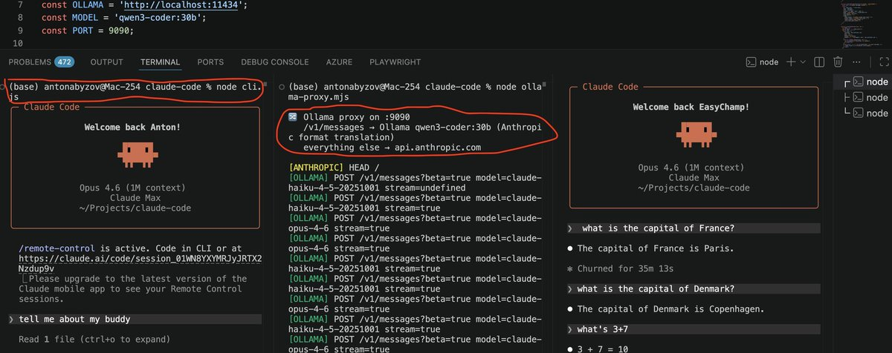

Mistakes happen. As a team, the important thing is to recognize it’s never an individuals’s fault — it’s the process, the culture, or the infra.

In this case, there was a manual deploy step that should have been better automated. Our team has made a few improvements to the automation for next time, a couple more on the way.

## 💬 Replies

### 1 @signulll (signüll)

*Wed Apr 01 05:44:24 +0000 2026*

@bcherny this is a great response. not pr slop.

### 2 @dabit3 (nader dabit)

*Wed Apr 01 10:43:23 +0000 2026*

@bcherny @rolandobarbella @wongmjane @BenLesh you sound like a great leader and teammate

### 3 @aabyzov (Anton Abyzov)

*Wed Apr 01 06:41:59 +0000 2026*

@bcherny @wongmjane @BenLesh The community takes this leakage as a gift for the 1st of April, now everybody could run local 2.1.88 version of Claude Code, with any model, like qwen3 in my example leveraging e.g. ollama proxy:  

ANTHROPIC\_BASE\_URL=http://localhost:9090 node cli.js 

### 4 @doodlestein (Jeffrey Emanuel)

*Wed Apr 01 10:28:25 +0000 2026*

@bcherny @DmitriyAnderson @wongmjane @BenLesh Nice. I had a feeling you guys would be nice about this and not crucify the poor dev who screwed up. I’m sure they feel terrible about it.

### 5 @tekbog (terminally onλine εngineer)

*Wed Apr 01 07:21:34 +0000 2026*

@bcherny @wongmjane @BenLesh clanker cloud solves this btw

### 6 @PnL63962200 (PnL)

*Wed Apr 01 09:48:21 +0000 2026*

@bcherny @wongmjane @BenLesh Or the yoamashit

### 7 @edzitron (Ed Zitron)

*Wed Apr 01 06:13:06 +0000 2026*

@bcherny @trq212 @wongmjane @BenLesh Hello Boris! Was this a result of somebody using Claude code to do something?

### 8 @LLMSherpa (Sherpa)

*Wed Apr 01 11:26:10 +0000 2026*

@bcherny @wongmjane @BenLesh I really dig this mindset.

When companies are more interested in assigning blame, it tends to result in folks hiding mistakes rather than surfacing &amp; addressing them.

Kudos for inherently knowing that.

### 9 @gaspargarcia_ (Gaspar Garcia)

*Wed Apr 01 07:04:12 +0000 2026*

@bcherny @wongmjane @BenLesh If you want we can review the fix

### 10 @martindonadieu (🧞‍♂️Martin Donadieu - oss/acc)

*Wed Apr 01 08:12:34 +0000 2026*

@bcherny @nachoad @wongmjane @BenLesh Why not turn this into opportunity to be oss on the cli ?
Everyone has the code already

### 11 @alt_w_v_g (Ethan Brooks)

*Thu Apr 02 03:11:38 +0000 2026*

@bcherny @wongmjane @BenLesh In case you don’t know what leadership looks like

It is this

Take notes

### 12 @Trace_Cohen (Trace Cohen)

*Wed Apr 01 11:14:02 +0000 2026*

@bcherny @wongmjane @BenLesh Nice very human centric and understanding response

### 13 @jeffannaraj (jeff annaraj)

*Wed Apr 01 06:09:47 +0000 2026*

@bcherny @wongmjane @BenLesh the good guys™️

### 14 @CDTEliot (Eliot)

*Wed Apr 01 06:40:56 +0000 2026*

@bcherny @wongmjane @BenLesh if you treat incidents as the fault of individuals, you get better villains but worse systems

### 15 @tomosman (Tom Osman 🐦‍⬛)

*Wed Apr 01 05:47:49 +0000 2026*

@bcherny @DanielleFong @wongmjane @BenLesh Nice Boris 👌🏼

### 16 @shazow (Andrey 🦃 Petrov)

*Wed Apr 01 13:30:36 +0000 2026*

@bcherny @wongmjane @BenLesh Maybe a good opportunity to consider embracing working in public? Transition can be a little painful but you've already endured the pain and it removes a whole class of failure modes.

### 17 @jad2222222 (Roy Jad)

*Wed Apr 01 07:24:26 +0000 2026*

@bcherny @wongmjane @BenLesh w team

### 18 @rahulsood (Rahul Sood 🏴‍☠️)

*Wed Apr 01 06:15:24 +0000 2026*

@bcherny @wongmjane @BenLesh What happens to the leaked code and all these models spawning then?

### 19 @EricBuess (Eric Buess)

*Wed Apr 01 13:19:02 +0000 2026*

@bcherny @danizord @wongmjane @BenLesh Well said!

### 20 @avthar (Avthar)

*Wed Apr 01 12:39:29 +0000 2026*

@bcherny @wongmjane @BenLesh Great response Boris, shows outstanding ownership and leadership.

### 21 @kushbhuwalka (Kush)

*Wed Apr 01 06:20:22 +0000 2026*

@bcherny @wongmjane @BenLesh womp womp now open source the harness

### 22 @ashen_one (ashen)

*Wed Apr 01 06:08:02 +0000 2026*

@bcherny @AlaHaddad23 @wongmjane @BenLesh nice

### 23 @thorgexyz (𓆩 thorge 𓆪)

*Wed Apr 01 05:57:26 +0000 2026*

@bcherny @wongmjane @BenLesh 🫡

### 24 @DegenApeDev (DegenApeDev)

*Wed Apr 01 06:44:28 +0000 2026*

@bcherny @wongmjane @BenLesh Well thanks for the code!

### 25 @WhatsupFranks (whatsupfranks)

*Wed Apr 01 22:28:59 +0000 2026*

@bcherny @wongmjane @BenLesh I'm more concerned about the token burning error that is killing certain users token usage. Still hasnt seem to be rectified and users deserve restitution of some form.

### 26 @TAbrodi (Tiger Abrodi)

*Wed Apr 01 11:16:01 +0000 2026*

@bcherny @Obinnaspeaks @wongmjane @BenLesh Much love.

Kindness and team spirit is the way. ❤️

### 27 @iwearahoodie (hoodie)

*Wed Apr 01 06:01:25 +0000 2026*

@bcherny @wongmjane @BenLesh soooooometimes it is the individual ngl

### 28 @SolusRGB (Solus 🍄 | Stronghold Validator)

*Wed Apr 01 09:36:46 +0000 2026*

@bcherny @wongmjane @BenLesh I’ll join the team

### 29 @transitive_bs (Travis Fischer)

*Wed Apr 01 16:46:55 +0000 2026*

@bcherny @pdrmnvd @wongmjane @BenLesh hmmm why not just make it open source?

milk's already been spilt

### 30 @insforge (InsForge)

*Wed Apr 01 16:12:43 +0000 2026*

@bcherny @wongmjane @BenLesh Manual step = eventual failure

### 31 @Ugo_alves (hugo alves)

*Wed Apr 01 08:33:01 +0000 2026*

@bcherny @wongmjane @BenLesh @clairevo

### 32 @EricBuess (Eric Buess)

*Wed Apr 01 13:18:45 +0000 2026*

@bcherny @danizord @wongmjane @BenLesh ❤️

### 33 @OrestTa (Orest Tarasiuk)

*Thu Apr 02 07:14:30 +0000 2026*

@bcherny @trq212 @wongmjane @BenLesh “Never” is an overstatement here

### 34 @matthewesp (Matt E)

*Wed Apr 01 16:02:15 +0000 2026*

@bcherny @wongmjane @BenLesh Oh hes dead dead

### 35 @Everlier (Everlier)

*Wed Apr 01 12:36:46 +0000 2026*

@bcherny @wongmjane @BenLesh em dashes :(

### 36 @KieranOnBase (kieran.base.eth)

*Wed Apr 01 15:09:04 +0000 2026*

@bcherny @wongmjane @BenLesh now we can all work on calude code together!

maybe there is a bright side to it all

