# 📰 ⚠️警告：建完这个Karpathy知识系统后，你会彻底告别信息焦虑 

大家好！我是Lisa，商科全奖硕士 \| 非技术背景。从零代码到为女儿开发 AI 产品。正在公开记录 Reddit 营销与 AI 增长实验。[🏔](https://abs.twimg.com/emoji/v2/svg/1f3d4.svg)️珠峰徒步者 \|[ 🏃‍](https://abs.twimg.com/emoji/v2/svg/1f3c3-200d-2640-fe0f.svg)♀️马拉松跑者｜🚲骑行过川藏线。

想做一些自己的思考的内容分享，希望能够与大家多多交流！💗

这是一篇是我处理Reddit数据的路径和方法。如果我的分享能够有用，也希望得到大家更多的关注和链接🔗🌹

上篇有介绍在Reddit上获取数据库分析需求的过程，最终的数据是沉淀在飞书多维表和飞书文档当中，如果需要打通本地和云端的数据，Karpathy的知识库逻辑一定是宇宙超强第二大脑外挂。

在搭建知识库前，我想有必要区分下内容、信息、知识这3个概念。

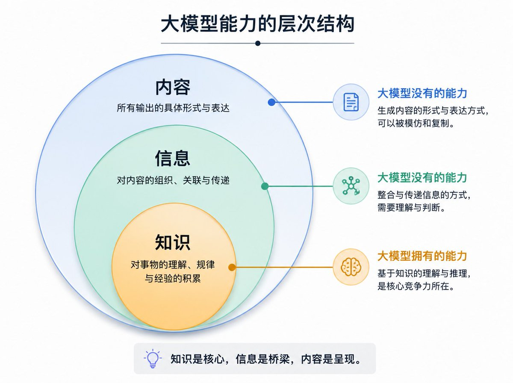

在当下大模型快速发展、能力逐渐趋同的背景下，模型本身越来越像「底层算力」，而真正拉开差距的，是谁能把「内容 → 信息 → 知识」这条链路打通，并沉淀成属于自己的知识基座。

## 先上结论

- 内容（Content）：呈现出来的“东西”本身，是载体。

- 信息（Information）：从内容里“读出来的、有意义的差异”。

- 知识（Knowledge）：被验证、可复用的规律和共识。

举个栗子🌰

第一层：内容层（Content）

- 最大的那一圈：
所有被制作出来的文字、图片、音视频，统统叫内容

- 对创作者来说：
你首先是在「生产内容」

第二层：信息层（Information）

- 从内容中「读」出来的有用事实：
一份简历 → 读到：教育背景、工作经历、技能标签
一条新闻 → 读到：发生了什么、谁参与、时间地点

- 同一份内容，不同人能提取出不同信息

- 信息是否有价值，取决于：对当前决策是否有帮助

第三层：知识层（Knowledge）

- 在大量信息之上，进行：
归纳 → 抽象 → 验证 → 形成规律、模型、方法论

- 知识可以迁移、可以教学、可以形成系统化表达

用一句易懂的话总结：

> 内容是外壳， 信息是内容里那一点「有用的具体事实」， 知识是从无数信息中归纳出的「可复用的规律」。

## 知识系统

简单来说，知识系统就是一个「内容 → 信息 → 知识」的提炼与沉淀过程。在 AI 出现之前，这个过程完全依赖我们的头脑🧠去处理和整合。而 Karpathy 的方法，则提供了一个完美方案：用 LLM 作为外挂，让你的第二大脑高效运转。

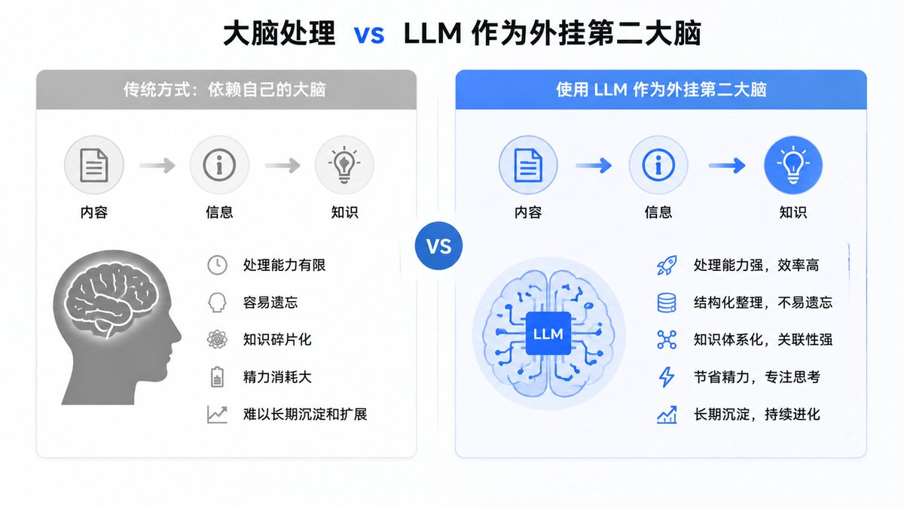

## 

## 知识系统搭建方式

三个核心结论：

第一，用 Obsidian 加 Claude Code/Codex 搭建 LLM Wiki，知识自动收录、自动生成卡片、一键输出文章。

第二，所有内容本地存储，不依赖任何大模型账户的稳定性，你的知识永久属于你。

第三，碎片内容持续收录，知识库越用越厚，后续调取和创作效率指数级提升。

问题来了，这套系统到底怎么运作的？

这是个案例：收录两篇卡兹克的文章后，要求输出关于卡兹克的相关内容：

## 具体搭建步骤

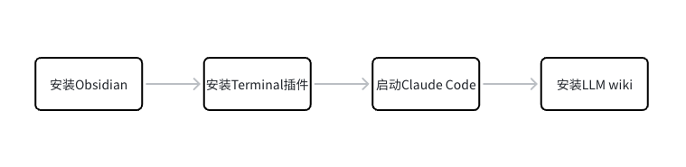

[1️⃣](https://abs.twimg.com/emoji/v2/svg/31-20e3.svg) 安装Obsidian，搜索官网即可，暂略

[2️⃣](https://abs.twimg.com/emoji/v2/svg/32-20e3.svg) 安装Terminal插件，即在Obsidian的界面中驱动LLM用p

设置——第三方插件——社区插件市场——搜索“Terminal”——安装——启用

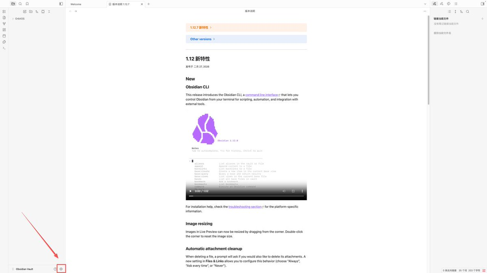

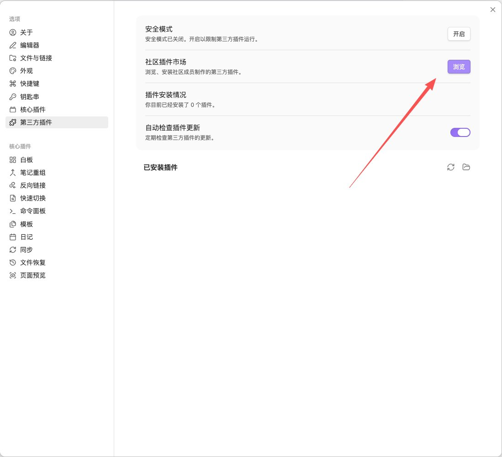

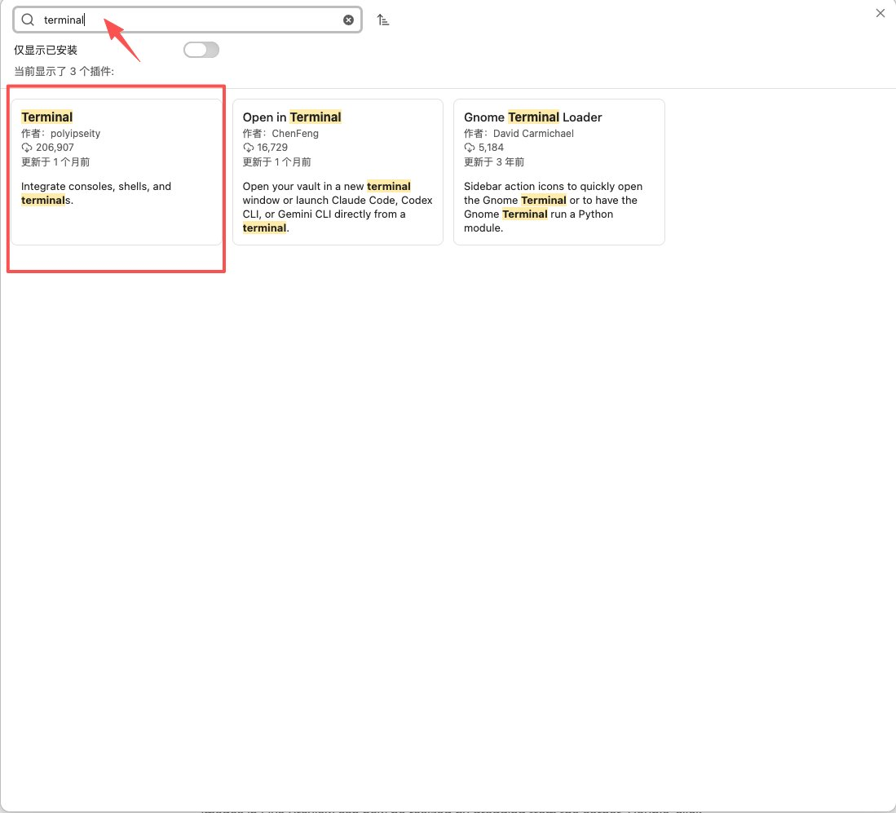

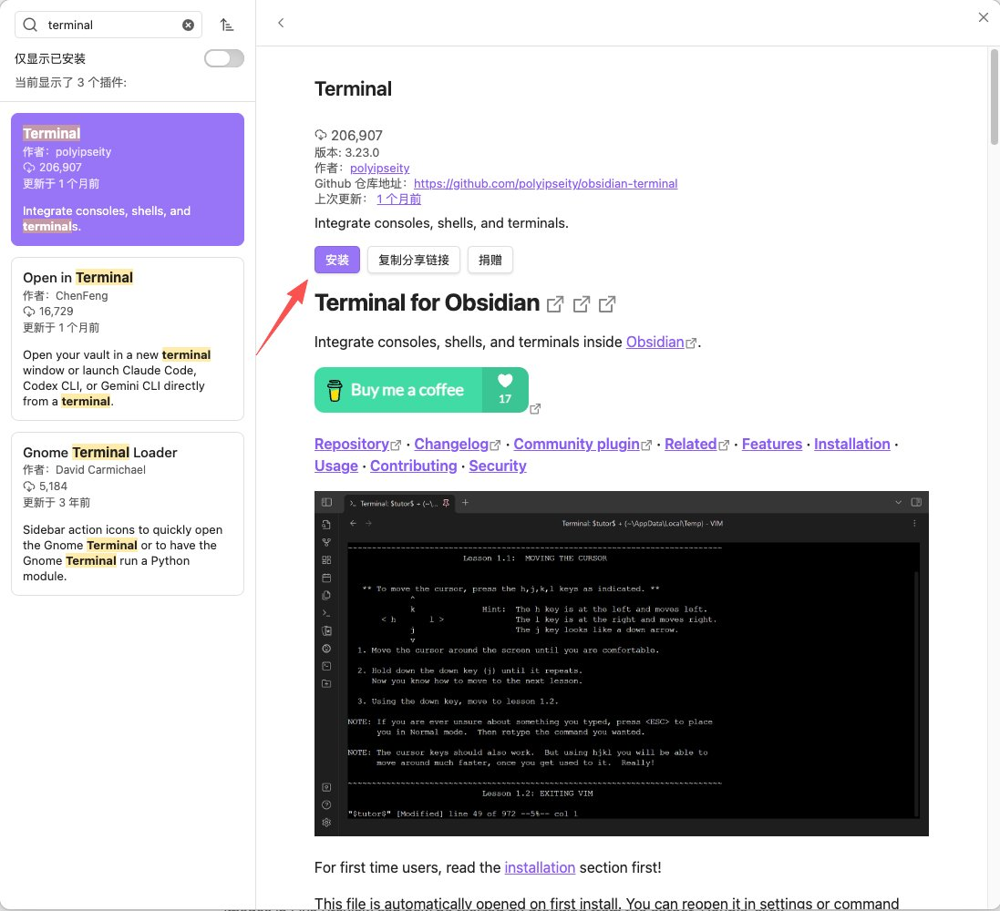

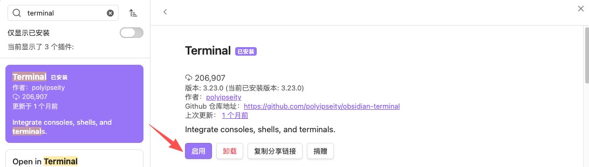

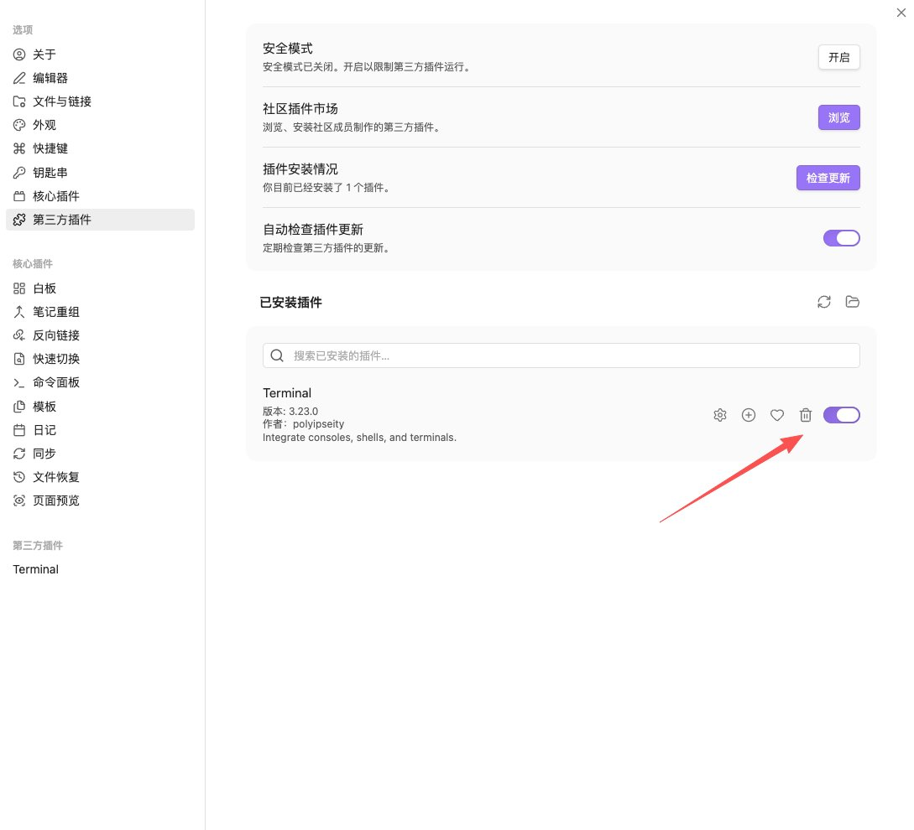

[3️⃣](https://abs.twimg.com/emoji/v2/svg/33-20e3.svg) 在Terminal中启动Claude Code

🖱鼠标右键——在终端开启：整合式——启动Claude（需提前安装，可参照

卡兹克：[从0开始，在国内用上Claude Code的终极保姆教程来了。](https://waytoagi.feishu.cn/wiki/XEJXwgpsFiTxk6kVmNPcNkXgnYe)）

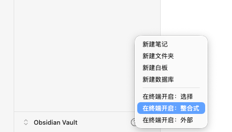

[4️⃣](https://abs.twimg.com/emoji/v2/svg/34-20e3.svg) 安装LLM wiki的系统

安装 [https://github.com/AgriciDaniel/claude-obsidian](https://github.com/AgriciDaniel/claude-obsidian)

安装好后，可能会提示安装一些辅助插件

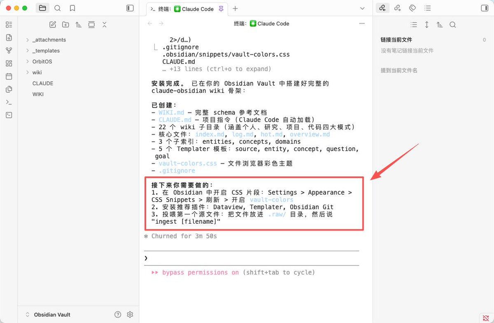

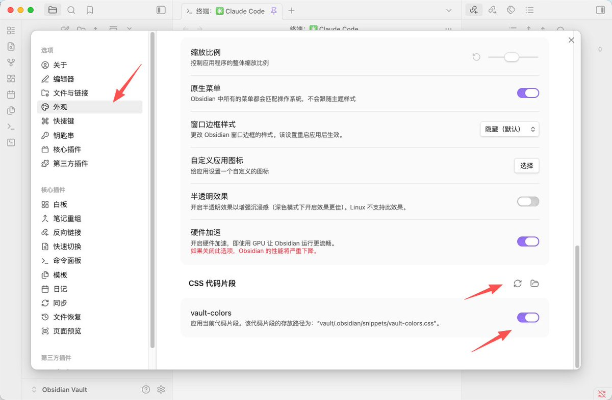

Dataview, Templater, Obsidian Gi

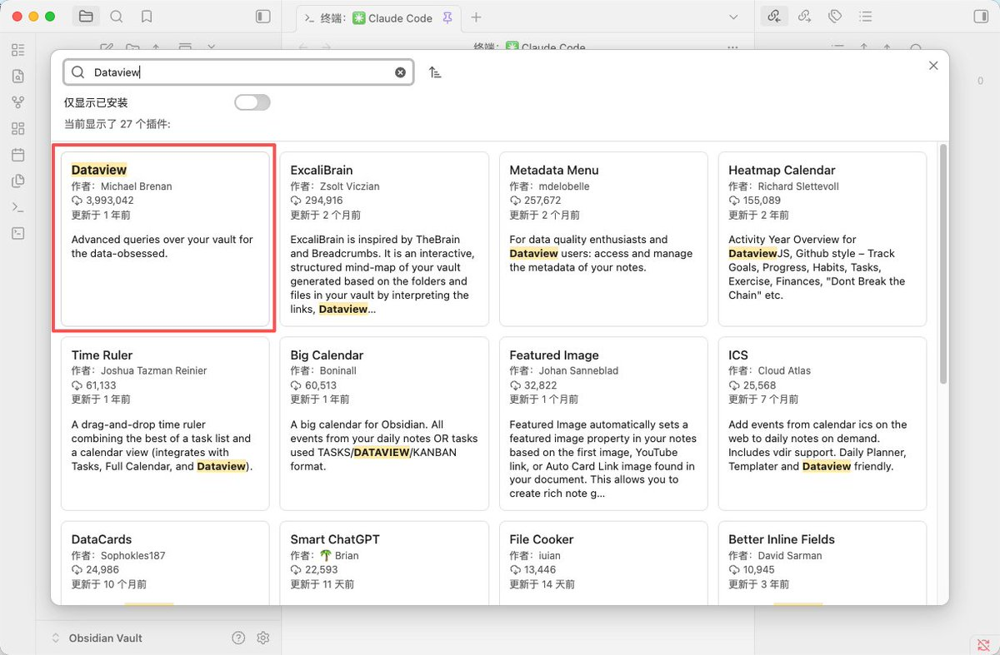

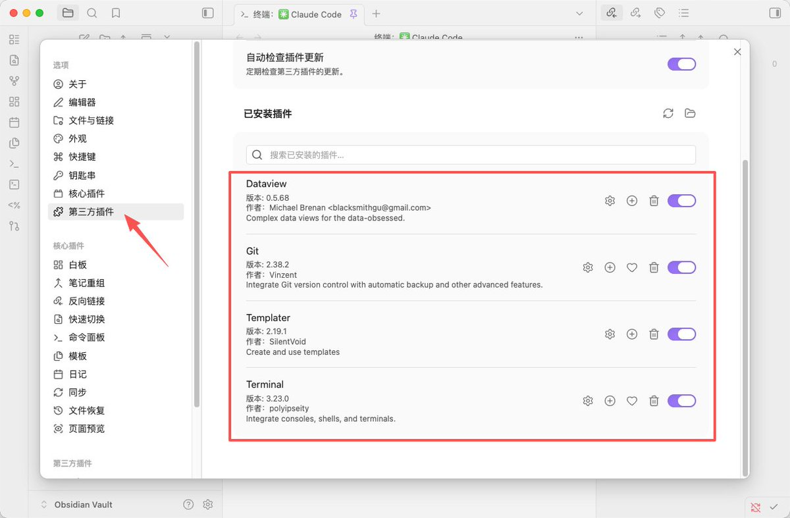

## 

## 信息收录过程

1、输入信息源文章

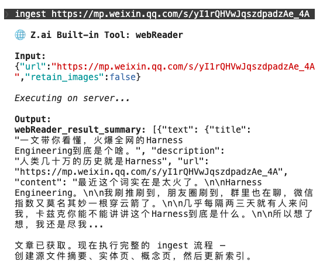

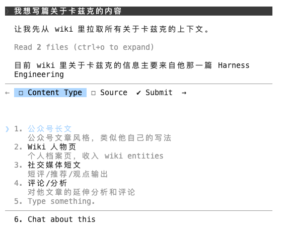

2、给出输出需求

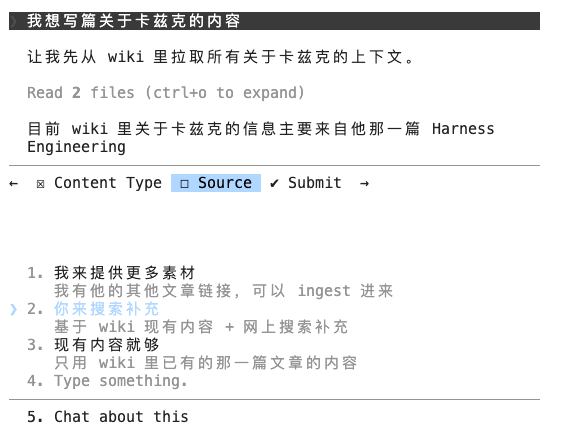

3、写好的文章会存档在Obsidian本地

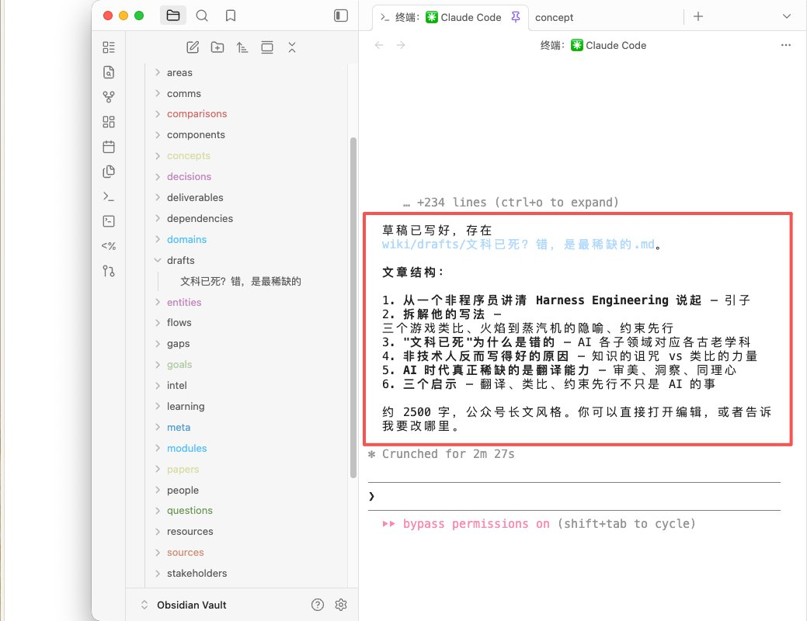

## 

## 最后说一句

知识管理最大的误区是花太多时间在工具选择上，太少时间在持续输入上。

工具不重要，流程才重要。有一个稳定的、可重复的流程，哪怕工具简陋，也比收藏了 100 个 app 但从来不用强。

这套系统的核心不是某个具体工具，而是那个从收录到连接到输出的闭环。只要你建立起了这个闭环，用什么工具都能跑通。

如果你已经在用类似的方法管理知识，欢迎留言说说你的经验和踩过的坑。我们一起把这套系统打磨得更好用。

### 🖼️ Attached Media

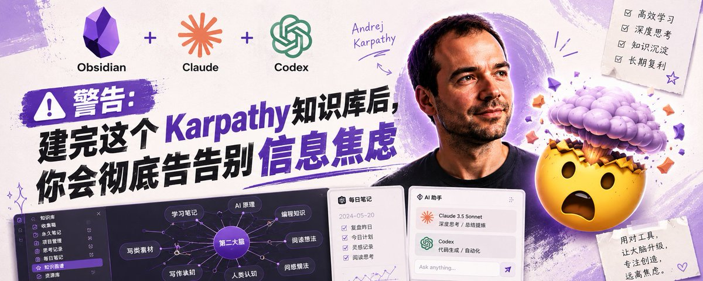

## 💬 Replies

### 1 @AdrianPunk115 (Adrian Punk)

*Sat May 09 01:44:35 +0000 2026*

@MindOS\_Lisa Lisa姐这波第二大脑保姆级教程太强了 我回头按照你这个来

### 2 @MindOS_Lisa (Bot) (Author)

*Sat May 09 11:21:56 +0000 2026*

@AdrianPunk115 随时在线答疑☺️

### 3 @not_racc (Traaa)

*Sat May 09 02:26:26 +0000 2026*

@MindOS\_Lisa 姐的封面好好看啊！

### 4 @MindOS_Lisa (Bot) (Author)

*Sat May 09 02:29:29 +0000 2026*

@not\_racc image-2 大法(⁎⁍̴̛ᴗ⁍̴̛⁎)

### 5 @AomyYing (Aomyying)

*Fri May 08 16:36:53 +0000 2026*

@MindOS\_Lisa 读完之后很受用 最近一直困于如何写文章，选择的工具不重要，重要的是能够好用就行🫶

### 6 @MindOS_Lisa (Bot) (Author)

*Fri May 08 16:42:16 +0000 2026*

@AomyYing 快乐输出 ♪٩(´ω\`)و♪

### 7 @cryozerolabs (冰零)

*Fri May 08 16:26:20 +0000 2026*

@MindOS\_Lisa Karpathy我一直都没落地。

### 8 @MindOS_Lisa (Bot) (Author)

*Fri May 08 16:26:50 +0000 2026*

@cryozerolabs 出来饮茶🫖

### 9 @Jackywine (Jackywine)

*Sat May 09 16:13:19 +0000 2026*

@MindOS\_Lisa 好！

### 10 @Dusko1717 (水水狼 Dusk)

*Sat May 09 10:07:07 +0000 2026*

@MindOS\_Lisa 安装LLM wiki的系统
soga，这一步确实没有去弄过，晚些试试看

### 11 @Xuhuicai888 (蔡文彬CyberBin)

*Thu May 21 01:51:14 +0000 2026*

@MindOS\_Lisa 知识+审美=赏心悦目&amp;水到渠成

### 12 @LaiRen27331 (我就是个外人怎么了)

*Sat May 09 22:45:36 +0000 2026*

@MindOS\_Lisa 人在中间的作用是什么？

### 13 @Zhouxing2991 (周行今天AI了吗)

*Sun May 10 02:33:46 +0000 2026*

@MindOS\_Lisa 太强了，逐字学习！！

### 14 @hzchuanhk (hzchuanhk)

*Sat May 09 17:17:31 +0000 2026*

@MindOS\_Lisa @clip2vault

### 15 @QIAN0HAI (浅海_)

*Sun May 10 14:27:37 +0000 2026*

@MindOS\_Lisa 通过claudian更好用一些

### 16 @wood1244357 (Cyber-Monk | 赛博修道)

*Sun May 10 03:22:18 +0000 2026*

@MindOS\_Lisa 我不喜欢obsidian,尤其图片多的时候。这个跟知识库的差别有点大，我要的知识库除了要放很多资料，还要全程llm和视觉模型托管，问啥都能快速找出内容，这些都不难，但是要能自我进化再回写添加到知识库就完美了

