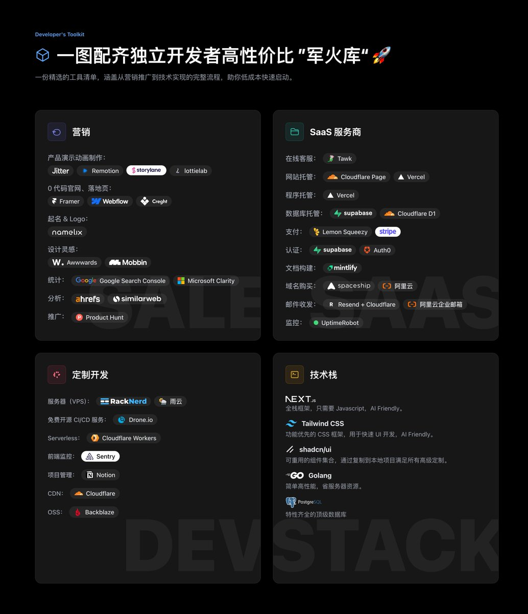
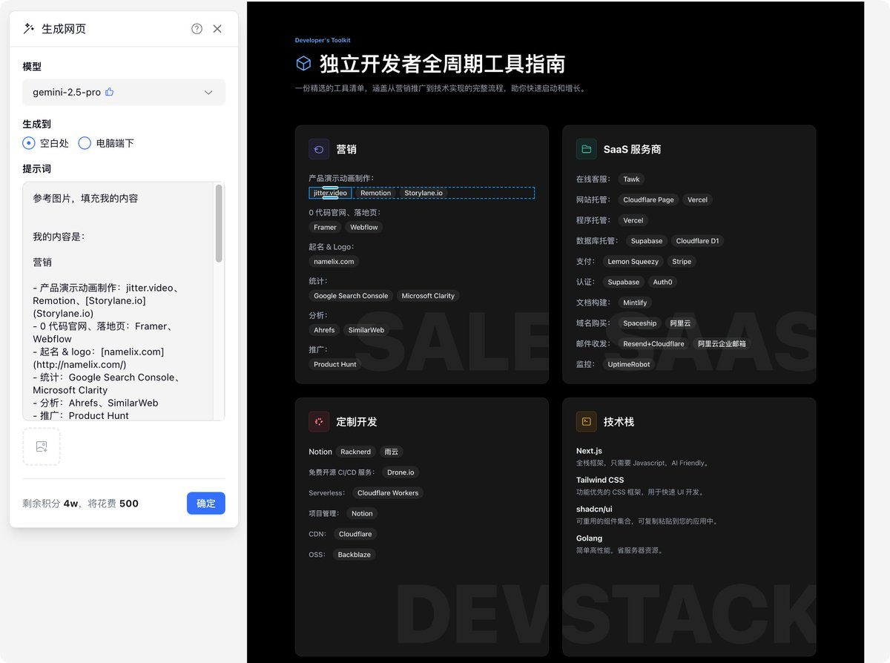

性价比拉满，一图配齐独立开发者全生命周期工具

来自我们团队构建产品的真实经验 

## 💬 Replies

### 1 @hi_bysir (Bysir) (Author)

*Mon Nov 10 03:12:58 +0000 2025*

制图工具：SVGLogo 库 [svgl.app](https://svgl.app/)，Figma，Gemini 2.5 Pro。

### 2 @shdcheng (leo.shi)

*Mon Nov 10 11:38:59 +0000 2025*

@hi\_bysir 域名可以用namesilo  服务器用德国henzter

### 3 @hi_bysir (Bysir) (Author)

*Mon Nov 10 11:51:30 +0000 2025*

@shdcheng 感谢，收藏了

### 4 @iamzhihui (志辉)

*Tue Nov 11 01:20:10 +0000 2025*

@hi\_bysir 不错，一波收藏

### 5 @hi_bysir (Bysir) (Author)

*Tue Nov 11 02:13:56 +0000 2025*

@iamzhihui 感谢认可～

### 6 @zacharyzdigital (Zachary | AI SEO)

*Tue Nov 11 04:58:27 +0000 2025*

@hi\_bysir 居然还推荐雨云，最垃圾的一个

### 7 @hi_bysir (Bysir) (Author)

*Tue Nov 11 05:56:02 +0000 2025*

@zacharyzdigital 如何得此评价？我感觉价格不是最低，但是稳定性（主要是跨国网络）不错，综合性价比很好。

你有其他推荐吗？感谢分享

### 8 @hellokaton (katon)

*Mon Nov 10 11:41:19 +0000 2025*

@hi\_bysir 太棒了，正好需要☺

### 9 @hi_bysir (Bysir) (Author)

*Mon Nov 10 11:51:58 +0000 2025*

@hellokaton 希望有帮助到你，就很棒

### 10 @l4walk6 (溪河)

*Tue Nov 11 16:54:27 +0000 2025*

@hi\_bysir 这图是怎么做的呀？自己做的还是有 AI 生成+人微调

### 11 @hi_bysir (Bysir) (Author)

*Wed Nov 12 02:35:36 +0000 2025*

打开 Gemini 2.5 Pro (实测审美最好)，找了一个参考图（你可以就用我的图），然后说：

\---
参考图片生成单页 HTML，要求使用 Tailwindcss，填充我的内容。

我的内容是：

营销

\- 产品演示动画制作：jitter、Remotion ...
...
\---

接下来打开这个 html，浏览器截图就行。

以上是不人工微调的版本。

如果你想人工微调，可以使用 figma make 和 creght 的 AI 功能。

这是 Creght：

### 12 @tianshangwuyun (苹果土豆泥)

*Tue Nov 11 05:41:42 +0000 2025*

@hi\_bysir 收款的 lemon 好用吗 要注册公司还是个人，这个没搞过

### 13 @hi_bysir (Bysir) (Author)

*Tue Nov 11 05:50:00 +0000 2025*

@tianshangwuyun lemon 特点就是个人也可以，很多设计师卖模板都是通过它。

### 14 @yppceo (社长-杨鹏鹏)

*Mon Nov 10 11:58:01 +0000 2025*

@hi\_bysir 收藏收藏，用的时候在翻看😂😂

### 15 @hi_bysir (Bysir) (Author)

*Mon Nov 10 12:32:11 +0000 2025*

@yppceo 哈哈好，记得记得

### 16 @jacky_xbb (Jacky Xbb)

*Mon Nov 10 04:17:56 +0000 2025*

@hi\_bysir vercel 稍微流量大一点，免费的就扛不住了

### 17 @hi_bysir (Bysir) (Author)

*Mon Nov 10 04:55:18 +0000 2025*

@jacky\_xbb 实际上 vercel 订阅下来比单独买一个服务器更贵，但胜在简单易用，没那么琐碎的事。我一开始的 demo 阶段是跑在 vercel 上的，后面都自己买服务器了。

