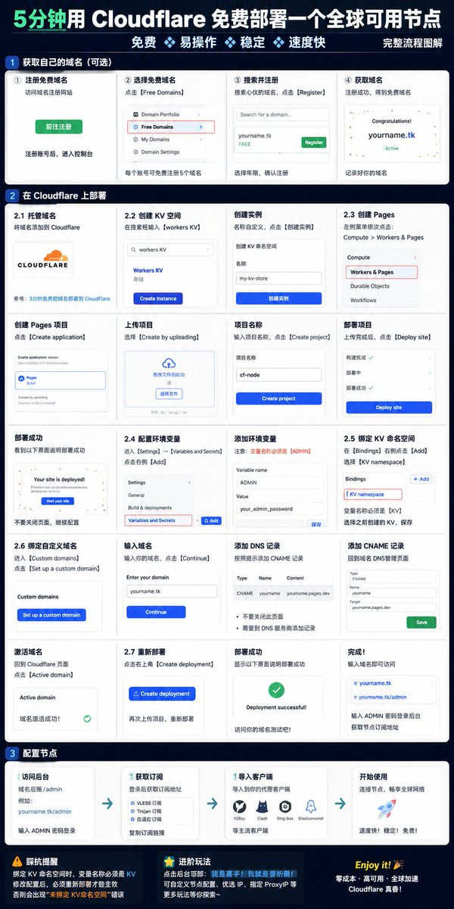

Cloudflare 免费资源大全

✅免费 CDN
✅免费 SSL
✅免费 DNS
✅免费 Pages
✅免费 Workers
✅免费 KV
✅免费 R2
✅免费 D1

今天又用：

Pages + KV + 免费域名

部署了一个免费节点。

全程零成本。
下面是免费节点的部署教程，欢迎自取👇G

## 💬 Replies

### 1 @Cander_zhu (Cander) (Author)

*Sat Jun 06 06:54:14 +0000 2026*

部署完成之后，我这边出了一个小小的bug：

因为没有认真看文档，直接在绑定KV的变量名那边随意填了变量名，
导致项目报“未绑定 KV 命名空间”的错误，
回过头发现问题做了修改，结果改完之后访问还是报同样的错误；

继续排查才发现：

Cloudflare Pages 修改 Binding 后不会立即生效。

必须重新部署一次项目。

也就是说

修改 KV Binding ≠ 立即生效

还需要：Create Deployment（重新部署）。

最终：

✅ 修改变量名为 KV

✅ 重新部署

项目恢复正常。

这个看起来只有一个变量名的问题，前后硬是浪费了我将近20分钟。
记录一下。

如果你也在折腾 Cloudflare Pages + KV，遇到：

❓未绑定 KV命名空间

优先检查这几个地方：

💡KV Namespace 是否创建成功

💡Binding 名称是否为项目要求的名称（很多项目要求必须是 KV）

💡是否绑定到了 Production 环境

💡修改后是否重新部署

有时候最难排查的，不是复杂问题，而是一个看起来最不可能出错的配置项。😂

### 2 @nemoisme (nemo)

*Sat Jun 06 07:37:17 +0000 2026*

@Cander\_zhu 零成本部署成功率高吗？最近正好需要一个节点，谢谢分享！

### 3 @Cander_zhu (Cander) (Author)

*Sat Jun 06 08:07:37 +0000 2026*

@nemoisme 完完全全依托cloudeflare的免费版搭建的

### 4 @fantuantalk (饭团)

*Sat Jun 06 06:57:43 +0000 2026*

@Cander\_zhu 感谢分享！Pages + KV 这个组合牛，免费域名也搞定了？

### 5 @Cander_zhu (Cander) (Author)

*Sat Jun 06 07:00:31 +0000 2026*

@fantuantalk 是的，免费域名搞定了
然后之前也自己购买了域名

### 6 @zhouluobo (zhouluobo)

*Sat Jun 06 07:51:31 +0000 2026*

@Cander\_zhu 这个真的实用啊，白嫖党狂喜

### 7 @Xing_zi_xing (星子星 Xingzixing)

*Sat Jun 06 06:57:59 +0000 2026*

@Cander\_zhu Mark it first

### 8 @longlong_sky (Skivein)

*Sat Jun 06 12:49:09 +0000 2026*

@Cander\_zhu 太实用了，感谢分享🍎

### 9 @keyan898786 (AI 可研/标书操盘手)

*Sat Jun 06 07:40:01 +0000 2026*

@Cander\_zhu 可以用ChatGPT 部署吗？

### 10 @xiaoai_aigc (小艾)

*Sat Jun 06 10:47:40 +0000 2026*

@Cander\_zhu 哇，太实用了，宝藏🤩

### 11 @aken780 (阿肯)

*Sat Jun 06 07:51:00 +0000 2026*

@Cander\_zhu 学到了，感谢分享👍

### 12 @RockT7587 (Rocky Tse)

*Sat Jun 06 07:40:04 +0000 2026*

@Cander\_zhu 感谢 UP 主的分享。

### 13 @JieJing73654 (HonorJie（关注必回）)

*Sat Jun 06 10:47:32 +0000 2026*

@Cander\_zhu 支持博主，写得很好！

### 14 @niuerxiong1 (neilson)

*Sat Jun 06 07:30:27 +0000 2026*

@Cander\_zhu 真是宝藏

### 15 @SunMTime (SunTime)

*Sun Jun 07 09:33:30 +0000 2026*

@Cander\_zhu 免费域名也是cloudflare吗？我在注册域名页面没有看到有free domains的选项

