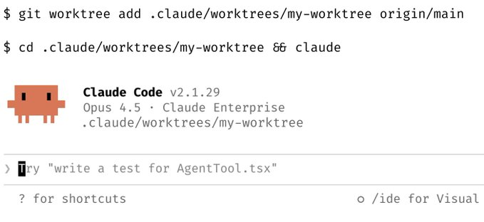
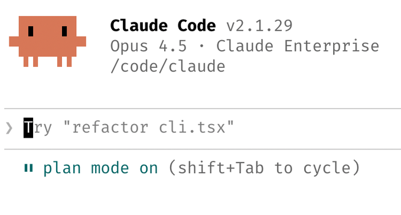
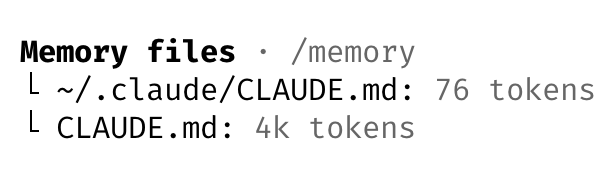
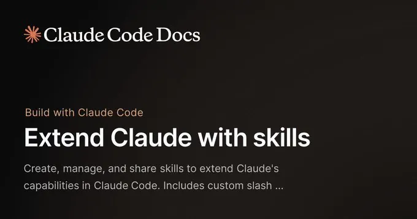
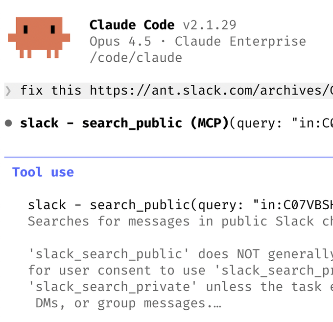
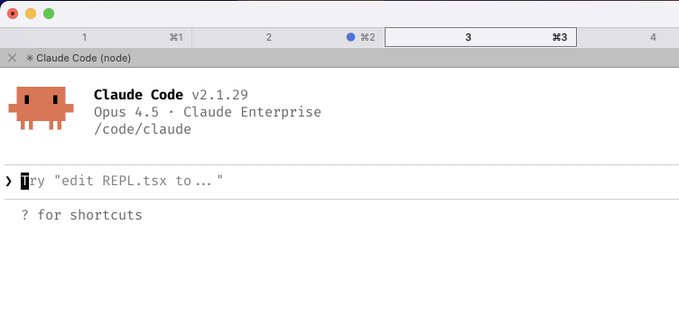
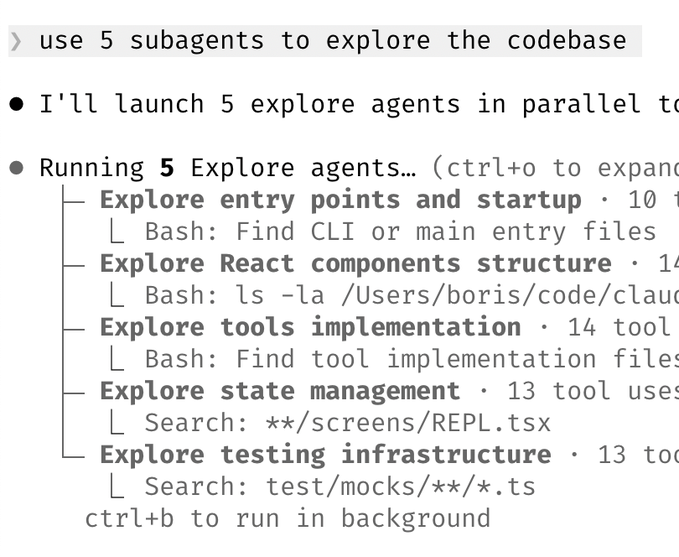

# 📰 来自 Claude Code 创始团队的 CC 最佳实践技巧

> 译者注：本文翻译自 Claude Code 创始人 Boris 的分享文章

我是 Boris，我创建了 Claude Code。我想快速分享一些使用 Claude Code 的技巧，这些建议直接来自 Claude Code 团队。团队使用 Claude 的方式和我个人的用法不太一样。记住：使用 Claude Code 没有唯一正确的方法——每个人的环境和配置都不同。你应该多实验，找到最适合自己的方式！

##  1\. 尽量并行做更多事

同时开 3-5 个 git worktree（Git 工作树），每个工作树里各跑一个独立的 Claude 会话并行推进。这是生产力提升最大的“解锁点”，也是团队给的头号建议。就我个人而言，我用的是多个 git checkout（多份代码检出），但 Claude Code 团队大多数人更偏爱 worktree——这也是为什么 @amorriscode 会在 Claude Desktop 应用里内置对它的原生支持！

有些人会给 worktree 起名字，并配 shell alias（别名）比如 \`za\`、\`zb\`、\`zc\`，这样一键就能在不同 worktree 之间跳转。也有人专门建一个 “analysis” worktree，只用来读日志、跑 BigQuery。

参考：https://code.claude.com/docs/en/common-workflows#run-parallel-claude-code-sessions-with-git-worktrees

## 2\. 每个复杂任务都从 plan mode 开始：把精力用在计划上，让 Claude 一把完成实

有人会让一个 Claude 先写 plan（计划），然后再开第二个 Claude 以 “staff engineer（资深工程师）” 的角色来审阅这份计划。

还有人说：一旦事情开始跑偏，就立刻切回 plan mode 重新规划，别硬推。

他们还会明确告诉 Claude：验证步骤也要进入 plan mode，不只是写代码时才用。

##  3\. 认真维护你的 CLAUDE.md

每次纠正完 Claude，都用这句话收尾：“更新你的 CLAUDE.md，这样你就不会再犯这个错误了。“Claude 在给自己写规则这件事上强得有点”诡异“。

随着时间推移，毫不留情地打磨你的 \[CLAUDE.md\](http://CLAUDE.md)。持续迭代，直到你能明显量化地看到 Claude 的出错率下降。

有位工程师会让 Claude 为每个任务/项目维护一个 notes 目录，每次 PR 后都更新，然后在 \[CLAUDE.md\](http://CLAUDE.md) 里指向这个目录。

## 4\. 自己做 skills（技能）并提交到 git：所有项目复用

团队的建议：

- 如果你每天会做不止一次，就把它做成一个 skill 或 command（命令）

- 做一个 \`/techdebt\` slash command，并在每次会话结束时跑一遍，用来找出并清理重复代码

- 做一个 slash command，把最近 7 天的 Slack、GDrive、Asana、GitHub 同步成一份上下文 dump（上下文汇总）

- 像 analytics engineer（分析工程师）那样做 agents：写 dbt model、做代码 review、在 dev 环境里测试变更

了解更多：https://pbs.twimg.com/card\_img/2015672598026399744/fwSIztiM?format=jpg&name=small

## 5\. 大多数 bug Claude 能自己修：我们是这么做的

启用 Slack MCP，然后把 Slack 里的 bug 讨论串贴给 Claude，只说一句 “fix”。完全不需要切来切去。

或者直接说：“去修 failing 的 CI tests。”别告诉它怎么修，别微操。

把 Claude 指向 docker logs 来排查分布式系统问题——它在这方面强得出乎意料。

## 6\. 提示词进阶

a. 质疑 Claude：比如说“对这些改动狠狠审问我，只有我通过你的测试你才准发 PR。”让 Claude 当你的 reviewer。或者说：“证明给我看这能跑”，让它比较 main 分支和你的 feature 分支的行为差异（diff 行为）。

b. 当修得一般般时，直接说：“基于你现在已经知道的一切，把这套方案扔掉，重新实现一个优雅的解法。”

c. 交付前先写清楚规格说明（spec），尽量减少歧义。你越具体，输出越好。

## 7\. 终端与环境配置

团队很喜欢 Ghostty！好几个人喜欢它的 synchronized rendering（同步渲染）、24-bit color（24 位色）以及完善的 Unicode 支持。

为了更轻松地“多 Claude 调度”，用 \`/statusline\` 自定义状态栏，让它始终显示上下文用量和当前 git 分支。我和团队中的很多人还会给终端标签页上色并命名，有时会用 tmux——一个任务/工作树一个 tab。

用语音输入（voice dictation）。你说话速度比打字快 3 倍，而且因此你的提示词会更细更完整。（macOS 上按 fn 两次）

更多建议：&lt;https://code.claude.com/docs/en/terminal-config&gt;

## 8\. 使用 subagents（子代理）

a. 只要你希望 Claude 在问题上投入更多算力，就在请求末尾加一句 “use subagents”。

b. 把单独的小任务丢给 subagents，保持主 agent 的上下文窗口更干净、更聚焦。

c. 用 hook 把权限请求路由到 Opus 4.5：让它扫描攻击并自动批准安全请求（见 https://code.claude.com/docs/en/hooks#permissionrequest）

## 9\. 用 Claude 做数据分析与指标查询

让 Claude Code 使用 “bq” CLI 随时拉取并分析指标。我们把一个 BigQuery skill 提交到了代码库里，团队所有人都在 Claude Code 里直接跑分析查询。就我个人而言，我已经 6 个多月没写过一行 SQL 了。

这个思路适用于任何提供 CLI、MCP 或 API 的数据库。

## 10\. 用 Claude 学习

团队还有一些用 Claude Code 学习的技巧：

a. 在 \`/config\` 里启用 “Explanatory” 或 “Learning” 输出风格，让 Claude 解释它改动背后的 \*why\*。

b. 让 Claude 生成一个可视化的 HTML presentation 来讲解陌生代码——它做出来的幻灯片意外地好。

c. 让 Claude 用 ASCII 画协议/代码库结构图，帮助你快速理解。

d. 做一个 spaced-repetition（间隔复习）学习 skill：你先讲自己的理解，Claude 追问补缺口，并把结果存下来。

希望这些技巧对你有帮助！

\---

译者：Cell 细胞 & Claude

原文作者：Boris（Claude Code 创建者）

原文：https://x.com/bcherny/status/2017742741636321619?s=46

### 🖼️ Attached Media

## 💬 Replies

### 1 @0xhardman (0xhardman)

*Fri Feb 06 05:09:29 +0000 2026*

@cellinlab 请教下是用什么语音输入到terminal的 ghostty 自带的嘛？

### 2 @cellinlab (Cell 细胞) (Author)

*Fri Feb 06 05:22:44 +0000 2026*

@0xhardman 我用 typeless

### 3 @LocationCk (Kiro有点Yes)

*Sun Feb 01 09:56:14 +0000 2026*

@cellinlab 封面图用的哪个skill出的提示词？

### 4 @cellinlab (Cell 细胞) (Author)

*Sun Feb 01 09:57:21 +0000 2026*

@LocationCk 提示词：结合 Claude Code 的 IP 形象图，和全文内容 帮我生成一个 横版的全文封面配图，最后配图的 一边 可以做为 方形封面图，

### 5 @furan86999 (furan)

*Sun Feb 01 09:23:46 +0000 2026*

@cellinlab 哇这个项目太酷了，未来可期！

### 6 @myzwilpan (zwil Pan)

*Sun Feb 01 15:57:12 +0000 2026*

@cellinlab 值得反复阅读学习

### 7 @JerryBobAI (JerryBobAI)

*Sat Feb 14 12:54:49 +0000 2026*

@cellinlab 

### 8 @hiheimu (赖叔 | LaiShu.ai)

*Sun Feb 01 15:37:20 +0000 2026*

@cellinlab 看来claude真的是变强了
我记得去年刚用cc时
给的开发建议是从小模块开始，慢慢搭建整套系统

### 9 @aiwaremax (AIWare)

*Mon Feb 02 14:31:38 +0000 2026*

@cellinlab get,I will have each Moltbot learn this skill.😀

### 10 @Kerro99920 (Kerro)

*Sun Feb 01 17:55:51 +0000 2026*

@cellinlab ❤️

### 11 @whincwu (右耳朵猫AI)

*Tue Feb 03 14:26:32 +0000 2026*

@cellinlab 你好可以转载吗？会注明你为来源链接和作者

### 12 @Dthinkc (大小王)

*Mon Feb 02 15:10:42 +0000 2026*

@cellinlab good

### 13 @liudicy (D)

*Tue Feb 03 08:52:09 +0000 2026*

@cellinlab 非常有收获。

