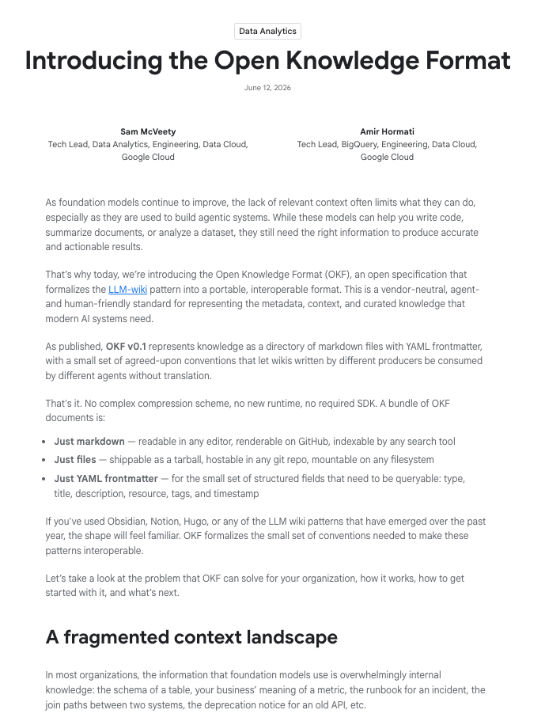
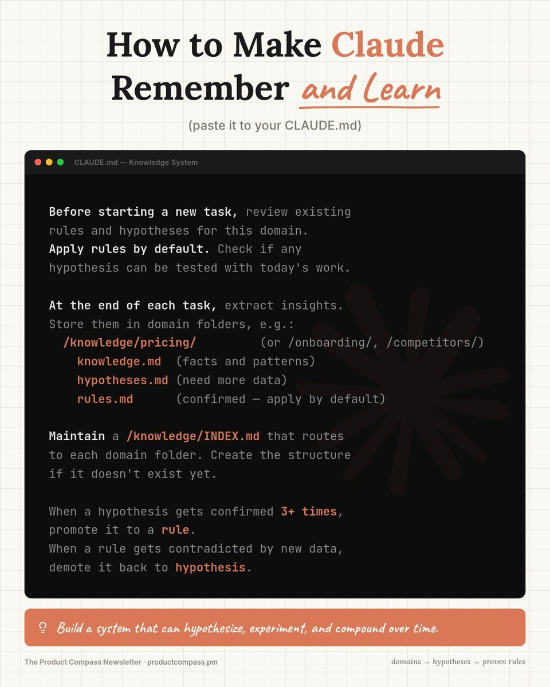
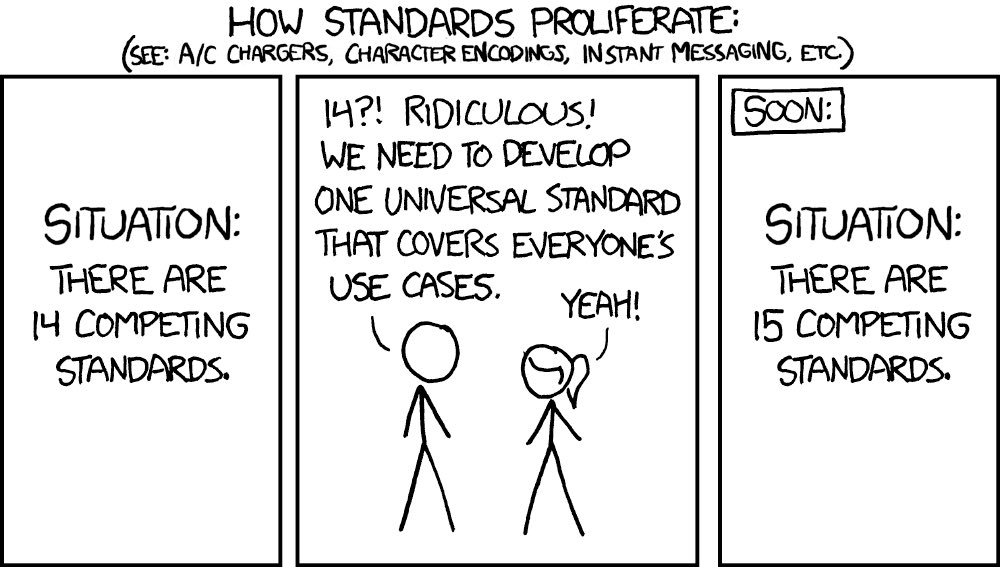

🚨 @Karpathy predicted the power of the "LLM Wiki." Google just formalized it.

Meet Open Knowledge Format (OKF): a vendor-neutral standard for giving foundation models the curated context they need.

I can genuinely see this replacing Notion, Obsidian, or traditional wikis for developer teams, and the reason comes down to bookkeeping.

Traditional wikis fail because humans inevitably abandon the tedious work of updating them.

As Andrej Karpathy pointed out recently, LLMs don't get bored.

They don't forget to update a cross-reference, and they can touch 15 files in a single pass.

OKF standardizes the interoperability layer so agents can actually do that heavy lifting autonomously.

Because the format is minimally opinionated, it doesn't dictate what you write, it just dictates how it's structured. You get:
→ Human-readable documents that live right alongside your code in version control
→ Cross-links that map out complex entity relationships without needing a graph database
→ A system that survives moving between different tools and organizations

There is no complex compression scheme.

No central registry.

If you can cat a file, you can read it.

If you can git clone a repo, you can deploy it.

This is how we stop rebuilding context pipelines from scratch every time a new model drops.

Announcement + spec file in 🧵↓

### 🖼️ Attached Media

## 💬 Replies

### 1 @DataChaz (Charly Wargnier ♨️) (Author)

*Sat Jun 13 10:46:13 +0000 2026*

Google's blog post: [cloud.google.com/blog/products/…](https://cloud.google.com/blog/products/data-analytics/how-the-open-knowledge-format-can-improve-data-sharing/)

### 2 @DataChaz (Charly Wargnier ♨️) (Author)

*Sat Jun 13 10:46:16 +0000 2026*

Spec file here: [github.com/GoogleCloudPla…](https://github.com/GoogleCloudPlatform/knowledge-catalog/blob/main/okf/SPEC.md)

### 3 @DataChaz (Charly Wargnier ♨️) (Author)

*Sat Jun 13 21:12:08 +0000 2026*

... and I like this too, from my friend @kidehen 💥↓
[x.com/kidehen/status…](https://x.com/kidehen/status/2065897463085400211)p

### 4 @PawelHuryn (Paweł Huryn)

*Sat Jun 13 19:25:18 +0000 2026*

Karoathy is a genius, but here, there was nothing to predict, I published this infographic before Karpathy. And I wasn't the first.

What Karpathy and Google didn't include:
\- synthesizing knowledge
\- surfacing contradictions
\- quality of each claim (e.g., data vs. opinion vs. decision)
\- observation &gt; hypothesis &gt; rule 
\- forgetting on purpose 

And, most importantly, knowledge systems managed by the agents, write for the agents - humans usign wikis are still a bottleneck.

### 5 @DataChaz (Charly Wargnier ♨️) (Author)

*Sat Jun 13 19:25:56 +0000 2026*

@PawelHuryn @karpathy Nice!

Claude only?

### 6 @kidehen (Kingsley Uyi Idehen)

*Sat Jun 13 20:41:52 +0000 2026*

As usual, with this LLM Wiki concept, you can take things a step further by having an LLM-powered AI agent generate a knowledge graph deployed in Semantic Web form.

Remember, LLMs have no difficulty producing RDF documents, and RDF-Turtle—think compact, human-readable structured sentences—is particularly well suited to this approach.
Any combination of Markdown and YAML can be transformed by an LLM into RDF. Once you do that, the benefits of a Semantic Web for context engineering, context sharing, and AI-agent harnessing become off the charts.

I already use this approach in practice, so this isn’t speculation or hand-waving. 😄

The Semantic Web project’s deliverables become particularly powerful in the age of LLMs because they provide a machine-computable framework for understanding that complements natural language processing. The combination is remarkably effective.

### 7 @DataChaz (Charly Wargnier ♨️) (Author)

*Sat Jun 13 21:23:28 +0000 2026*

@kidehen @karpathy love this, thanks Kingsley!

I hope you're well man

### 8 @suganthan (Suganthan Mohanadasan)

*Mon Jun 15 06:51:58 +0000 2026*

@DataChaz @karpathy Made a Wordpress Plugin for this Charley

[x.com/suganthan/stat…](https://x.com/suganthan/status/2066412527920222477)

### 9 @DataChaz (Charly Wargnier ♨️) (Author)

*Mon Jun 15 06:55:01 +0000 2026*

@suganthan @karpathy Sweet!

### 10 @maxmax (Max Winderbaum)

*Sat Jun 13 18:07:48 +0000 2026*

We’re building this at [Comment.io](http://Comment.io) \- check it out!

\- Just Markdown
\- Share instantly with any human or agent
\- Multi-author collaborative editing
\- Fully free forever
\- Pluggable with no lock-in
\- Agent-native with full agent identity and auth system

We’ll have OKF working very soon as well - early next week

### 11 @DataChaz (Charly Wargnier ♨️) (Author)

*Sat Jun 13 18:17:08 +0000 2026*

@maxmax @karpathy Amazing l!!

### 12 @draparente (Angelica Parente)

*Sun Jun 14 09:48:24 +0000 2026*

@DataChaz @karpathy Karpathy was nowhere near the first....people have been  using LLMs with Obsidian since GPT-2.

### 13 @nicky_sap (ns)

*Sun Jun 14 13:23:47 +0000 2026*

@DataChaz @Johnny\_DGB @karpathy 

### 14 @nickventuri (Nick Venturi)

*Sat Jun 13 21:00:38 +0000 2026*

@DataChaz @karpathy my obsidian vault is a graveyard anyway

### 15 @wey_gu (Wey Gu 古思为)

*Sat Jun 13 16:56:53 +0000 2026*

@DataChaz @xiaoze\_jin @karpathy great work!

### 16 @SlotWinX (SLOT.WIN)

*Sat Jun 13 16:45:13 +0000 2026*

@DataChaz @karpathy i run a casino where the house never wins but knowledge does structured chaos is still chaos until the agents start placing bets

### 17 @sebuzdugan (Sebastian Buzdugan)

*Sun Jun 14 07:40:37 +0000 2026*

@DataChaz @karpathy until okf handles writeback permissions and freshness it's a context layer not a wiki

### 18 @0x_lun (Lunari)

*Sat Jun 13 10:48:08 +0000 2026*

@DataChaz @karpathy markdown files with yaml frontmatter is just obsidian but google put their name on it lol

### 19 @robb2u (Robb Bush)

*Sat Jun 13 20:48:05 +0000 2026*

@DataChaz @karpathy 

### 20 @ShinkaIoT (Shinka - AI)

*Sat Jun 13 11:11:05 +0000 2026*

@DataChaz @karpathy OKF giving LLMs a structured way to handle the tedious work of keeping knowledge current is the unsexy plumbing that unlocks serious agent scale. ⚡️

### 21 @arXivBangers (arXiv Bangers)

*Sat Jun 13 21:37:02 +0000 2026*

@DataChaz @karpathy Banger

### 22 @ChioEdoardo (Edoardo Chiò)

*Sat Jun 13 15:43:26 +0000 2026*

Local KBs managed by agents is the current trend, at least since Karpathy's post. Now Google is suggesting a standard structure for them, but these are conventions, nothing is forcing an agent to follow them. I'm developing a CLI that makes it easy to validate and query markdown based wikis, take a look if interested!
[github.com/edochi/mdvs](https://github.com/edochi/mdvs)

### 23 @_ar9av (Arnav Gupta)

*Sun Jun 14 05:55:21 +0000 2026*

I run my whole second brain on this and plenty of others do too

I use obsidian-wiki skill set that writes the page, the frontmatter and the \[\[wikilinks\]\] for you then keeps the index current. It lets you export/import OKF, round-trips a 46-page vault with zero loss. It pretty much does  more than what all you mentioned

 [github.com/ar9av/obsidian…](https://github.com/ar9av/obsidian-wiki)

### 24 @itsthedonhashim (Hussain Hashim | Building SundayBack)

*Sat Jun 13 11:12:36 +0000 2026*

@DataChaz @karpathy @DataChaz sounds cool, but isn’t it gonna be chaos without some solid curation? I feel like info overload will get real.

### 25 @PromptSlinger (Max Slinger)

*Sat Jun 13 12:03:17 +0000 2026*

@DataChaz @karpathy karpathy's whole point was local editable context though. wrapping that in a google standard feels like it misses why it worked

### 26 @per_arneng (𝒫𝑒𝓇 𝒜𝓇𝓃𝑒𝓃𝑔 【🐧λ🦀⎈】)

*Sat Jun 13 19:52:43 +0000 2026*

@DataChaz @karpathy [x.com/i/status/20658…](https://x.com/i/status/2065884649297953159)

### 27 @per_arneng (𝒫𝑒𝓇 𝒜𝓇𝓃𝑒𝓃𝑔 【🐧λ🦀⎈】)

*Sat Jun 13 18:39:39 +0000 2026*

@DataChaz @karpathy My understanding is that once hallucination errors gets in there it can move around and spread and it becomes very hard to detect it and clean it up fully. Also how do you clean up stale knowledge that has spread around?

### 28 @Lucface (Lucas Cooper-Bey)

*Wed Jun 17 18:43:19 +0000 2026*

@DataChaz @karpathy My system was already ahead of it, but I did steal some of the memory trimming features

### 29 @thePM_001 (the.PM)

*Sat Jun 13 16:17:44 +0000 2026*

@DataChaz @karpathy Just use 100% deterministic NLA Agentstream super memory for AI: [x.com/thePM\_001/stat…](https://x.com/thePM_001/status/2063434989367165223?s=20)

### 30 @darkrlab (DARKR ░░░)

*Sat Jun 13 15:13:21 +0000 2026*

@DataChaz @karpathy you guys heard of HTML ?

### 31 @aiseomastery (AI Mastery Guide)

*Sun Jun 14 01:12:33 +0000 2026*

@DataChaz @karpathy LLMs don't get bored and don't forget to update a cross reference 😭 that's exactly why traditional wikis always die and this actually won't

### 32 @marthaelax (ΛNGΞL)

*Sun Jun 14 19:34:15 +0000 2026*

@DataChaz @karpathy I wonder how it's different from what @tolariamd is doing. They open-source their format as well.

### 33 @Soschner (Christian Soschner)

*Sun Jun 14 11:22:19 +0000 2026*

Karpathy is right—delegating updates to AI makes sense.

When a human needs the info, they can optimize it for that person and their current situation: retrieve data, assess the situation, and tailor the response.

This should fix problems faster since the info is delivered in applied form, not just raw data.

### 34 @tonitrades_ (toni)

*Sat Jun 13 17:49:11 +0000 2026*

@DataChaz @karpathy OKF is not a new format - it's a new audience.
We already had wikis. Now they're written for machines, not humans.

