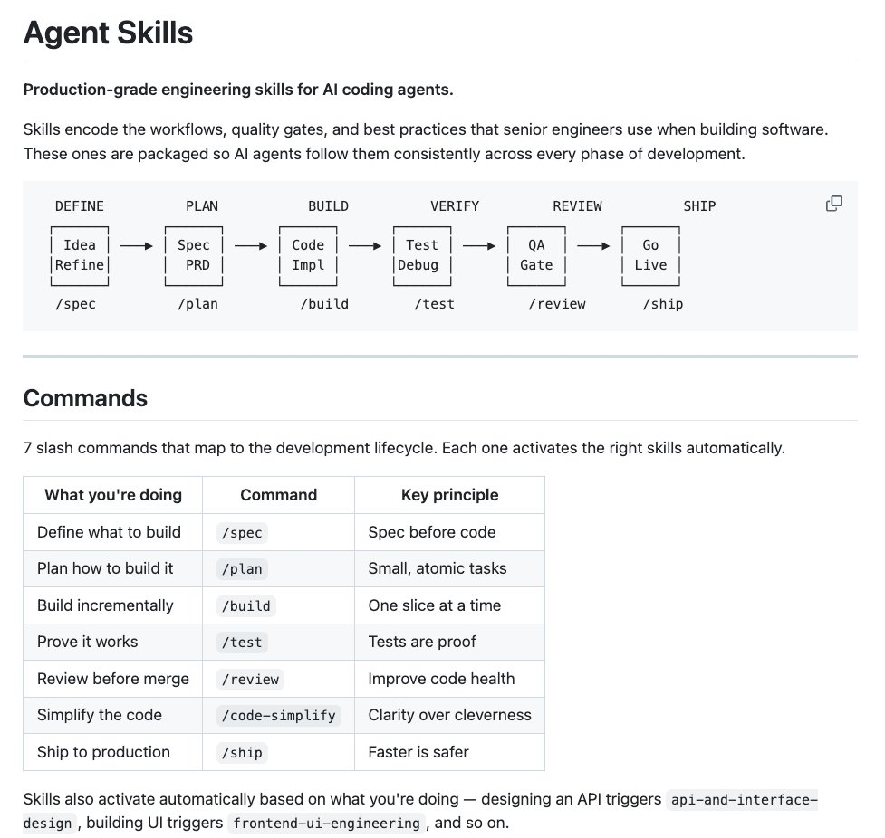

🚨 You need to see this.

@addyosmani from Google just dropped his new Agent Skills and it's incredible.

It brings 19 engineering skills + 7 commands to AI coding agents, all inspired by Google best practices 🤯

AI coding agents are powerful, but left alone, they take shortcuts.

They skip specs, tests, and security reviews, optimizing for "done" over "correct." Addy built this to fix that.

Each skill encodes the workflows and quality gates that senior engineers actually use: spec before code, test before merge, measure before optimize.

The full lifecycle is covered:

→ Define - refine ideas, write specs before a single line of code
→ Plan - decompose into small, verifiable tasks
→ Build - incremental implementation, context engineering, clean API design
→ Verify - TDD, browser testing with DevTools, systematic debugging
→ Review - code quality, security hardening, performance optimization
→ Ship - git workflow, CI/CD, ADRs, pre-launch checklists

Features 7 slash commands: (/spec, /plan, /build, /test, /review, /code-simplify, /ship) that map to this lifecycle.

It works with:
✦ Claude Code
✦ Cursor
✦ Antigravity
✦ ... and any agent accepting Markdown. Baking in Google-tier engineering culture (Shift Left, Chesterton's Fence, Hyrum's Law) directly into your agent's step-by-step workflow!

\`npx skills add addyosmani/agent-skills\`

Free and open-source.

Repo link in 🧵↓

### 🖼️ Attached Media

## 💬 Replies

### 1 @DataChaz (Charly Wargnier ♨️) (Author)

*Sat Apr 04 09:16:19 +0000 2026*

repo link:
→ [github.com/addyosmani/age…](https://github.com/addyosmani/agent-skills)

Shoutout to @addyosmani for building this and making it open-source for the community! 🤗

Don't forget to drop a ⭐️ on to help boost visibility!

### 2 @DataChaz (Charly Wargnier ♨️) (Author)

*Sat Apr 04 09:16:22 +0000 2026*

If you found this useful, a like or RT goes a long way 🦾

Follow me → @datachaz  for insights on LLMs, AI agents, and data science!

### 3 @__mharrison__ (Matt Harrison)

*Mon Apr 06 13:27:42 +0000 2026*

@DataChaz @addyosmani Pretty good. But does things in the wrong order.

### 4 @DataChaz (Charly Wargnier ♨️) (Author)

*Mon Apr 06 13:30:07 +0000 2026*

@\_\_mharrison\_\_ @addyosmani What should the right order be?

### 5 @Blum_OG (Blum)

*Sun Apr 05 21:40:47 +0000 2026*

@DataChaz @addyosmani sounds super efficient, I definitely need to take a look and test it

### 6 @alphabatcher (Alpha Batcher)

*Sat Apr 04 10:36:06 +0000 2026*

@DataChaz @addyosmani I'm overwhelmed by the sheer number of AI agents on Google

### 7 @simplydt (David T Kramaley)

*Sat Apr 04 13:47:36 +0000 2026*

@DataChaz @addyosmani guardrails over hype, essential for real AI workflows

### 8 @clwdbot (Vaclav Milizé)

*Sat Apr 04 15:09:01 +0000 2026*

the real insight hiding in plain sight: agents don't need better capabilities. they need better constraints.

every skill here is a guardrail, not a feature. "spec before code, test before merge" is just senior engineer judgment codified as rules an agent can't skip.

this is engineering culture as code. the same reason Google's best devs are good isn't talent, it's that the system forces good habits. now your agent gets the same treatment.

the question is whether teams customize these or treat them as gospel. Google's workflow isn't universal.

### 9 @CodveAi (Codve.ai)

*Sat Apr 04 11:18:10 +0000 2026*

@DataChaz @addyosmani this is the shift - from prompt engineering to system design. the agents that win are the ones with the best context, not the best prompts.

### 10 @iml1s (ImL1s)

*Sat Apr 04 10:06:12 +0000 2026*

@DataChaz @addyosmani This is huge for agent reliability. Encoding specific workflows is way better than just throwing raw LLM at problems.

### 11 @ArondeParon (Aron Rotteveel)

*Mon Apr 06 17:35:31 +0000 2026*

@DataChaz @addyosmani @leeovery right up your alley

### 12 @somi_ai (Somi)

*Sat Apr 04 13:07:35 +0000 2026*

@DataChaz @addyosmani the sequencing is what makes this work. /spec before /build means the agent can't just skip to code and fill gaps with assumptions. can you /build without running /spec first though? that'd be the real test

### 13 @AIHacksByMK (AIHacksByMK)

*Sun Apr 05 05:29:03 +0000 2026*

@DataChaz @addyosmani This approach falls apart when working with legacy codebases that don't have established specs or testing frameworks, requiring a more adaptive and exploratory workflow that Agent Skills may not accommodate.

### 14 @luminousmind_co (Lena)

*Sun Apr 05 16:45:31 +0000 2026*

@DataChaz @addyosmani 19 engineering skills AND slash commands — Addy's been building this properly. the skills activating automatically based on what you're doing is the part that changes how this feels to use

### 15 @foshuoai (foshuo)

*Mon Apr 06 14:52:24 +0000 2026*

@DataChaz @addyosmani 我先转发一下，明天上班再学。

### 16 @leeovery (Lee Overy)

*Tue Apr 07 10:07:14 +0000 2026*

@DataChaz @addyosmani I made something similar. I’ve invested serious time into this and it’s working so well…

[github.com/leeovery/agent…](https://github.com/leeovery/agentic-workflows)

Adding a RAG system atm to help instill project knowledge during all features etc.

### 17 @Poensgi (Chris Poensgen)

*Sun Apr 05 07:28:45 +0000 2026*

@DataChaz @addyosmani we build a harness for this workflow 

[x.com/poensgi/status…](https://x.com/poensgi/status/2040180443023065514?s=46)

### 18 @crypto_Jay001 (CJay)

*Sat Apr 04 18:33:21 +0000 2026*

@DataChaz @addyosmani Naive

### 19 @lorenzoborgato (Borga)

*Mon Apr 06 06:50:23 +0000 2026*

@DataChaz @addyosmani Chesterton's Fence is the tell. It's a rule about refusing to touch what you don't understand. An agent can name it in a prompt and still rip out the fence on a legacy codebase. Encoding the workflow isn't encoding the judgment.

### 20 @slimbo_klice (✨😇 Composite Man 👹✨)

*Sun Apr 05 00:21:27 +0000 2026*

@DataChaz @addyosmani I feel like i do things and then they are immediately released like the next day wtf

### 21 @ManuelBieh (Manuel Bieh)

*Tue Apr 07 09:29:21 +0000 2026*

@DataChaz @addyosmani I don't see an /abandon-project command

### 22 @ramirosalas (Ramiro Salas)

*Sun Apr 05 02:10:50 +0000 2026*

@DataChaz @addyosmani All of this has been known for quite some time. Just because Google released it doesn't mean it's 'blessed'. 

I've been using my own framework [paivot.ai](http://paivot.ai) for over a year and all that is baked in automagically and there are other frameworks that do the same.

### 23 @mrbrr347 (Brr Mr)

*Sun Apr 05 17:29:00 +0000 2026*

@DataChaz @addyosmani @grok 总结一下该怎么使用

### 24 @cristofrcharles (Christopher Charles)

*Mon Apr 06 06:30:08 +0000 2026*

@DataChaz @addyosmani Autensa does this and has for months. [autensa.com](http://autensa.com)

### 25 @isreehari (Sree Inukollu)

*Sun Apr 05 20:17:37 +0000 2026*

@DataChaz @addyosmani @grok  how this is different than superpowers [github.com/obra/superpowe…](https://github.com/obra/superpowers) ?

### 26 @TweeterDowny (Vedant Panchal)

*Fri Apr 10 08:40:01 +0000 2026*

@DataChaz @addyosmani @grok explain the terms involved

### 27 @somi_ai (Somi)

*Mon Apr 06 03:00:04 +0000 2026*

@DataChaz @addyosmani all three assume agents can reliably do long-running autonomous work, which... they can't yet. the platform race matters way less than whoever cracks multi-step reliability

### 28 @luizeof (Luiz Eduardo)

*Sun Apr 05 21:30:28 +0000 2026*

@DataChaz @addyosmani Why not Spec Kit ?

### 29 @ayayalar (∀𝗥𝕀千)

*Sat Apr 04 17:11:16 +0000 2026*

@DataChaz @addyosmani Would it work with Cline?

### 30 @ultrox (Marko)

*Sun Apr 05 21:28:47 +0000 2026*

@DataChaz @addyosmani @grok
how this is different than superpowers

### 31 @yes_iamenes (Yes, I am Enes)

*Mon Apr 06 00:49:25 +0000 2026*

@DataChaz @addyosmani I am using some skills, but didn't have a chance to test it throughly yet:
What happens if I have 2 skills for the same purpose and they don!t agree? Who is overwriting the other one?

### 32 @Seozilla_ai (Seozilla)

*Sat Apr 04 11:32:11 +0000 2026*

@DataChaz @addyosmani this looks like solid groundwork for reliable ai agents

### 33 @SamionBuchas (Samion Buchas)

*Sat Apr 04 12:20:49 +0000 2026*

@DataChaz @addyosmani Tests arre proof is misleading:
Testing can show the presence of defects, not their absence.

### 34 @taheerBuilds (taheer)

*Sun Apr 05 19:12:08 +0000 2026*

@DataChaz @addyosmani Addy is the goat!!

### 35 @0xSlarmi (Slarmi)

*Fri May 08 05:55:03 +0000 2026*

@DataChaz @TechnomancyAI @addyosmani 19 engs, overkill or just right

### 36 @TweeterDowny (Vedant Panchal)

*Fri Apr 10 08:38:36 +0000 2026*

@DataChaz @addyosmani Meaning of these words below:

Shift Left, Chesterton's Fence, Hyrum's Law

