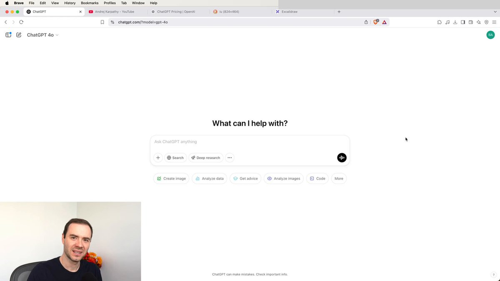

Andrej Karpathy spent 2h showing how he actually uses AI day to day

he's a co-founder of OpenAI and led AI at Tesla, so when he shows how he works, it’s worth watching

and the whole session is just him telling the machine what he wants in simple terms, like he's briefing a coworker

watch what's actually happening the entire time:

&gt; he describes the task in normal words
&gt; it goes off and does the work
&gt; he glances at the result and nudges it with one more sentence

that's the whole skill, and you've had it since you learned to talk

the only gap between that and a worker that runs on its own is handing that sentence a schedule and the tools to act

check his work, then build the version that keeps working when you stop

### 🖼️ Attached Media

## 💬 Replies

### 1 @AIwithJames (James AI)

*Sun Jun 07 11:43:48 +0000 2026*

@0xchromium Big shift: the real skill is turning plain instructions into repeatable workflows that AI can keep executing with tools, not just one-off answers.

### 2 @crediblefin (Credible)

*Mon Jun 08 11:13:39 +0000 2026*

@0xchromium incredible workflow

### 3 @sawinyh (Nick Sawinyh)

*Sun Jun 07 13:20:47 +0000 2026*

@0xchromium @karinadoteth Karpathy usage demos are useful because they're not tool worship. More like watching where friction actually disappeared from a real workflow.

### 4 @ArchiveExplorer (Archive)

*Sun Jun 07 12:51:00 +0000 2026*

@0xchromium this is exactly the video i was missing
glad his breakdown on using ai popped up for me

but i think to fully get it you should watch a few more different ones

### 5 @exploraX_ (m0h)

*Mon Jun 08 08:40:05 +0000 2026*

@0xchromium the future of workflow

### 6 @shmidtqq (shmidt)

*Sat Jun 06 18:07:51 +0000 2026*

@0xchromium karpathy explaining something is always a vibe, dude just makes it click

### 7 @nickventuri (Nick Venturi)

*Sun Jun 07 06:15:23 +0000 2026*

@0xchromium funny how the best way to code now is just explaining things

### 8 @Blum_OG (Blum)

*Sun Jun 07 15:23:02 +0000 2026*

@0xchromium Andrej Karpathy explains AI better than anyone out there

### 9 @balakhonoff (Kirill Balakhonov)

*Sun Jun 07 16:02:13 +0000 2026*

@0xchromium a lot of stuff there is obsolete , but basics remain

### 10 @Amart_AI (Alex Martin)

*Sun Jun 07 15:07:10 +0000 2026*

@0xchromium this is a year ago and is already very out of date

### 11 @dom_gag_96 (Dom Italian Builder)

*Sun Jun 07 16:43:04 +0000 2026*

@0xchromium amazing stuff

### 12 @DaveThackeray (Thack)

*Sun Jun 07 11:04:42 +0000 2026*

@0xchromium 2025? Do catch up, dog. We’re living in 3027 now.

### 13 @PorgimusPrime (Porg)

*Mon Jun 08 01:57:31 +0000 2026*

@0xchromium are you kidding me- this is ONE YEAR OLD. Why in the world is it being posted as if its new- it doesn't say it is but implied tone is clearly there.

### 14 @HenryHonto (Henry Honto)

*Mon Jun 08 11:51:44 +0000 2026*

@0xchromium 1.2 million views for a stolen YouTube video that's a year old. Wtf. [youtube.com/watch?v=EWvNQj…](https://www.youtube.com/watch?v=EWvNQjAaOHw)

### 15 @ViceSol (ViceSol)

*Sun Jun 07 13:39:20 +0000 2026*

This is completely misrepresenting his content. Karpathy's famous 2-hour video is an intensive, highly technical coding tutorial where he builds a GPT model from scratch using raw Python and PyTorch. He isn't casually chatting with an automated assistant or building passive, hands-free workflows - he is writing complex code line by line to teach fundamental machine learning

### 16 @ForestHike21 (Lost in the Forest)

*Sun Jun 07 20:04:15 +0000 2026*

FYI. This is so old it’s basically a beginner tutorial. 

Here’s my agents summary:
Yep — I pulled/transcribed the X video locally. It’s basically Karpathy doing a practical tour of how he actually uses LLMs, and the most interesting takeaways are:

Best takeaways

\- Treat the context window like working memory.
  \- When you switch topics, start a new chat.
  \- His point: old tokens are not just clutter — they can distract the model and waste budget.
  \- Timestamp: \~16:33

\- Model choice matters more than people admit.
  \- He emphasizes being intentional about which model/tier you’re using.
  \- Use cheap/fast models for routine stuff, and only pay for bigger / “thinking” models when the task justifies it.
  \- Timestamp: \~20:05 and \~30:00

\- Cross-check across models.
  \- One of his actual habits is asking multiple models the same question and seeing where they agree/disagree.
  \- That’s a very practical way to get a better first-pass answer without pretending any one model is always right.
  \- Timestamp: \~21:56

\- Use search for anything recent, changing, or niche.
  \- He draws a clean boundary:
    - model memory for common/stable knowledge
    - search tools for fresh facts, obscure topics, prices, launches, rumors, etc.
  \- He also shows that search-based outputs are often useful but still “first draft” quality, not unquestionable truth.
  \- Timestamp: \~31:27 to \~50:00

\- “Deep research” is basically search + reasoning + time.
  \- His framing is useful: deep research isn’t magic, it’s the model getting to spend minutes, not seconds, doing tool-assisted research.
  \- Good for tasks that would otherwise eat 30–90 minutes of manual browsing.
  \- Timestamp: \~42:21

\- Python/tool use is the real unlock — but verify assumptions.
  \- For math, data analysis, plots, and structured work, the model should use tools, not just “think in text.”
  \- But even when the tool execution is real, the model can still make bad assumptions around it, so you still need to inspect outputs.
  \- Timestamp: \~59:40 and \~1:07:51

\- Single-use software is becoming normal.
  \- His demo with Claude artifacts is a big mindset shift:
    - instead of hunting for the perfect app,
    - you can have the model generate a tiny custom app just for your task.
  \- That’s a pretty important change in how software gets created/used.
  \- Timestamp: \~1:09:16

\- Voice is massively underrated.
  \- Probably the most practical behavior change from the whole video:
    - talk to the model instead of typing
  \- He explicitly says a huge share of his own usage is voice because it’s faster and lower friction.
  \- Timestamp: \~1:27:23

\- Multimodal use is already very real.
  \- He treats image/camera/audio input as normal:
    - point the camera at books/devices/maps
    - ask the model what it sees
    - use it as a live assistant
  \- This makes the model feel less like “chatbot” and more like a general interface.
  \- Timestamp: \~1:40:00 to \~1:50:00

\- Prompting lesson: be concrete, give examples, save reusable setups.
  \- His advice is not “learn prompt magic.”
  \- It’s:
    1. clearly describe the task
    2. give examples
    3. save repeatable workflows as custom GPTs/instructions
  \- In other words: good delegation beats clever prompting.
  \- Timestamp: \~1:59:48

My one-line summary

The deepest point of the video is:

 The winning skill is not “knowing AI tricks” — it’s being able to clearly delegate work, choose the right tools, and quickly verify the result.

That’s why the Chromium post resonated: Karpathy’s workflow really does look like briefing a competent junior coworker, then nudging/checking.

### 17 @MitchellAGordon (Mitchell Gordon)

*Sun Jun 07 19:12:11 +0000 2026*

@0xchromium Same video on Youtube
[youtube.com/watch?v=EWvNQj…](https://www.youtube.com/watch?v=EWvNQjAaOHw)

for those who want to talk to the transcript

### 18 @florentmsl (florent)

*Mon Jun 08 07:55:56 +0000 2026*

@0xchromium DISCLAIMER: that this video is almost a year old. Tools and workflows have changed massively. This was even pre-OpenClaw

..next time add it yourself because people would waste their time on this

### 19 @OmerGal16 (Omer Gal)

*Sun Jun 07 13:27:12 +0000 2026*

@0xchromium This video is over a year old. A lot has changed in the AI scene since then. Posting about it now as if it’s new is misleading.

### 20 @glitchtruth (Glitch Truth)

*Sun Jun 07 10:10:11 +0000 2026*

@0xchromium Most people prompt like they're asking a search engine. Karpathy's showing the real skill: write out exactly what you need.

That's transferable.

### 21 @im_ytoufik (Youssef Toufik)

*Sun Jun 07 13:00:58 +0000 2026*

@0xchromium we need more video @karpathy, please have fun for 3 hours and record it so we can all have fun watching it haha 😅

### 22 @gm297589919292 (vvs)

*Sun Jun 07 14:40:58 +0000 2026*

Midwits obsess over workflows and other worthless shit when all you really need to do nowadays is to get Hermes agent, wire it to GPT 5.5 xhigh, dump all env on him and then say "fix this". I just RAW DOG bare metal servers nowadays. Even github is worthless legacy software. We're 1-2 generations away from programming languages themselves becoming worthless because AI will just code the binary directly

### 23 @koharishant (Ishant)

*Sun Jun 07 15:27:51 +0000 2026*

@0xchromium @grok summarise whats he talking about in the video

### 24 @jelukas89 (Jesús Lucas)

*Sun Jun 07 13:55:59 +0000 2026*

@0xchromium 🛑This video is from a year ago... things have actually changed a lot since then.

### 25 @leakorsawe (Lea Marie Korsawe)

*Sun Jun 07 14:07:08 +0000 2026*

@0xchromium How is he just capable of only having 5 tabs open? I mean: 

### 26 @SSXToTheMoon (StarShipX)

*Sun Jun 07 04:11:03 +0000 2026*

仕事の方法を説明するとき、アンドレイ・カルパシーはAIをどのように使っているかを2時間かけて実演しました。彼はOpenAIの共同創設者であり、TeslaでAIを主導しているため、彼が自分の作業方法を示すときは見る価値があります。彼のセッション全体が、彼が単純な言葉で機械に指示を与えるだけであり、まるで同僚にブリーフィングしているかのようです。そのスキルの秘訣は、普通の言葉でタスクを説明し、それを機械に任せ、結果をほんの少し見てからさらに1つの文で修正することです。それがすべてであり、話すことを覚えたときからあなたはそれを持っていました。それと自動的に動作する労働者の間の唯一の隔たりは、その文にスケジュールと行動するためのツールを渡すことです。彼の仕事をチェックして、そしてあなたが止めたときにも作業を続けるバージョンを構築してください。

### 27 @Aghp8d (A)

*Sun Jun 07 18:25:34 +0000 2026*

@0xchromium briefing it like a human, not programming it like a machine.

that's the whole game now.

the best interface was always language.

### 28 @liu360567 (book or technique)

*Sun Jun 07 16:49:52 +0000 2026*

@0xchromium Totally felt this in my bones.  
Talking to AI feels oddly natural now.  
Anyone else just winging it like that?

### 29 @aiseomastery (AI Mastery Guide)

*Sun Jun 07 23:32:30 +0000 2026*

@0xchromium "That's the whole skill and you've had it since you learned to talk" is genuinely the most reassuring thing I've read about AI all year

### 30 @rohan_x2 (Rohan)

*Mon Jun 08 10:10:14 +0000 2026*

@0xchromium I thought, if only I could get myself to watch the full video. Until I heard it was shot in 2025. One year ago in AI is like a decade behind relevance.

### 31 @anu_realm (Anu — the NPC)

*Sun Jun 07 19:12:54 +0000 2026*

@0xchromium So you stole a 2h video from @karpathy, reupload on your account instead of linking it… for what? Views? @X payouts?

### 32 @rag_upta (Rachit Gupta)

*Mon Jun 08 03:42:02 +0000 2026*

@0xchromium You don’t need to be Karpathy to understand and reason at this level. Any good senior engineer at this point in time is doing exactly what Karpathy does.. mostly more.. at scale.. just that there aren’t a lot of us who have enough motivation to make such videos and post 😅

### 33 @Nicoqp (Nico)

*Sun Jun 07 11:50:22 +0000 2026*

@0xchromium good instructions make or break or systems

### 34 @Serantych (sunick)

*Sun Jun 07 15:27:27 +0000 2026*

@0xchromium the "nudge with one more sentence" part is underrated - that's where taste actually matters

### 35 @0x_pr1me (pr1me)

*Mon Jun 08 10:33:24 +0000 2026*

@0xchromium we all should create our own ecosystems within claude, imagine having your personal advisor, analyst, designer etc. all on your computer 24/7

### 36 @Bishgare (Bishnu Gaire)

*Mon Jun 08 09:21:22 +0000 2026*

@0xchromium FFS this was last century - waisted my 2 mins to go and and check if he actually posted anything recently 😡

