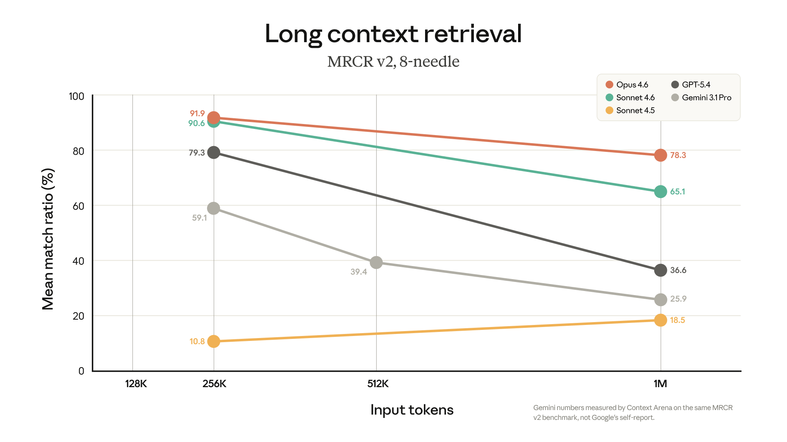

# 1M context is now generally available for Opus 4.6 and Sonnet 4.6

> Standard pricing now applies across the full 1M window for both models, with no long-context premium. Media limits expand to 600 images or PDF pages. ‍

Claude Opus 4.6 and Sonnet 4.6 now include the full 1M context window at standard pricing on the Claude Platform. Standard pricing applies across the full window — $5/$25 per million tokens for Opus 4.6 and $3/$15 for Sonnet 4.6. There's no multiplier: a 900K-token request is billed at the same per-token rate as a 9K one.

**What's new with general availability:**

* **One price, full context window.** No long-context premium.
* **Full rate limits at every context length.** Your standard account throughput applies across the entire window.
* **6x more media per request**. Up to 600 images or PDF pages, up from 100. Available today on Claude Platform natively, Microsoft Foundry, and Google Cloud’s Vertex AI.
* ​​**No beta header required.** Requests over 200K tokens work automatically. If you're already sending the beta header, it's ignored so no code changes are required.

**1M context is now included in Claude Code for Max, Team, and Enterprise users with Opus 4.6.** Opus 4.6 sessions can use the full 1M context window automatically, meaning fewer compactions and more of the conversation kept intact. 1M context previously required extra usage.

### **Long context that holds up** ###

A million tokens of context only matters if the model can recall the right details and reason across them. Opus 4.6 scores 78.3% on MRCR v2, the highest among frontier models at that context length.

*Claude Opus 4.6 and Sonnet 4.6 maintain accuracy across the full 1M window. Long context retrieval has improved with each model generation.*

That means you can load an entire codebase, thousands of pages of contracts, or the full trace of a long-running agent — tool calls, observations, intermediate reasoning — and use it directly. The engineering work, lossy summarization, and context clearing that long-context work previously required are no longer needed. The full conversation stays intact.
