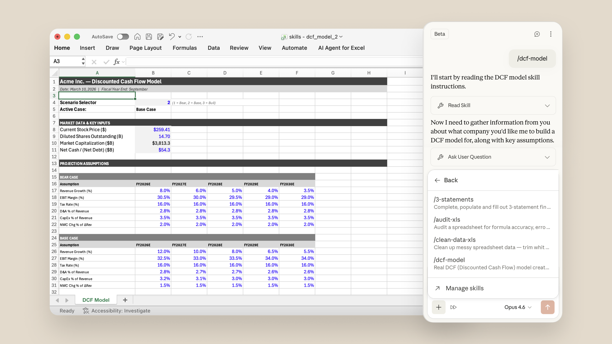

# Advancing Claude for Excel and PowerPoint

> Claude for Excel and PowerPoint now share full context across open files, and skills make any workflow instantly repeatable.

***Update:*** *Claude for Word beta now available on Team and Enterprise plans. (April 10, 2026)*

Starting today, [Claude for Excel](https://claude.com/claude-in-excel) and [Claude for PowerPoint](https://claude.com/claude-in-powerpoint) share the full context of your conversation across all open files, so every action Claude takes in one application is informed by everything that’s happening in the other.

Skills are also now available inside the Excel and PowerPoint add-ins, and Claude for Excel and PowerPoint are available via the three leading cloud platforms: Amazon Bedrock, Google Cloud’s Vertex AI, and Microsoft Foundry.

These updates enable Claude to move between tasks, spreadsheets, and slides, so you can work with a higher degree of efficiency and quality, without having to re-explain at every step.

## One conversation across Excel and PowerPoint

Claude can pass context across multiple Excel and PowerPoint files in one continuous conversation—reading cell values, writing formulas, merging data sets, editing slides, and carrying user conversations across open Excel and PowerPoint files.

A financial analyst can pull comparable company financials from an open workbook and other data sources. From there they could build out a trading comps table in Excel, drop the valuation summary into the pitch deck, and draft the email to the MD—without switching tabs or re-explaining the dataset at each step. Reducing the back-and-forth across tools is the crux of getting to a finished deliverable faster.

## Turn best practices into one-click actions with skills

[Skills](https://support.claude.com/en/articles/12512180-use-skills-in-claude) turn complete workflows into a one-click action. When someone on the team figures out the right way to run a variance analysis or compose a client deck using the firm's template, saving it as a skill makes that process instantly repeatable for the future.

We've shipped a preloaded starter set of skills that cover the most common Excel and PowerPoint use cases. For Excel, the starter skills cover the workflows that come up most often in financial analysis:

* Auditing a model for formula errors and balance-sheet integrity
* Building and populating LBO, DCF, and 3-statement model templates
* Running comparable company analyses
* Cleaning messy spreadsheet data—a range, active sheet, or whole file

For PowerPoint, the starter skills cover the presentation-layer work that follows an analysis:

* Building competitive landscape decks including market positioning and peer deep-dives
* Updating an existing deck with new information or additional data
* Reviewing an investment banking deck for number consistency, data-narrative alignment, and language polish

Every skill already set up in Claude via the desktop or web app—either personal or organization-wide—works inside the add-ins out of the box, the same way MCP connectors do. The starter skills for Excel and PowerPoint are also available through the[Financial Analysis plugin](https://github.com/anthropics/financial-services-plugins/tree/main/financial-analysis/skills), which auto-installs on both add-ins. New skills added to the plugin are available without any additional setup.

Finally, [instructions](https://support.claude.com/en/articles/12512180-use-skills-in-claude) handle persistent, app-level preferences that should always apply. This could include always using the firm’s number formatting in Excel, keeping PowerPoint bullets to one line, or flagging cells that reference hardcoded assumptions. Instructions can be set once and applied automatically without additional prompting. Claude can also help write and edit instructions for you.

## Deployment flexibility

Claude for Excel and PowerPoint can now meet customers where their compliance posture already lives. Organizations can access both add-ins with a Claude account, or route traffic through an existing LLM gateway to Claude models running on Amazon Bedrock, Google Cloud’s Vertex AI, or Microsoft Foundry. See [the guide](https://support.claude.com/en/articles/13945233-use-claude-in-excel-and-powerpoint-with-an-llm-gateway) on using Claude for Excel and PowerPoint with an LLM gateway.

Claude also powers [Agent Mode natively inside Excel](https://support.microsoft.com/en-gb/topic/use-claude-with-agent-mode-in-excel-b2c3b3ec-154b-484b-84d0-914a80df395a), so Microsoft 365 Copilot customers can build, edit, and analyze workbooks side by side with Copilot.

## Getting started

All Mac and Windows users on paid plans can access the improved communication between [Claude for Excel](https://claude.com/claude-in-excel) ([see guide](https://support.claude.com/en/articles/12650343-use-claude-for-excel)) and [Claude for PowerPoint](https://claude.com/claude-in-powerpoint) ([see guide](https://support.claude.com/en/articles/13521390-use-claude-in-powerpoint)) in beta. Skills in Excel and PowerPoint are also available on all paid plans. For best practices on getting the most out of these new tools, [register for our webinar](https://www.anthropic.com/webinars/best-practices-for-claude-in-excel-and-powerpoint).

We're proud of our partnership with Microsoft and aspire to help more people experience the power of Microsoft 365 and Claude together.

‍
