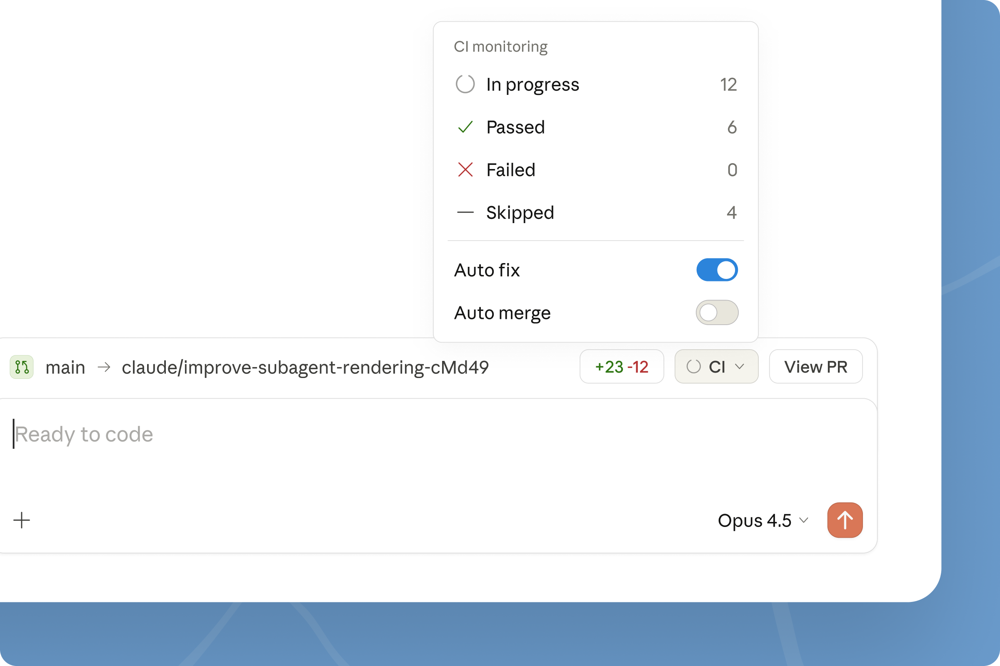

# Bringing automated preview, review, and merge to Claude Code on desktop

# 📰 Bringing automated preview, review, and merge to Claude Code on desktop

> Updates to Claude Code on desktop help you close the development loop, so you can go from writing code to merging PRs in one place.

Today, we're shipping Claude Code improvements that let you preview running apps, auto-review code, auto-fix and merge PRs, and seamlessly switch between desktop, mobile, and CLI. Together these updates help you spend less time on the toil around code and more time on the parts you enjoy.

## **Write code and see it run**

Claude Code on desktop can now start dev servers and preview your running app directly in the desktop interface. Claude views the webapp UI, reads console logs, catches errors, and keeps iterating, so you don’t have to switch to a browser and manually describe what you’re seeing to Claude. You can also select visual elements in the preview and pass feedback directly to Claude to iterate.

## **Review code before you push**

Once your changes look right, ask Claude to review them using the new “Review code” button. Claude examines your local diffs and leaves comments directly in the desktop diff view, highlighting bugs, making suggestions, and spotting potential issues inline.

You immediately get a second set of eyes to catch obvious issues before anything leaves your machine, and you can ask Claude to address the inline comments and make changes.

## **Monitor PRs without leaving the app**

For code hosted on GitHub, you can also monitor pull request status directly in the desktop app. After you open a PR, Claude Code will track its status, including CI check passes and failures, using the GitHub CLI under the hood.

You can also enable auto-fix so Claude automatically attempts to fix any CI failures it detects. If you enable auto-merge, Claude will also attempt to merge PRs once all checks pass.

You can work on one task in a Claude Code session and open a PR, then move on to a new task. In the background, Claude Code will be monitoring the PR for the original task, and will attempt to fix CI failures so that the PR is ready to merge (or is automatically merged) by the time you switch back to that task.

## **Pick up where you left off**

Sessions now move with you. When you start a session from Claude Code in the CLI, run /desktop to bring your full session context into the desktop app.

You can also move local desktop app sessions to the cloud using the “Continue with Claude Code on the web” button. Start a task on the desktop app, then pick it up from the web or your phone with the Claude mobile app.

## **Getting started**

These updates are available now to all users. Update or download [Claude Code on desktop](https://claude.com/download) to get started. Explore the[documentation](https://code.claude.com/docs/en/desktop) to learn more.
