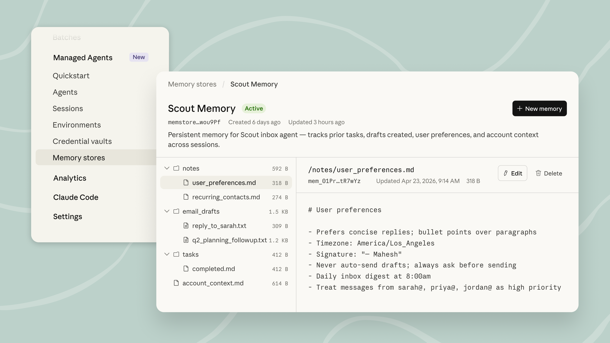

# Built-in memory for Claude Managed Agents

> Memory for Claude Managed Agents is a built-in memory layer that lets agents learn across sessions, improve over time, and share what they've learned.

Memory on [Claude Managed Agents](https://claude.com/blog/claude-managed-agents) is available today in public beta. Your agents can now learn from every session, using an intelligence-optimized memory layer that balances performance with flexibility. Because memories are stored as files, developers can export them, manage them via the API, and keep full control over what agents retain.

## How memory works in Claude Manged Agents

Memory for Claude Managed Agents is a built-in, intelligence-optimized memory layer that lets agents learn from every session. Memory is optimized against internal benchmarks for long-running agents that improve across sessions and share what they've learned with each other.

We've found that agents are most effective with memory when it builds on the tools they already use. Memory on Claude Managed Agents mounts directly onto a filesystem, so Claude can rely on the same bash and code execution capabilities that make it effective at agentic tasks. With filesystem-based memory, [our latest models](https://www.anthropic.com/news/claude-opus-4-7#:~:text=Memory.%20Opus%204.7%20is%20better%20at%20using%20file%20system%2Dbased%20memory.%20It%20remembers%20important%20notes%20across%20long%2C%20multi%2Dsession%20work%2C%20and%20uses%20them%20to%20move%20on%20to%20new%20tasks%20that%2C%20as%20a%20result%2C%20need%20less%20up%2Dfront%20context.) save more comprehensive, well-organized memories and are more discerning about what to remember for a given task.

## Portable memories for production-grade agents

Memory is built for enterprise deployments, with scoped permissions, audit logs, and full programmatic control. Stores can be shared across multiple agents with different access scopes. For example, an org-wide store might be read-only, while per-user stores allow reads and writes. Multiple agents can work concurrently against the same store without overwriting each other.

Memories are files that can be exported and independently managed via the API, giving developers full control. All changes are tracked with a detailed audit log, so you can tell which agent and session a memory came from. You can roll back to an earlier version or redact content from history. Updates also surface in the [Claude Console](https://platform.claude.com/) as session events, so developers can trace what an agent learned and where it came from.

## **What teams are building**

Teams have been using memory to close feedback loops, speed up verification, and replace custom retrieval infrastructure:

* **Netflix** agents carry context across sessions, including insights that took multiple turns to uncover and corrections from a human mid-conversation, instead of manually updating prompts and skills.
* **Rakuten's** task-based long-running agents use memory to learn from every session and avoid repeating past mistakes, cutting first-pass errors by 97%, all within workspace-scoped, observable boundaries.
* **Wisedocs** built their document verification pipeline on Managed Agents, using cross-session memory to spot and remember recurring document issues, speeding up verification by 30%.**‍**
* **Ando** is building their workplace messaging platform on Managed Agents, capturing how each organization interacts instead of building memory infrastructure themselves.
