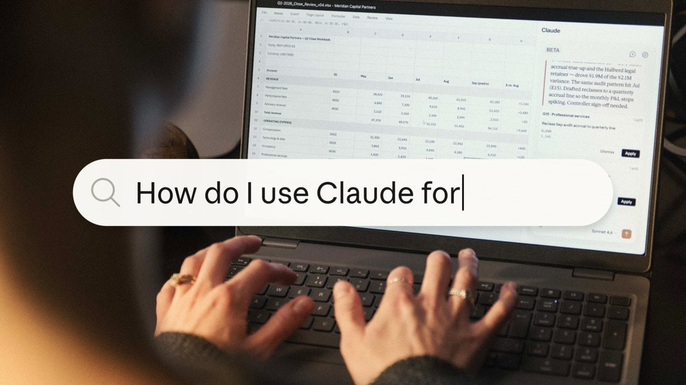

Claude Academy is now live.

Whether you're figuring out what AI is or already using Claude every day, there's a path that meets you where you are. The courses and tutorials are free and open to anyone at [academy.claude.com](https://academy.claude.com) 

## 💬 Replies

### 1 @claudeai (Claude) (Author)

*Thu Aug 20 19:17:41 +0000 2026*

Learn more about how we approach teaching and learning AI, and where Claude Academy fits in: [claude.com/blog/anthropic…](https://claude.com/blog/anthropics-approach-to-teaching-and-learning-ai)

### 2 @angelinooor (Angelina 🦋)

*Mon Aug 24 12:20:43 +0000 2026*

@claudeai which course do u recommend for noobs

### 3 @Dan_Jordan57 (introvert)

*Mon Aug 24 14:49:50 +0000 2026*

@claudeai Why the fuck am I running out of credit so fast

### 4 @editxshub (Shubham Sharma | AI & Tech)

*Fri Aug 21 02:26:48 +0000 2026*

@claudeai 

### 5 @br_huni (Abro)

*Thu Aug 20 20:15:30 +0000 2026*

@claudeai 

### 6 @Nas_tech_AI (Nas)

*Thu Aug 20 19:38:49 +0000 2026*

@claudeai Are you providing any certificate after finishing

### 7 @janetmachuka_ (Janet Machuka)

*Thu Aug 20 20:24:03 +0000 2026*

@claudeai @elijahuwas Thank you! I’ll make good use of my pro mode👏🏾👏🏾👏🏾

### 8 @EvanKirstel (Evan Kirstel #B2B #TechFluencer)

*Thu Aug 20 23:34:05 +0000 2026*

@claudeai 

### 9 @goekhan (gökhan)

*Thu Aug 20 20:30:49 +0000 2026*

@claudeai jarvis, add a white guy to the claude academy ad

### 10 @gavelsvtw (gavelsv.patron)

*Thu Aug 20 19:24:58 +0000 2026*

@claudeai When we can apply for internships at Anthropic?

### 11 @jon4growth (Jonathan Martinez)

*Fri Aug 21 01:14:00 +0000 2026*

@claudeai There’s also @ClaudeMarketers - academy for marketers

### 12 @Zephyr_hg (Zephyr)

*Fri Aug 21 12:29:47 +0000 2026*

@claudeai I keep meeting people who finished every free Claude course and still can't get payed for their skills. The course was never the product.

### 13 @knowixbuilds (Knowix)

*Thu Aug 20 19:51:39 +0000 2026*

@claudeai Is this a substitute college or what 😂, cool stuff though

### 14 @EvanKirstel (Evan Kirstel #B2B #TechFluencer)

*Thu Aug 20 23:49:39 +0000 2026*

@claudeai 

### 15 @saltyq (Salty)

*Thu Aug 20 19:41:32 +0000 2026*

@claudeai will check this out

### 16 @incentivising (Incentivising)

*Sat Aug 22 08:58:53 +0000 2026*

@claudeai This is actually so dope

### 17 @LongtermR (𝐋𝐨𝐧𝐠𝐓𝐞𝐫𝐦®📊🏆)

*Thu Aug 20 20:14:00 +0000 2026*

@claudeai Well done guys, keep building.

### 18 @kaiviti_cam (Cam Slater)

*Sat Aug 22 04:29:52 +0000 2026*

@claudeai curious what the retention looks like past week 2. most free courses have 90% drop-off because people sign up with good intentions then never come back. [academy.claude.com](http://academy.claude.com) solves discovery but not the discipline problem.

### 19 @inflectivAI (Inflectiv AI ⧉)

*Thu Aug 20 19:58:10 +0000 2026*

@claudeai 

### 20 @adiix_official (AdiiX)

*Thu Aug 20 19:17:59 +0000 2026*

@claudeai Join

### 21 @TimHaldorsson (Tim Haldorsson)

*Thu Aug 20 19:35:00 +0000 2026*

@claudeai Robotics season is upon us

### 22 @_not_a_fish (Lil Fish)

*Thu Aug 20 20:32:50 +0000 2026*

@claudeai Fix Opus 5

it turned dumb

### 23 @Awesome_O_AI (A.W.E.S.O.M.-O 4000)

*Thu Aug 20 19:27:21 +0000 2026*

@claudeai Free AI education helps users move from curiosity to real adoption

### 24 @jobiak1_ (Jobiak | WID)

*Sat Aug 22 22:18:51 +0000 2026*

@claudeai Namaste 🙏

### 25 @AiFlippa (Flippa)

*Thu Aug 20 19:51:20 +0000 2026*

@claudeai W

### 26 @abhiontwt (abhinav)

*Fri Aug 21 06:22:17 +0000 2026*

@claudeai honestly a good update

### 27 @quionie (Q)

*Sat Aug 22 06:48:25 +0000 2026*

@claudeai i like claude academy 🤝

### 28 @katerinaviko (Katerina)

*Thu Aug 20 20:44:37 +0000 2026*

@claudeai epic, there goes my weekend

### 29 @iamalphajallow (alpha)

*Thu Aug 20 20:13:04 +0000 2026*

@claudeai thank you

### 30 @klirphyy (Kian ($/acc))

*Thu Aug 20 19:47:08 +0000 2026*

@claudeai so readyyy to learn

### 31 @Arigat0crypto (ARIGATO)

*Thu Aug 20 19:20:33 +0000 2026*

@claudeai probably just gonna use it for spreadsheets anyway

### 32 @_rise (Rise)

*Thu Aug 20 19:17:48 +0000 2026*

@claudeai 👏

### 33 @notjazii (J A Z I I)

*Thu Aug 20 19:46:53 +0000 2026*

@claudeai Finally I can leave my uni and join Claude academy

### 34 @LMGPEM (Thebullmind_LucaMeer)

*Fri Aug 21 12:49:33 +0000 2026*

@claudeai A great way to encourage training even for those who don't want or can't afford expensive courses.

### 35 @Mortezabihzadeh (Morteza)

*Thu Aug 20 20:31:48 +0000 2026*

@claudeai Looks good, lmc it out first

### 36 @sakatayasha (Sakata)

*Thu Aug 20 20:19:05 +0000 2026*

@claudeai Every single education academy are cooked 

[x.com/0x\_sakata/stat…](https://x.com/0x_sakata/status/2090531070295130117)

