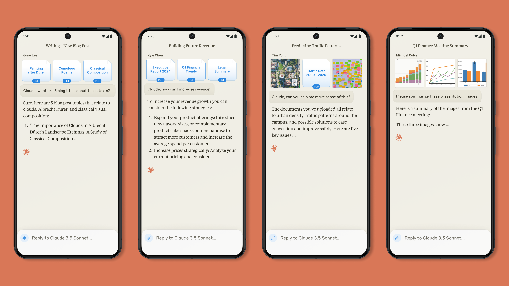

# Claude Android app

> Claude is now available on Android with full vision, multilingual, and reasoning capabilities across web, iOS, and Android platforms.

The new Claude Android app brings the power of Claude—including our most powerful model, Claude 3.5 Sonnet—to Android users. The app is free and accessible with all plans, including Pro and Team.

The Claude Android app works just like Claude on iOS and the web, meaning you get access to:

* **Multi-platform support:** Pick up and continue conversations with Claude across [web](https://claude.ai), [iOS](https://apps.apple.com/us/app/claude-by-anthropic/id6473753684), and [Android](https://play.google.com/store/apps/details?id=com.anthropic.claude) apps
* **Vision capabilities:** Take new pictures or upload files for real-time image analysis
* **Multilingual processing:** Real-time language translation to help communicate or translate aspects of the world around you
* **Advanced reasoning:** Claude can help you tackle complex problems, like analyzing contracts while traveling or conducting market research to prepare for a meeting

## Talk to Claude from anywhere

Use Claude for work or for fun. Whether you're drafting a business proposal between meetings, translating menus while traveling, brainstorming gift ideas while shopping, or composing a speech while waiting for a flight, Claude is ready to assist you.

## Get started

To get started with the Claude Android app, download it on [Google Play](https://play.google.com/store/apps/details?id=com.anthropic.claude).
