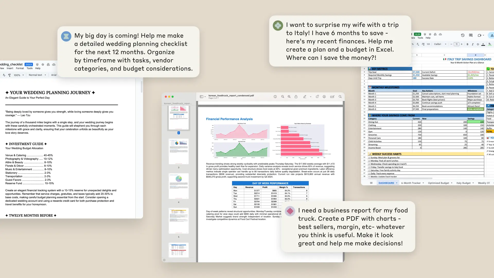
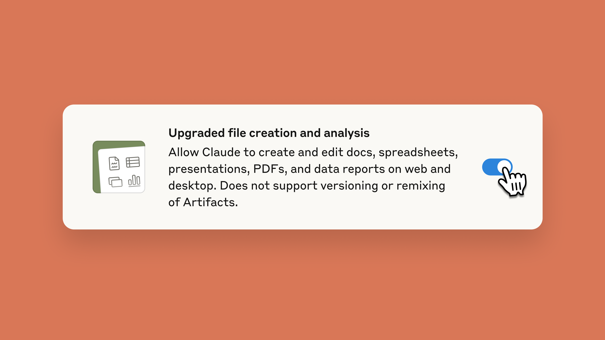

# Claude can now create and edit files

# 📰 Claude can now create and edit files

> Describe what you need and get back ready-to-use spreadsheets, documents, presentations, and PDFs instead of just text responses.

**Update:** Now generally available for paid plans with network and egress controls (October 21, 2025).

Claude can now create and edit Excel spreadsheets, documents, PowerPoint slide decks, and PDFs directly in [Claude.ai](https://claude.ai/) and the desktop app. This transforms how you work with Claude—instead of only receiving text responses or in-app artifacts, you can describe what you need, upload relevant data, and get ready-to-use files in return.

File creation is now available as a preview for Max, Team, and Enterprise plan users. Pro users will get access in the coming weeks.

### What you can do ###

Claude creates actual files from your instructions—whether working from uploaded data, researching information, or building from scratch. Here are just a few examples:

* **Turn data into insights**: Give Claude raw data and get back polished outputs with cleaned data, statistical analysis, charts, and written insights explaining what matters.
* **Build spreadsheets**: Describe what you need—financial models with scenario analysis, project trackers with automated dashboards, or budget templates with variance calculations. Claude creates it with working formulas and multiple sheets.
* **Cross-format work**: Upload a PDF report and get PowerPoint slides. Share meeting notes and get a formatted document. Upload invoices and get organized spreadsheets with calculations. Claude handles the tedious work and presents information how you need it.

‍

Whether you need a customer segmentation analysis, sales forecasting, or budget tracking, Claude handles the technical work and produces the files you need. File creation turns projects that normally require programming expertise, statistical knowledge, and hours of effort into minutes of conversation.

### **How it works: Claude’s computer** ###

Over the past year we've seen Claude move from answering questions to completing entire projects, and now we're making that power more accessible. We've given Claude access to a private computer environment where it can write code and run programs to produce the files and analyses you need.

This transforms Claude from an advisor into an active collaborator. You bring the context and strategy; Claude handles the technical implementation behind the scenes. This shows where we’re headed: making sophisticated multi-step work accessible through conversation. As these capabilities expand, the gap between idea and execution will keep shrinking.

### **Getting started** ###

To start creating files:

1. Enable "Upgraded file creation and analysis" under [Settings \> Features \> Experimental](https://claude.ai/settings/features)
2. Upload relevant files or describe what you need
3. Guide Claude through the work via chat
4. Download your completed files or save directly to Google Drive

Start with straightforward tasks like data cleaning or simple reports, then work up to complex projects like financial models once you're comfortable with how Claude handles files.

This feature gives Claude internet access to create and analyze files, which may put your data at risk. Monitor chats closely when using this feature. [Learn more](https://support.anthropic.com/en/articles/12111783-create-and-edit-files-with-claude).
