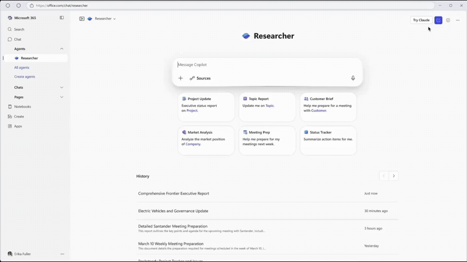

# Claude is now available in Microsoft 365 Copilot

> Today, Microsoft announced that Claude models are now available in Microsoft 365 Copilot, bringing Claude to millions of enterprise users through Microsoft's productivity platform.

Today, Microsoft announced that Claude models are now available in Microsoft 365 Copilot, bringing Claude to millions of enterprise users through Microsoft's productivity platform.

Starting with Microsoft's Researcher agent and Copilot Studio, enterprise customers can now choose Claude Sonnet 4 and Opus 4.1 alongside existing model options, giving organizations greater flexibility to select the right AI for their specific business needs.

The addition of Claude Sonnet 4 and Claude Opus 4.1 help Microsoft bring the best AI innovation from across the industry to Microsoft 365 Copilot, tuned for work and tailored to your business needs.

**How Anthropic models now show up in Microsoft 365 Copilot:**

* **Researcher agent**: Microsoft’s reasoning agent can now be powered by Claude Opus 4.1. Whether you’re building a detailed go-to-market strategy, analyzing emerging product trends, or creating a comprehensive quarterly report, you can now select your preferred model to power in-depth work. Researcher helps you tackle complex, multistep research—reasoning over not only the web and trusted third-party data, but all of your work content across your emails, chats, meetings, files, and more to deliver highly-skilled expertise on demand—and now you have model choice.
* **Copilot Studio**: Claude Sonnet 4 and Claude Opus 4.1 models are now available as model options in Copilot Studio, enabling you to easily create and customize enterprise-grade agents. With this launch, you can build, orchestrate, and manage agents powered by Anthropic models for deep reasoning, workflow automation, and flexible agentic tasks. With multiagent systems and prompt tools in Copilot Studio, you can choose Claude for specialized tasks as you see fit.

Once you opt-in, you’ll be able to choose Claude in Researcher with ease.

*Claude Opus 4.1 is now available in Microsoft's Researcher agent, allowing teams to tackle complex, multi-step research powered by Anthropic's industry-leading AI.*

**Getting started**

Claude in Researcher is rolling out today via Microsoft’s Frontier Program to Microsoft 365 Copilot licensed customers who opt in. To build agents, users can also opt in to try Claude in Copilot Studio through the Frontier Program. Anthropic models are hosted outside Microsoft-managed environments and subject to Anthropic’s Terms and Conditions. To get started, an organization’s admin can enable access to Anthropic models in the Microsoft 365 admin center. Learn more [here](https://go.microsoft.com/fwlink/?linkid=2334803).

Stay tuned for additional Claude experiences within the Microsoft 365 ecosystem, and learn more about Claude's enterprise capabilities and our commitment to safe, trusted AI at [anthropic.com/enterprise](http://anthropic.com/enterprise). Additional details are available in [Microsoft’s launch blog](https://www.microsoft.com/en-us/microsoft-365/blog/2025/09/24/expanding-model-choice-in-microsoft-365-copilot/).
