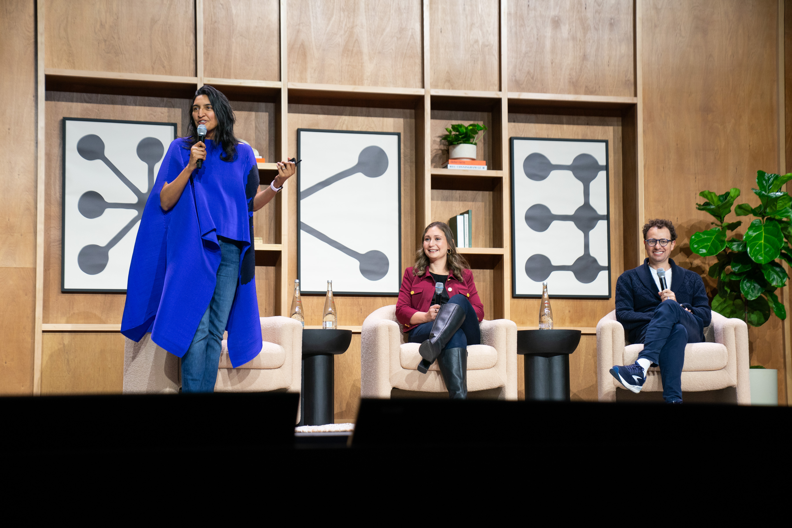
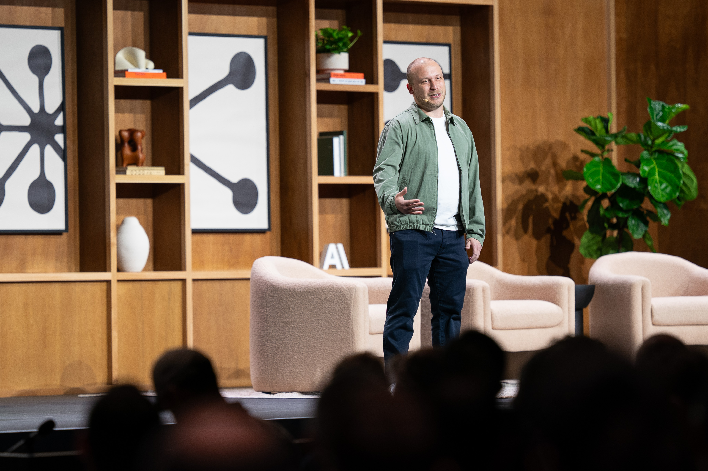

# Code w/ Claude SF 2026 recap: Building on the AI exponential

# 📰 Code w/ Claude SF 2026 recap: Building on the AI exponential

> Missed our SF Code w/ Claude developer conference? Keynotes and breakout sessions are now on YouTube.

This week in San Francisco, we hosted [Code w/ Claude](https://claude.com/code-with-claude/san-francisco#agenda), our annual developer conference. The event brought together developers, engineers, and founders for two days of keynotes, breakout sessions, and workshops with the teams building Claude.

From prompting and [model selection](https://www.youtube.com/watch?v=OXJO4LldSnc&list=PLmWCw1CzcFim2obQ-w3ohbULOfwp5lApR&index=12) to architecting skills and [scaling AI-native engineering teams](https://www.youtube.com/watch?v=igO8iyca2_g&list=PLmWCw1CzcFim2obQ-w3ohbULOfwp5lApR&index=11), every session circled the same shift: the distance between an idea and production software is narrowing, and the teams getting the most leverage are designing for the AI exponential—not reacting to it.

We demonstrated this through [live coding sessions](https://www.youtube.com/watch?v=DlTCu_pNDHE&list=PLmWCw1CzcFim2obQ-w3ohbULOfwp5lApR&index=5), [customer deep-dives](https://www.youtube.com/watch?v=EdmuYPBt_EM&list=PLmWCw1CzcFim2obQ-w3ohbULOfwp5lApR&index=2), and hands-on tutorials highlighting what this looks like today.

*Daniela Amodei, Co-founder and President, and Dario Amodei, Co-founder and CEO, participate in a fireside chat moderated by Ami Vora, CPO.*

## What we announced

Announced at the conference, we [doubled rate limits on Claude Code](https://www.anthropic.com/news/higher-limits-spacex) and raised API limits for Claude Opus so developers, startups, and enterprises can build more reliably at scale. Both changes are now live.

We also introduced new capabilities to [Claude Managed Agents](https://platform.claude.com/docs/en/managed-agents/overview) on the Claude Platform aimed at helping teams build and deploy cloud-hosted agents at scale. Four [new features](https://claude.com/blog/new-in-claude-managed-agents) are now available to all developers:

* **Dreaming.** A scheduled process that reviews past agent sessions, surfaces patterns, and curates memory, so agents improve between runs. Recurring mistakes, shared workflows, and team preferences get pulled into a more useful memory store.
* **Multiagent orchestration.** A lead agent can delegate to specialist subagents working in parallel on a shared filesystem, each with its own model, prompt, and tools. The whole flow is traceable in the Claude Console.
* **Outcomes.** Developers define a rubric for what a good output looks like. A separate grader evaluates each result in its own context window and sends the agent back to revise until it meets the bar. On our internal benchmarks, outcomes lifted task success by up to 10 points on the hardest problems.
* **Webhooks**: Once you’ve defined an outcome, you can let the agent run, and get notified by a webhook when it's done.

## In case you missed it

*Boris Cherny, creator of Claude Code, presents during Code w/ Claude 2026 in San Francisco.*

If you missed the livestream, check out our keynote and breakout session recordings, [here](https://www.youtube.com/playlist?list=PLmWCw1CzcFim2obQ-w3ohbULOfwp5lApR).

Our talks go behind the scenes of building Claude with Anthropic teams and share how customers like [Asana](https://www.youtube.com/watch?v=BrpB-h1e--k&list=PLmWCw1CzcFim2obQ-w3ohbULOfwp5lApR&index=10), [Cursor](https://www.youtube.com/watch?v=BbYSGxtsMic&list=PLmWCw1CzcFim2obQ-w3ohbULOfwp5lApR&index=15), [GitHub](https://www.youtube.com/watch?v=y5TmF_6o6xk&list=PLmWCw1CzcFim2obQ-w3ohbULOfwp5lApR&index=7), [Replit](https://www.youtube.com/watch?v=snroDwX1-JU&list=PLmWCw1CzcFim2obQ-w3ohbULOfwp5lApR&index=14), and [Vercel](https://www.youtube.com/watch?v=bJKdXhnw7NU&list=PLmWCw1CzcFim2obQ-w3ohbULOfwp5lApR&index=3&pp=iAQB0gcJCQMLAYcqIYzv) about how they’re designing production-ready agents and pushing the boundaries of agentic development.

We’ll be taking [Code w/ Claude to London](https://claude.com/code-with-claude/london) (May 20-21) and [Tokyo](https://claude.com/code-with-claude/tokyo) (June 5-6). All Day 1 keynotes and breakout sessions will be streamed live.

*Stay tuned for technical tutorials, guides, and customer stories inspired by our talks.*

‍
