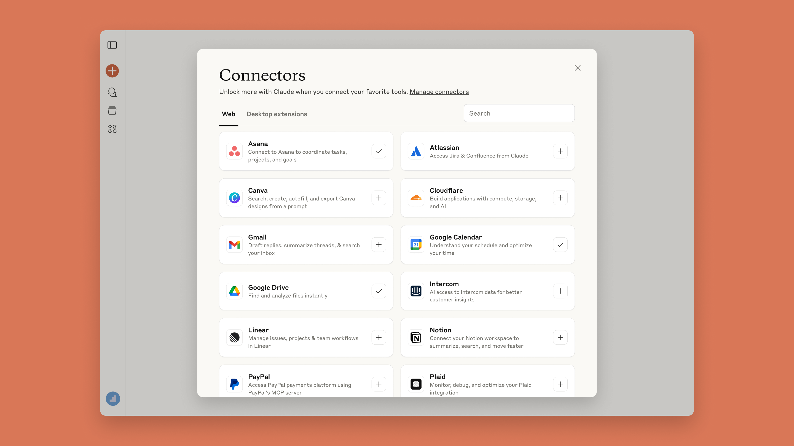

# Discover tools that work with Claude

# 📰 Discover tools that work with Claude

> Browse and connect Claude to your favorite apps and tools with one-click. ‍

Today, we are introducing a new directory of tools that connect to Claude, which you can explore and try with a single click. We are also featuring new connectors, built by our partners, to remote services like Notion, Canva, and Stripe and local desktop applications like Figma, Socket, and Prisma.

Now Claude can have access to the same tools, data, and context that you do—transforming it from a helpful assistant into an informed AI collaborator that gives you more relevant responses and can work with you directly in your tools.

### Context changes everything ###

Most AI interactions start with you explaining everything. Your project details, your deadlines, your tools—over and over again. It's like starting from scratch every time.

You might ask Claude to *"write release notes for our latest features"* and get a helpful template. By connecting Claude to tools like Linear, you could instead ask Claude to *"write release notes for our latest sprint from Linear"* and it pulls your actual Linear tickets and generates professional release notes—ready to publish.

Here are some ways you could use Claude with connected tools:

* **Ship faster:** Turn Claude discussions into organized Notion roadmaps
* **Create designs:** Transform creative briefs into Canva social media posts
* **Improved design to code:** Turn Figma files into production-ready code
* **Manage payments:** Access Stripe customer data and payment information

### Getting started ###

You can explore our directory of recommended tools at [claude.ai/directory](http://claude.ai/directory). Click "Connect" to authenticate (or “Install” for desktop extensions), and Claude gains access to your work context. You can also browse featured tools at [anthropic.com/partners/mcp](https://www.anthropic.com/partners/mcp).

The directory is available now to all Claude users on web and desktop. Local desktop extensions are available through the Claude Desktop app. Connectors to remote apps and services are available to paid plan users only.
