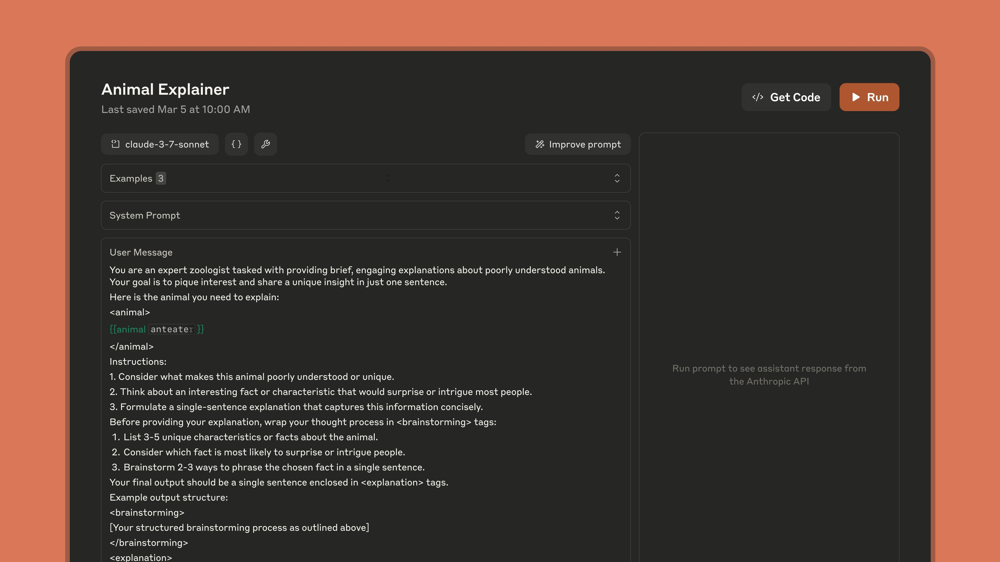
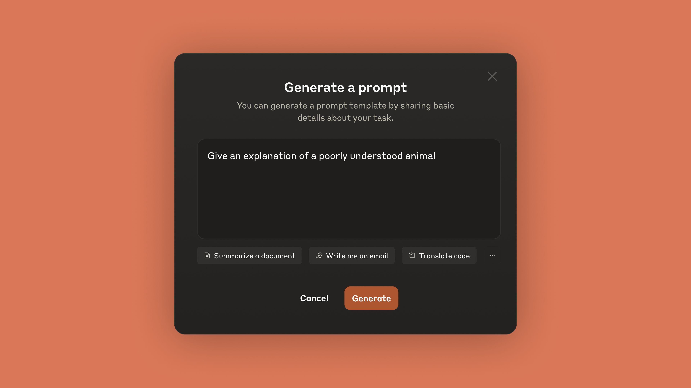
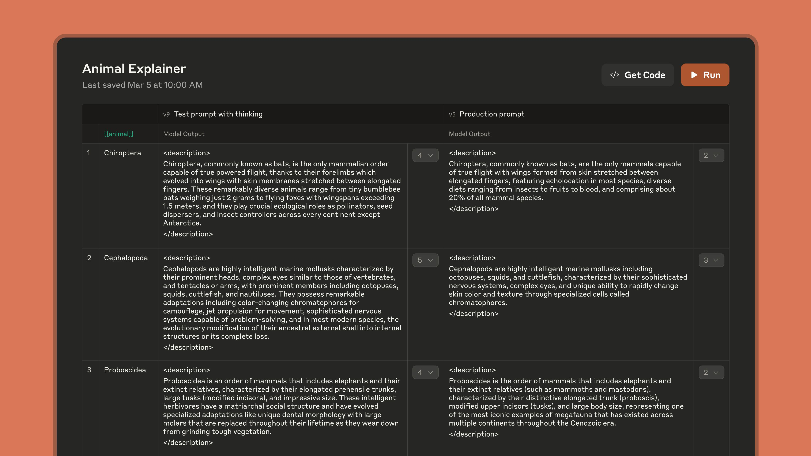
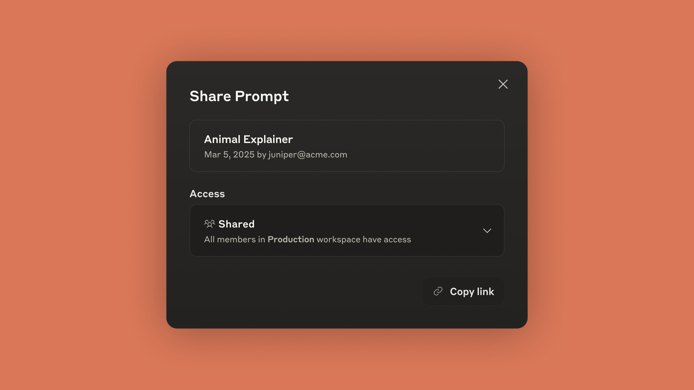
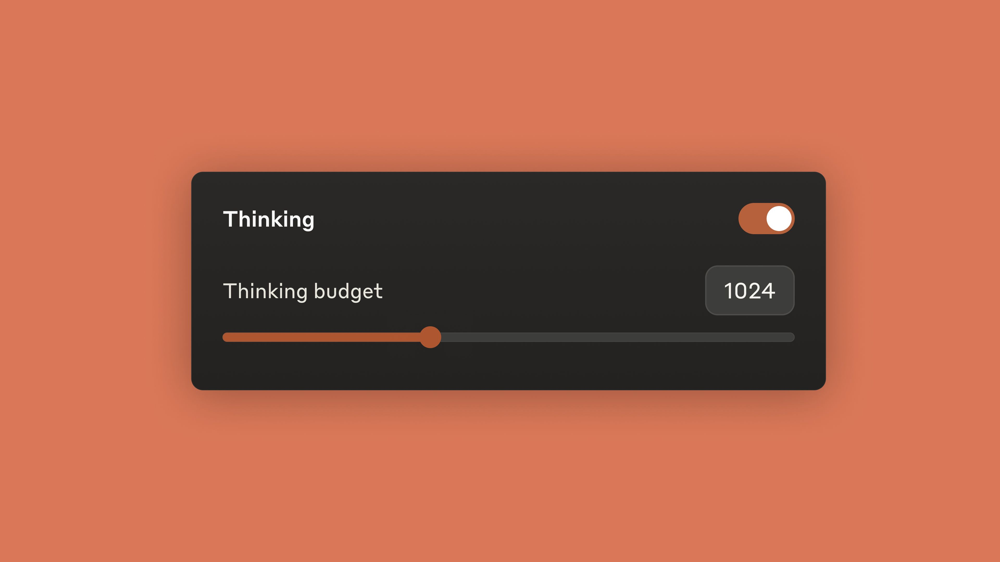

# Get to production faster with the upgraded Anthropic Console

# 📰 Get to production faster with the upgraded Anthropic Console

> We've redesigned the Anthropic Console to serve as one place to build, test, and iterate on your AI deployment with Claude and your teammates. Developers can now share prompts to collaborate with teammates directly in the Anthropic Console . We've also added support for our latest model, Claude 3.

We've redesigned the Anthropic Console to serve as one place to build, test, and iterate on your AI deployment with Claude and your teammates.

Developers can now share prompts to collaborate with teammates directly in the [Anthropic Console](https://console.anthropic.com/). We've also added support for our latest model, Claude 3.7 Sonnet, and the ability to control the extended thinking budget.

### Build reliable AI applications ###

Prompt quality plays a significant role in how successful a model's responses are for a given task. The Anthropic Console already streamlines AI development with tools to write, evaluate, and optimize prompts more efficiently.

**Write prompts:** Use the Workbench to structure your prompts effectively, incorporate examples, and integrate external tools, in an interactive environment for testing API calls.

**Automatically generate prompts:** Describe what you want to achieve, and Claude will use prompt engineering techniques such as chain-of-thought reasoning to create an effective, precise, and reliable prompt.

**Evaluate model responses:** Evaluate your prompts against real-world scenarios with automatic test case generation and side-by-side output comparison. Easily run test suites, grade response quality, and make data-driven decisions about which prompts to deploy.

**Improve prompts:** Automatically refine prompts using advanced prompt engineering techniques. This is ideal for adapting prompts that were originally written for other AI models, as well as for optimizing hand-written prompts.

After finalizing your prompt, you can click “Get Code” for a production-ready API call you can immediately deploy.

### Collaborate with shareable prompts ###

Developers, domain experts, product managers, and QA specialists often need to collaborate on prompts to achieve optimal results. Previously, teams resorted to copying and pasting prompts between documents or chat applications, leading to version control issues and knowledge silos.

Shareable prompts in the Anthropic Console now provide a centralized way to develop, refine, and standardize prompts across your organization. Team members can access and collaborate on a shared library of prompts, making it easier to establish best practices and ensure consistent quality across all your Claude-powered applications.

### Optimize prompts for extended thinking ###

[Claude 3.7 Sonnet](https://www.anthropic.com/news/claude-3-7-sonnet), our latest and most intelligent model to date, can produce near-instant responses or extended, step-by-step thinking that is made visible to the user.

While prompting generally works the same with extended thinking enabled, we've made it easy to optimize prompts to make the most of this new capability. Simply specify the prompt will be used with extended thinking on, and Claude will generate the best responses possible. You can also use the Anthropic Console to control the *budget* for thinking by setting a max number of thinking tokens.

### Get started ###

The upgraded Anthropic Console is now available to all users. [Log in](https://console.anthropic.com/) to get started or explore our [documentation](https://docs.anthropic.com/en/docs/build-with-claude/prompt-engineering/overview) to learn more.
