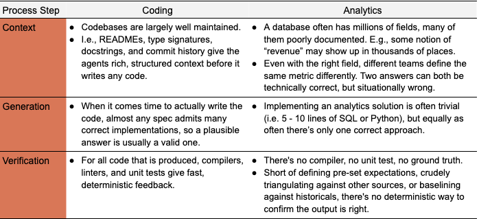

# How Anthropic enables self-service data analytics with Claude

# 📰 How Anthropic enables self-service data analytics with Claude

> How Anthropic enables self-service data analytics with Claude: the governed data foundations, sources of truth, skills, and validation techniques that make AI-driven analytics trustworthy.

As many data science and data engineering teams can attest, enabling self-service data analytics has traditionally been a slog.

Making the data model more accessible to less technical coworkers via wide and denormalized tables often leads to overlapping views with inconsistent definitions as the business scales (and does little to bridge the gap for employees with little desire to learn SQL). Alternatively, creating more ringfenced environments for users often misses the long tail of business questions and leads to metric and dashboard bloat as teams silo their work.

The rise of LLMs provides an additional path for self-service analytics that avoids those challenges. However, pointing Claude at a warehouse and letting the agents execute can create a false sense of precision.

The initial elation of liberation from ad-hoc requests turns into dread with the realization that this setup separates stakeholders from the underlying infrastructure, documentation, and expertise that previously steered them toward carefully curated datasets. 

At Anthropic, 95% of business analytics queries are automated via Claude, with \~95% accuracy in aggregate. By giving this often rote, repetitive work to Claude, our data science team can focus on more strategic work like causal modeling, forecasting, and machine learning. 

After meeting with dozens of Anthropic’s top Claude Code users and having seen myriad design patterns for analytics agents, we’ve cultivated some best practices for other data teams working with LLMs. In this post, we’ll share these tips and approaches to maximizing Claude’s ability to drive self-serve business insights, including:

* Why analytics accuracy is a context and verification problem, not a code generation issue;
* The three failure modes that cause most errors; 
* The agentic analytics stack we built to address these errors;
* How we measure effectiveness; and
* A basic template for how we create the majority of our skills (see the appendix)

## **Data is not software**

LLMs' generative abilities are a double-edged sword: the mechanisms that enable creative solutions to complex problems can also hallucinate erroneous output. To fully understand the challenges with analytics agents, it’s useful to compare them to coding agents.

Coding is an open-ended solution space that rewards the models' creativity, while documentation and tests provide natural guardrails against hallucination. In contrast, for analytics use cases, there’s often only a single correct answer using a single correct source in which there’s no deterministic way of proving the correctness. 

For self-service agentic business analytics, the complexity mainly lies in the ambiguity of the data. The central problem comes down to our ***ability to map a user’s question to specific and up-to-date entities in our data model and know the correct way of working with them***. If we can do that, then the resulting execution and SQL becomes trivial.

We’ve identified three attributes of this problem that account for an overwhelming majority of inaccurate responses:

1. **Concept \<\> entity ambiguity**: with hundreds of viable options in a data model (out of potentially millions of fields), the agent is unable to choose the correct fields that best answer a user’s question. For example, in measuring the number of active users: what actions constitute being “active”? Do you include fraudulent users? What lookback window do you use?

1. **Data staleness**: data sources, business definitions, and schemas change constantly; assets and agent knowledge go stale and start returning subtly wrong answers.

1. **Retrieval failure**: the right information may actually be in the data model and properly annotated, but given the vastness of the search space, the agent simply doesn’t find it.

