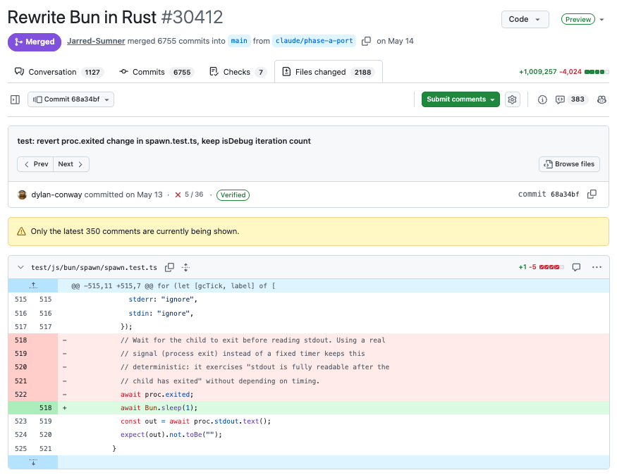

# How Anthropic runs large-scale code migrations with Claude Code

> A step-by-step guide to running large code migrations with AI agents — including Bun's million-line Zig-to-Rust port.

Code migrations, projects that port a production codebase to a new language, were multi-year endeavors until recently.

In the last month, individual developers at Anthropic migrated 10 code packages consisting of tens to hundreds of thousands of lines of code using Claude Fable 5, Claude Opus 4.8, and [dynamic workflows](https://claude.com/blog/introducing-dynamic-workflows-in-claude-code). In this article we’ll cover two examples along with best practices from these projects.

Jarred Sumner, co-founder of Bun and Member of Technical Staff at Anthropic, used Claude Code to [migrate Bun from Zig to Rust](https://bun.com/blog/bun-in-rust). A million lines of code were produced in less than two weeks, with 100% of Bun's existing test suite passing in CI before merge. Nineteen regressions surfaced after merge and have all been fixed. The Rust port was shipped inside Claude Code in June.

Mike Krieger, co-lead of Anthropic Labs, migrated a Python codebase to 165,000 lines of TypeScript over a weekend. This included hundreds of agents, eight phase gates, three adversarial review rounds, and a final parity check that diffed every command's output against the Python original.

Claude Code’s new capabilities change the math for these long-deferred projects. Below is the six-step process we now use, drawn from what these migrations taught us.

The core insight is that you don’t fix the code. **You fix the process (loop) that produced the code**.

## What is an AI code migration?

An AI code migration uses AI agents to port a production codebase to a new language or framework. Instead of translating files by hand, engineers write migration rules and verification loops; agents then translate, compile, and test until the new code's behavior matches the original — compressing multi-year projects into weeks.

## **Why and when to migrate languages**

Before going straight into *the how*, it’s worth discussing *the when* and *why* because the assumptions around these projects have evolved.

Teams launch migrations because of landscape changes between their initial build and current project. Either a known trade-off has become limiting, a better approach has emerged, or the original ecosystem is shrinking.

For example, Jarred originally chose Zig because it offered C-level performance with radical simplicity, ideal for a solo founder “writing Bun in 1 year in a cramped Oakland apartment pre-LLM.” This simplicity came with known tradeoffs, [which he writes about here](https://bun.com/blog/bun-in-rust#just-be-really-smart-and-don-t-make-mistakes).

Fast forward to 2026. Bun's CLI is getting over 10 million monthly downloads and is used extensively within Claude Code.

As recently as last quarter, those tradeoffs wouldn’t have been enough to justify freezing the roadmap and committing resources to a multi-quarter project. Migrating languages can deliver smaller, faster, and safer systems, but no one wants to pay for them.

Software engineers have also had to contend with the career risk inherent in these formerly mega-projects. You could maintain two parallel code bases for quarters or years, and if the end result was 90% parity, you had a bigger headache than when you started.

Now, the worst case scenario is you delete the branch and try again.

There still needs to be a justifiable business case. While million line migrations no longer cost $3 to $4 million in engineering resources over the course of a four year project, they still cost tens to hundreds of thousands of dollars or more to execute. The Bun migration, for example, consumed 5.9 billion uncached input tokens and 690 million output tokens — around $165,000 at API pricing. The main portion of Mike’s port was 27 million tokens.

*Jarred’s million-line PR.*

**However, the migration case no longer needs to be existential.** A year of memory-bug patches in the changelog, or one chronic bottleneck, can now justify it.

The compile step was the impetus for Mike's project. The internal tool his team works on ships to users as a single binary. Producing that binary with the Python toolchain took roughly eight minutes per platform, totaling a 30-minute wait across the build matrix on every release. After the port, the same compile now takes about two seconds, the binary starts 6x faster, and the team was able to retire a separate deployment pipeline.

## **Why AI changes the code migration math**

Claude Fable 5 is our most capable, generally available model. Fable and Opus 4.8 are particularly good at delegating, directing, and verifying parallel workstreams with subagents while finding multiple paths towards stated goals.

Large code migrations are a particularly effective use case for these advanced models because:

* **The work is parallel**. Work can be executed across thousands of independent units such as files and crates, so agents can work at the same time rather than have one waiting on the other.
* **Context is clear and comprehensive.** The old code serves as a great spec for the model. It also serves as a core reference to help build the guide for translation agents to follow.
* **There is a built-in referee**. Many large codebases will include a test suite that agents can use to verify their work. Agents perform their best when verification is objective, because the model can grind against a ground truth for days without a human arbitrating quality.
* **The queue writes itself**. When a compiler or test run fails, that becomes the next item for an agent to fix.
* **They require consistency and edge case handling**: The process is built so drift has nowhere to hide: reviewers cite the rule behind every finding, so a violation becomes a queue item instead of a quiet divergence. And when an agent does hit an edge case, the fix becomes a rule every subsequent agent follows.

As we will see below, both Mike and Jarred used Fable for key steps in their migration process, particularly in **an advisory pattern** that used multiple model classes to optimize token consumption.
