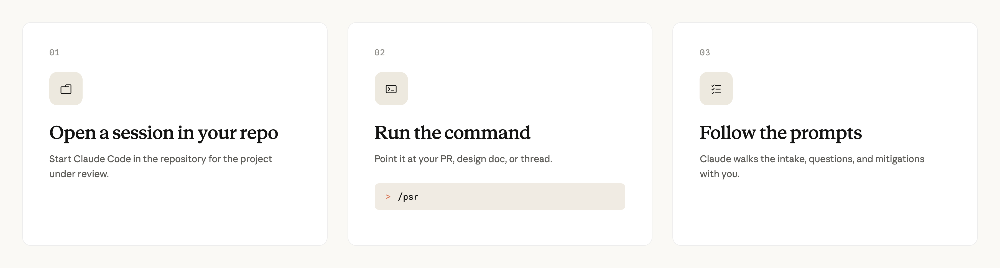

# How Anthropic secures its AI-native software development lifecycle

# 📰 How Anthropic secures its AI-native software development lifecycle

> Anthropic Deputy CISO, Jason Clinton, details how the Security Engineering team secures a SDLC that has AI authoring 80% of merged code.

At Anthropic, the amount of code and velocity of deployment have scaled exponentially. Our software engineers on average ship 8x as much code per quarter as they did from 2021 to 2025.

Our reviews, monitoring, and other security processes needed to scale alongside this increased pace. Otherwise it becomes a formula for bottlenecks ([Amdahl’s Law](https://en.wikipedia.org/wiki/Amdahl%27s_law)).

Our software development processes have changed drastically as well. Claude has evolved from coding assistant to primary creator and reviewer. [Claude authors](https://www.anthropic.com/institute/recursive-self-improvement) about 80% of the code merged into our codebase today.

More than half of all code is being merged by our internal version of [Claude Tag](https://www.anthropic.com/news/introducing-claude-tag) while human engineers focus on directing, setting intent, and owning final approval.

This means our security team must defend a rapidly expanding surface area and harden a lifecycle with non-deterministic, constantly evolving agents at its heart. In this article, I cover strategies to secure the software development lifecycle (SDLC).

*(This is intended to be combined with the* [*Zero Trust for Agents*](https://claude.com/blog/zero-trust-for-ai-agents) *framework we recently published; everything in this article uses security design ideas from that framework in the implementation).*

The threats we're designing against are specific: a compromised or prompt-injected agent introducing a malicious change; supply-chain and dependency poisoning that an agent ingests as trusted input; and the more familiar classes of application vulnerability now arriving at higher volume. Every control that follows maps to at least one of those.

There are several overarching strategies we’ve deployed to accomplish this without significantly throttling dev velocity including:

* Shifting security left and fully integrating with the code development stage;
* Using hard access and identity boundaries to contain the blast radius;
* Combining automated deterministic and agentic reviews before and after production; and
* Inserting humans in the loop at the highest leveraged points.

In this article, we’ll cover the security processes we have implemented at specific stages of the software development lifecycle as well as the core principles behind them. These principles are more enduring as security teams must reexamine, and often reinvent, their processes as model capabilities evolve. 

## **The evolving software development lifecycle**

Our development team has covered the changes to their software development lifecycle [at length](https://claude.com/blog/running-an-ai-native-engineering-org), so this will be a brief primer before we dive into each stage. 

At a high level, our software development lifecycle is compressed. It is driven by prototypes and internal adoption (dogfooding) more than lengthy planning cycles. Ideation comes from all corners of the organization and traditional roles (frontend, backend, design) are blurred. Reviews and approvals still have humans in the loop, but are also driven by agentic loops.

While each stage has been fundamentally transformed and accelerated by Claude Code and Claude Tag, the names and purposes of each stage wouldn’t look alien to a developer coming from a more traditional organization. These are natural gates that we also use as part of our security processes for an AI-native SDLC.

## **Plan**

One of our first security automations ever was a simple Claude Opus powered PSR (project security review) web application. It ingested a project design document and analyzed it against the [MITRE ATT&CK framework](https://attack.mitre.org/) to identify potential vulnerabilities and suggested mitigations.

We’ve significantly enhanced the system by connecting it to an internal knowledge index that provides much deeper context across our organization-wide policies, past decisions, and related systems. 

*The process internally at Anthropic for an automated PSR.*

This gives us a better understanding of potential risk, and it also captures information missing from the PSR. This one implementation saved the majority of the AppSec team’s time. Once we gained confidence that Claude was accurate in assessing risk, we allowed teams to approve their own project, if Claude deemed the launch low enough risk.

Here we can see one of the first key adaptations to an AI-native SDLC. A PSR was originally designed to catch security issues before the lengthy and expensive coding process. Catching an issue at this stage saved months of re-development. 

Today, multiple prototypes of major features can be created in hours, making detailed architectural review a less critical gate. Connecting our PSR application to our knowledge index captures context that could otherwise be missed without creating an unnecessary speed bump. Creating a Claude Code skill allowed Claude to further fan out and capture additional context wherever it lived. 

**Enduring Principle**: Connect security agents to organizational context. As the planning cycle compresses, it is much more effective to bring these agents to where the context already lives – chat threads, prior reviews, the codebase – rather than forcing detailed documentation at stages that may no longer require them. Either way, agents need context outside of the code itself.

