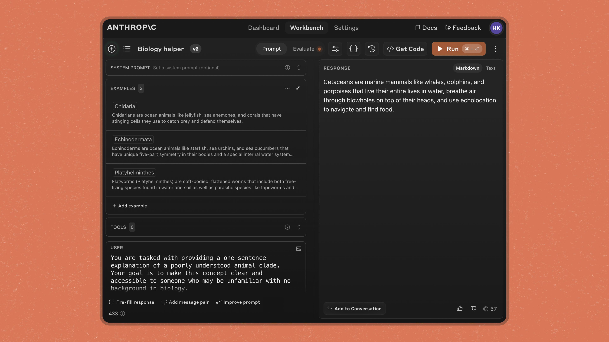

# Improve your prompts in the developer console

# 📰 Improve your prompts in the developer console

> Claude can now automatically refine prompts in the developer console using techniques like chain-of-thought reasoning and example enrichment. ‍

Today, we're introducing the ability to improve prompts and manage examples directly in the [Anthropic Console](https://console.anthropic.com/). These features make it easier to leverage prompt engineering best practices and build more reliable AI applications.

## Better prompts for better completions

Prompt quality plays a significant role in how successful a model's responses are for a given task. However, prompting best practices take time to implement and often vary across model providers.

The prompt improver allows developers to take existing prompts and leverage Claude to automatically refine them using advanced prompt engineering techniques. This is ideal for adapting prompts that were originally written for other AI models, as well as for optimizing hand-written prompts.

The prompt improver strengthens existing prompts via the following methods:

1. **Chain-of-thought reasoning:** Adds a dedicated section for Claude to think through problems systematically before responding to improve accuracy and reliability.
2. **Example standardization:** Converts examples into a consistent XML format for improved clarity and processing.
3. **Example enrichment:** Augments existing examples with chain-of-thought reasoning that aligns with the newly structured prompt.
4. **Rewriting:** Rewrites the prompt to clarify structure and correct any minor grammatical or spelling issues.
5. **Prefill addition:** Prefills the Assistant message to direct Claude’s actions and enforce output formats.

Once the new prompt is generated, you can provide feedback for Claude about what is and isn’t working to further improve the prompt.

**Our testing shows that the prompt improver increased accuracy by 30% for a multilabel classification test1 and brought word count adherence up to 100% for a summarization task.2**

# Manage multi-shot examples

Adding examples to prompts is one of the most effective ways to improve model response quality, especially when it comes to getting Claude to precisely follow a specific format in the output. You can now manage examples in a structured format directly in the Workbench. This makes it easier to add new examples with clear input/output pairs or edit existing examples to refine response quality.

If your prompt doesn’t have examples, you can add them with Claude-driven example generation. Claude can automatically create synthetic example inputs and draft outputs for you to streamline this process.

Adding examples contributes to increased:

* **Accuracy:** Reduces misinterpretation of instructions.
* **Consistency:** Ensures desired output formatting.
* **Performance:** Boosts Claude’s ability to handle complex tasks.

## Evaluate prompts with ideal outputs

Our [prompt evaluator](https://www.anthropic.com/news/evaluate-prompts) allows you to test your prompts under various scenarios. To help benchmark and improve prompt performance, we've added an optional "ideal output" column in the Evaluations tab. This column helps users effectively and consistently grade model outputs on a 5-point scale.

After testing your new prompt, you can give Claude additional feedback in the prompt improver on what’s still not working and repeat this process until you’re satisfied with the result. The prompt improver can also modify the prompt and examples based on arbitrary requests. For example you can ask Claude to change the prompt and examples to have JSON-formatted outputs instead of XML-formatted outputs.

## Customer spotlight: Kapa.ai

[Kapa.ai](https://www.kapa.ai/), a technology company that turns your technical knowledge base into a production-ready AI assistant, used the prompt improver to migrate multiple critical AI workflows to Claude.

"Anthropic's prompt improver streamlined our migration to Claude 3.5 Sonnet and enabled us to get to production faster," said Finn Bauer, Co-Founder at Kapa.ai.

## Getting started

The prompt improver, example management, and ideal outputs are available to all users in the [Anthropic Console](https://console.anthropic.com/).

To learn more about how to improve and evaluate prompts with Claude, check out our [docs](https://docs.anthropic.com/en/docs/build-with-claude/prompt-engineering/prompt-improver).

#### Footnotes ####

[1] Given 500 Wikipedia articles and titles, we tested Claude 3 Haiku’s ability to match article titles to a sentence pulled from an article at random. Claude 3 Haiku’s accuracy increased by 30% in comparison to the original prompt.

[2] Given ten Wikipedia articles, Claude’s adherence to an instruction to write summaries within a specific word count range was 100% after running through the prompt improver.
