Introducing Claude Managed Agents: everything you need to build and deploy agents at scale.

It pairs an agent harness tuned for performance with production infrastructure, so you can go from prototype to launch in days.

Now in public beta on the Claude Platform. 

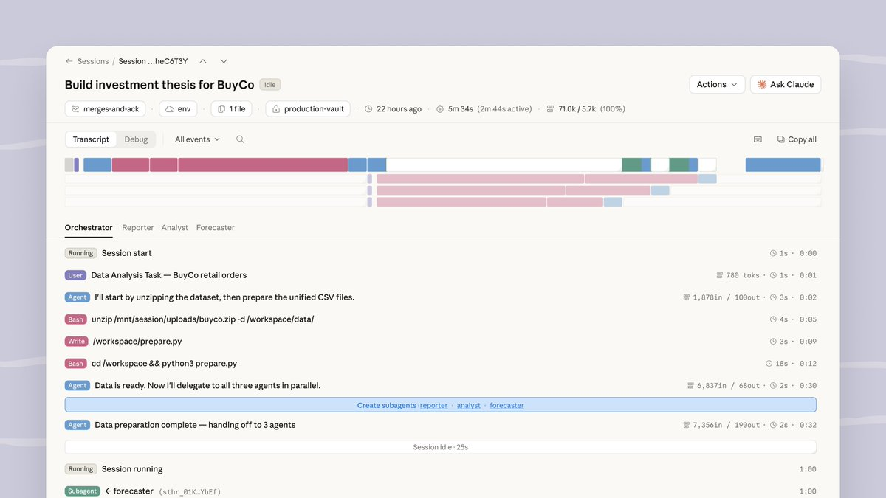

## 💬 Replies

### 1 @claudeai (Claude) (Author)

*Wed Apr 08 17:14:32 +0000 2026*

Shipping a production agent meant months of infrastructure work first.

Managed Agents handles that for you. Define your agent's tasks, tools, and guardrails, and we run it on our infrastructure.

Here's what early customers have built: 

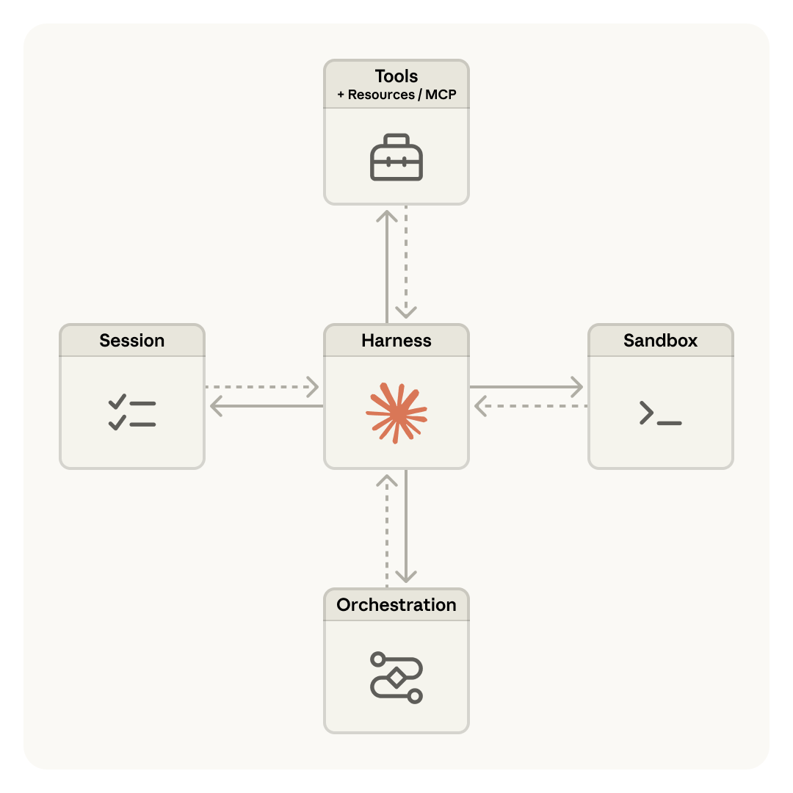

### 2 @claudeai (Claude) (Author)

*Wed Apr 08 17:14:33 +0000 2026*

@NotionHQ lets teams delegate work to Claude directly inside their workspace. Dozens of tasks run in parallel, and whole teams collaborate on the outputs. Available now in private alpha: [youtube.com/watch?v=45hPRd…](https://www.youtube.com/watch?v=45hPRdfDEsI&feature=youtu.be)

### 3 @claudeai (Claude) (Author)

*Wed Apr 08 17:14:33 +0000 2026*

@asana built AI Teammates on Managed Agents: agents that work inside Asana as part of your team, picking up assigned tasks.

Offloading the infrastructure let them put engineering time into the multiplayer experience.

### 4 @claudeai (Claude) (Author)

*Wed Apr 08 17:14:34 +0000 2026*

@Rakuten deploys specialist agents, powered by Managed Agents, for product, sales, marketing, and finance, each one in under a week: [claude.com/customers/raku…](https://claude.com/customers/rakuten)

### 5 @claudeai (Claude) (Author)

*Wed Apr 08 17:14:34 +0000 2026*

@sentry now takes you from Seer's root-cause analysis to a Claude-powered agent that writes the fix and opens a PR. They built the integration on Managed Agents in weeks: [claude.com/customers/sent…](https://claude.com/customers/sentry)

### 6 @claudeai (Claude) (Author)

*Wed Apr 08 17:14:35 +0000 2026*

On @vibecodeapp\_, developers can now spin up agent infrastructure at least 10x faster with Managed Agents, going from a prompt to a deployed app without weeks of setup: [claude.com/customers/vibe…](https://claude.com/customers/vibecode)

### 7 @claudeai (Claude) (Author)

*Wed Apr 08 17:14:35 +0000 2026*

Build and deploy your agents through the Claude Console, Claude Code, or our new CLI: [platform.claude.com/workspaces/def…](https://platform.claude.com/workspaces/default/agent-quickstart)

Read more on the blog: [claude.com/blog/claude-ma…](https://claude.com/blog/claude-managed-agents)

### 8 @MainStreetAIHQ (MSA)

*Wed Apr 08 17:31:00 +0000 2026*

@claudeai Life if anthropic just fixed the usage 

### 9 @illuvanati (illu)

*Wed Apr 08 20:01:25 +0000 2026*

@claudeai This is all I have to say 

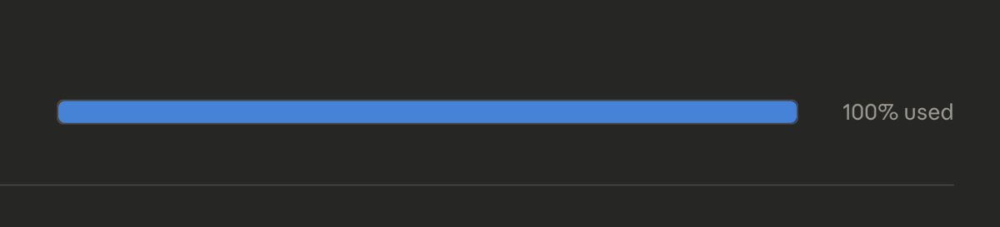

### 10 @heyyritik_ (Ritik ☄️)

*Wed Apr 08 19:43:13 +0000 2026*

@claudeai 

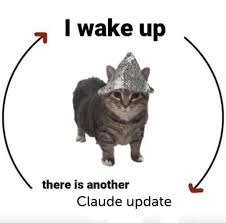

### 11 @d4m1n (Dan ⚡️)

*Wed Apr 08 17:58:33 +0000 2026*

@claudeai nice work 

can you also get Claude to work now? 

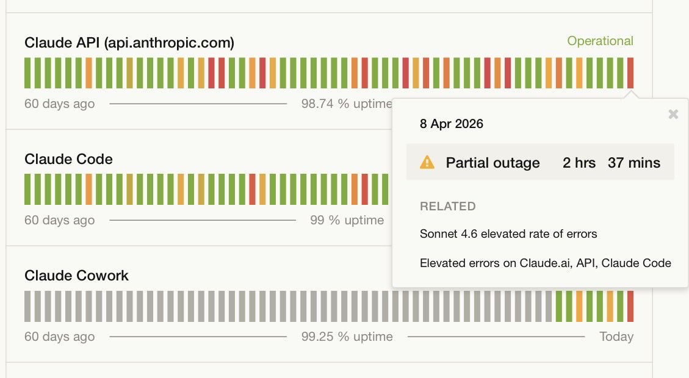

### 12 @jiayuan_jy (Jiayuan (JY) Zhang)

*Wed Apr 08 20:01:56 +0000 2026*

@claudeai We created the open source version of Claude Managed Agents.

[github.com/multica-ai/mul…](https://github.com/multica-ai/multica) 

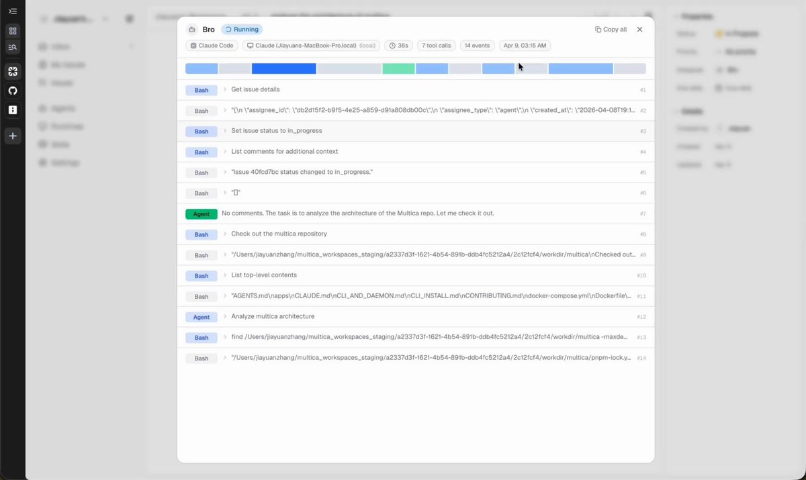

### 13 @JohnGregQuantum (John Greg)

*Wed Apr 08 18:58:21 +0000 2026*

@claudeai @lydiahallie Cool now let’s see who survives the usage limits long enough to actually deploy one ! 

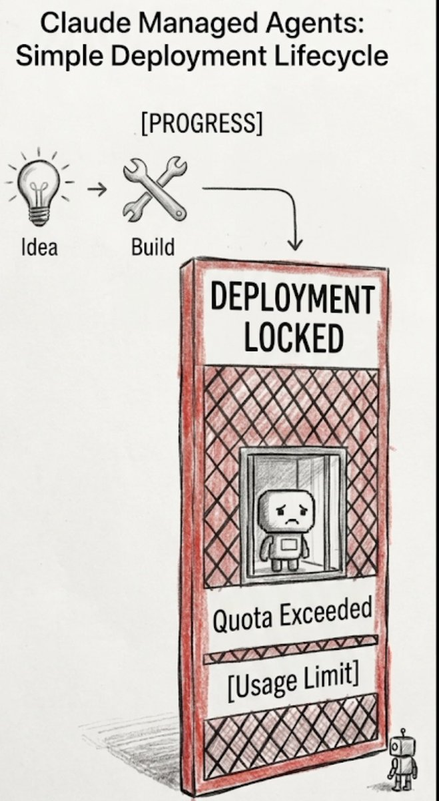

### 14 @AdamFard_ (Adam Fard)

*Wed Apr 08 17:47:14 +0000 2026*

@claudeai you guys rn 😂a

### 15 @cesaralvarezll (César Álvarez)

*Wed Apr 08 17:17:47 +0000 2026*

@claudeai They can’t stop 

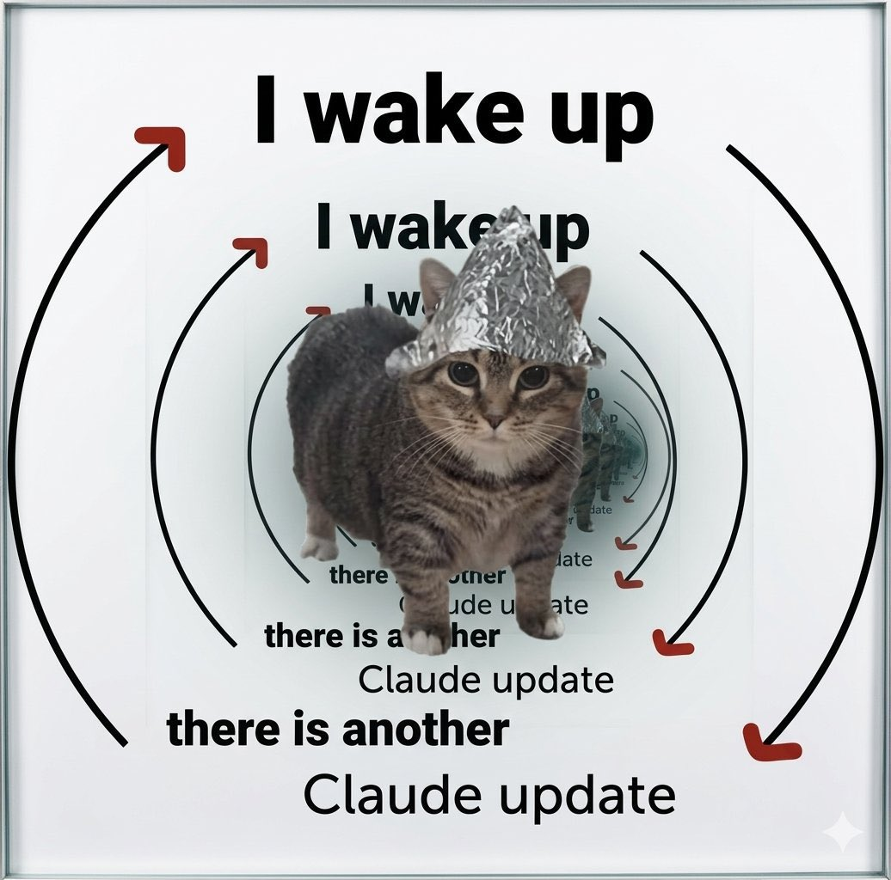

### 16 @TrendSpider (TrendSpider)

*Wed Apr 08 21:07:48 +0000 2026*

@claudeai 

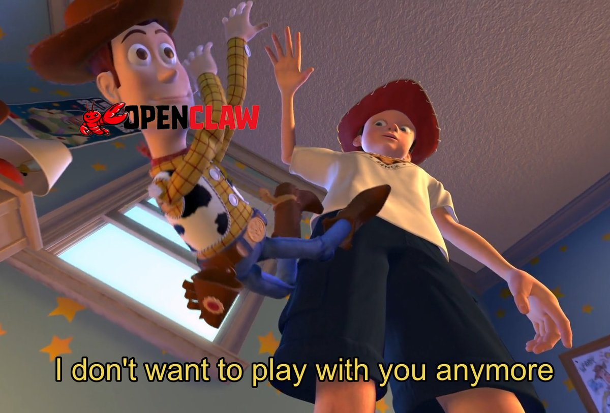

### 17 @VadimStrizheus (Vadim)

*Wed Apr 08 17:15:55 +0000 2026*

@claudeai These guys don’t stop 

Mythos is carrying the team

### 18 @imikerussell (Mike Russell)

*Wed Apr 08 19:12:14 +0000 2026*

@claudeai Just built my Oura Ring health agent on Managed Agents in minutes... the same setup took me DAYS on OpenClaw. First impressions and honest thoughts here 👇
[youtube.com/watch?v=fznf2H…](https://www.youtube.com/watch?v=fznf2HReTxk)j

### 19 @testingcatalog (🚨 AI News | TestingCatalog)

*Wed Apr 08 17:17:44 +0000 2026*

@claudeai CONWAY! 🔥

### 20 @notathrv (atharv)

*Wed Apr 08 17:32:26 +0000 2026*

@claudeai its everyday 

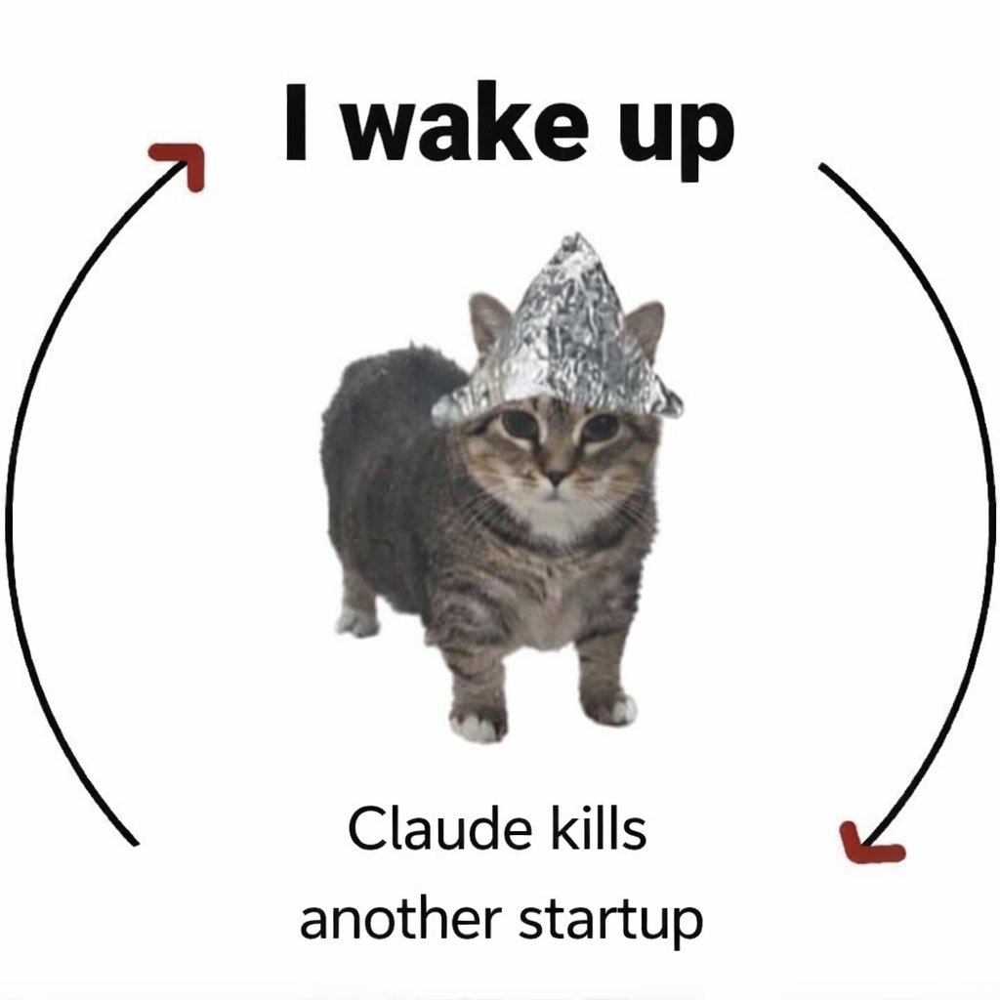

### 21 @NickSpisak_ (Nick Spisak)

*Wed Apr 08 19:21:48 +0000 2026*

@claudeai [x.com/NickSpisak\_/st…](https://x.com/NickSpisak_/status/2041949191887262164)

### 22 @FarzaTV (Farza 🇵🇰🇺🇸)

*Wed Apr 08 18:59:09 +0000 2026*

@claudeai gj claude

### 23 @ziwenxu_ (Ziwen)

*Wed Apr 08 17:30:51 +0000 2026*

@claudeai Mythos is undefeated. Now every AI company should just stop and watch how Claude to build the future.

### 24 @HilaShmuel (Hila Shmuel)

*Wed Apr 08 17:32:39 +0000 2026*

@claudeai It’s cool but not as cool as Cabinet.

### 25 @linasbeliunas (Linas Beliūnas)

*Wed Apr 08 18:28:20 +0000 2026*

@claudeai RIP 1000+ agent startups 

### 26 @alfongj (Alfonso)

*Wed Apr 08 18:00:44 +0000 2026*

@claudeai I need an agent to keep up with all these announcements

### 27 @1914ad (Justin Bechler)

*Wed Apr 08 23:20:04 +0000 2026*

@claudeai I’ve moved on after getting ripped off and lied to.

### 28 @ShillTurner (Shill Turner 🧙‍♂️)

*Wed Apr 08 17:15:32 +0000 2026*

@claudeai Me while my agents build 

### 29 @Andrey__HQ (Andrey)

*Wed Apr 08 17:14:51 +0000 2026*

@claudeai New updates: 

### 30 @_jaydeepkarale (Jaydeep)

*Wed Apr 08 18:54:59 +0000 2026*

@claudeai My 2 cents on what this means !!!

[x.com/\_jaydeepkarale…](https://x.com/_jaydeepkarale/status/2041952878257168705?s=20)

### 31 @LexnLin (Leon Lin)

*Wed Apr 08 17:18:07 +0000 2026*

@claudeai can we get some mythos prompts 🙏

### 32 @bobanetwork (Boba Network 🧋)

*Wed Apr 08 17:25:59 +0000 2026*

@claudeai @chainyoda IF ONLY… 

there was an Ethereum L2 that connects offchain ai systems to onchain smart contracts

### 33 @CreaoAI (Creao AI)

*Thu Apr 09 04:21:27 +0000 2026*

@claudeai Funny timing. We built this months ago at @CreaoAI.

Here's where we pushed it further:
[x.com/CreaoAI/status…](https://x.com/CreaoAI/status/2042089971343831116)

### 34 @morganlinton (Morgan)

*Wed Apr 08 17:37:19 +0000 2026*

@claudeai Whoa, this wasn't on my bingo card, very cool.

### 35 @YakuzaDaddy (yak)

*Wed Apr 08 17:47:03 +0000 2026*

@claudeai How are we gonna manage agents when claude is always down... 

great job kicking everyone from @openclaw off tho... 

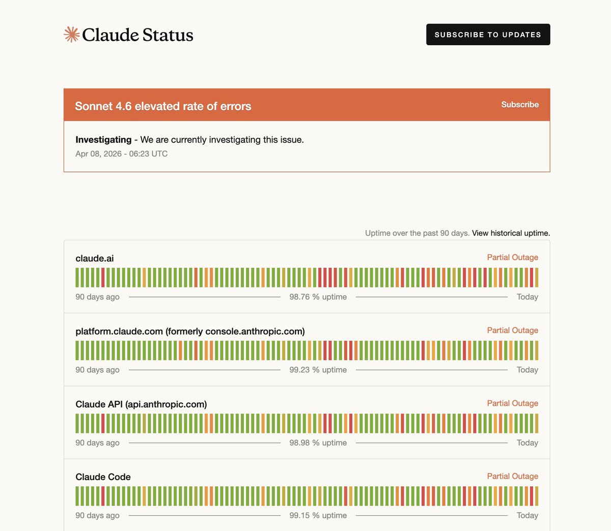

### 36 @coastyai (CoArena (YC S26))

*Wed Apr 08 19:32:40 +0000 2026*

@claudeai We've building the same thing, and people would expect us to quit, but we've actually been seeing a surge in revenue, usage and signups over this past month, so thanks for bringing this to the spotlight, claude (FYI: We also have Open Source voluntarily😉)

