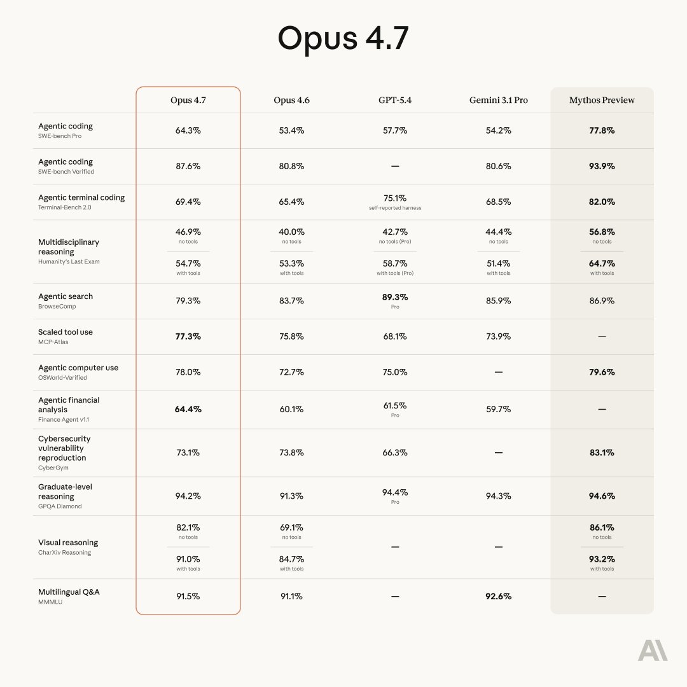
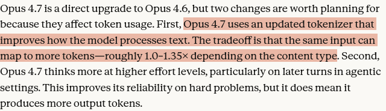
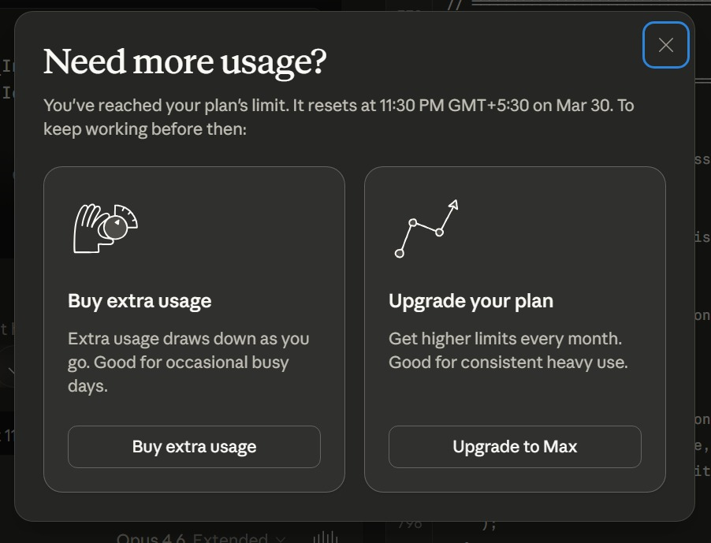
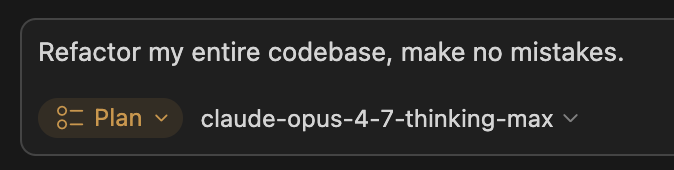
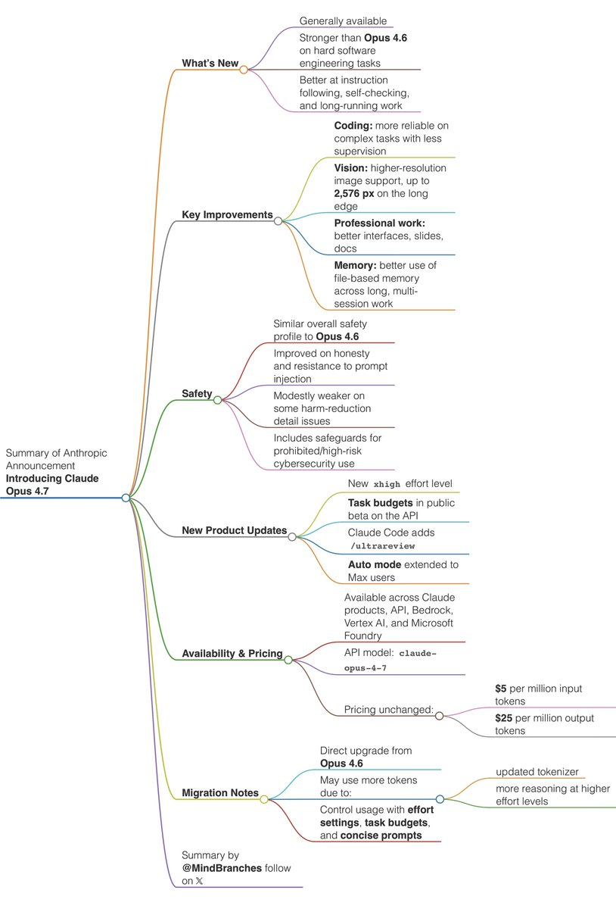
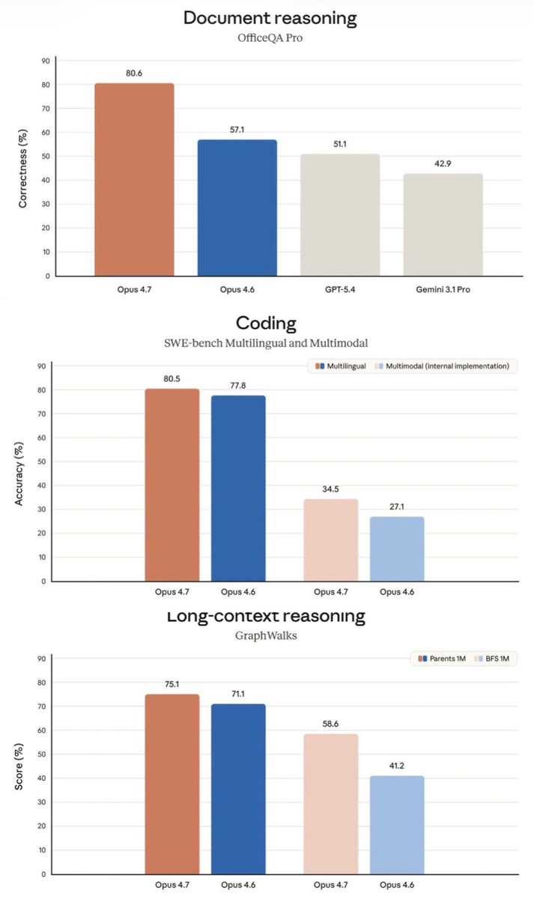
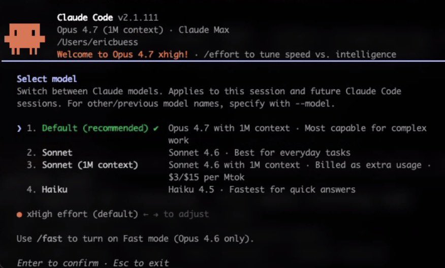
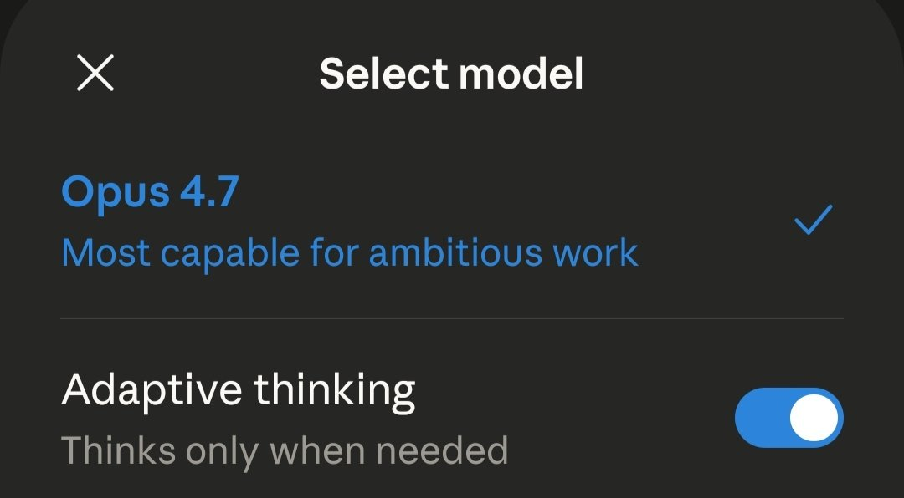

Introducing Claude Opus 4.7, our most capable Opus model yet.

It handles long-running tasks with more rigor, follows instructions more precisely, and verifies its own outputs before reporting back.

You can hand off your hardest work with less supervision. 

## 💬 Replies

### 1 @claudeai (Claude) (Author)

*Thu Apr 16 14:29:31 +0000 2026*

Opus 4.7 also has substantially better vision. It can see images at more than three times the resolution and produces higher-quality interfaces, slides, and docs as a result.

### 2 @claudeai (Claude) (Author)

*Thu Apr 16 14:29:31 +0000 2026*

On the API, a new xhigh effort level between high and max gives you finer control over reasoning and latency on hard problems. Task budgets (beta) help Claude prioritize work and manage costs across longer runs.

### 3 @claudeai (Claude) (Author)

*Thu Apr 16 14:29:32 +0000 2026*

In Claude Code, the new /ultrareview command runs a dedicated review session that reads through your changes and flags what a careful reviewer would catch.

We've also extended auto mode to Max users, so longer tasks run with fewer interruptions.

### 4 @claudeai (Claude) (Author)

*Thu Apr 16 14:29:33 +0000 2026*

Claude Opus 4.7 is available today on [claude.ai](http://claude.ai), the Claude Platform, and all major cloud platforms.  

Read more: [anthropic.com/news/claude-op…](https://www.anthropic.com/news/claude-opus-4-7)

### 5 @ValsAI (Vals AI)

*Thu Apr 16 14:59:45 +0000 2026*

@claudeai [x.com/ValsAI/status/…](https://x.com/ValsAI/status/2044792518953533777?s=20)

### 6 @NorthstarBrain (Alex Northstar)

*Thu Apr 16 15:09:53 +0000 2026*

@claudeai @Scobleizer If this is Opus 4.6 Original, I will be very happy!

### 7 @developedbyed (Dev Ed)

*Thu Apr 16 14:32:44 +0000 2026*

@claudeai Welcome back opus 4.6 

### 8 @HamptonAc_ (Ac Hampton)

*Thu Apr 16 15:28:34 +0000 2026*

@claudeai "okay, let's drop a model more powerful than Sonnet 4.6. but make it consume tokens more"

"now slowly make it dumber and reduce it's capability to Sonnet"

"okay, slow it down so they don't notice"

"now drop the original opus 4.6 as 4.7"

"let it consume even more tokens" 

### 9 @DefiIgnas (Ignas)

*Thu Apr 16 14:49:03 +0000 2026*

@claudeai When 4.7 gets nerfed like 4.6 we will know that Opus 4.8 is coming.

### 10 @full_kelly_ (𝕱𝖚𝖑𝖑 𝕶𝖊𝖑𝖑𝖞)

*Thu Apr 16 14:40:26 +0000 2026*

@claudeai Shrinkflation 

### 11 @JohnGregQuantum (John Greg)

*Thu Apr 16 14:32:39 +0000 2026*

@claudeai OMGGGGGGG LETS GOOOOOO 

### 12 @cyanidecomedy (fuze)

*Thu Apr 16 14:30:27 +0000 2026*

@claudeai Yay! We got the pre-nerfed 4.6 back!

### 13 @thekitze (kitze 🛠️ tinkerer.club)

*Thu Apr 16 14:34:06 +0000 2026*

@claudeai Unnerfed 4.6 \*

### 14 @pcshipp (pc)

*Thu Apr 16 15:24:08 +0000 2026*

@claudeai Please increase the daily and weekly limits. I’m frustrated with these quick limits 

### 15 @SuhailKakar (Suhail Kakar)

*Thu Apr 16 14:45:46 +0000 2026*

@claudeai we all know this is just opus 4.6 before you guys nerfed it 

### 16 @ErRahul337 (Rahul - QA - Automation - AI)

*Thu Apr 16 14:52:22 +0000 2026*

@claudeai @AnthropicAI 

### 17 @luisrmartinez (Luis)

*Thu Apr 16 15:28:00 +0000 2026*

@claudeai "M' lord the people ask for mythos"

"Let them have march opus 4.6..no call it 4.7" 

### 18 @randomrecruiter (The Random Recruiter)

*Thu Apr 16 14:52:55 +0000 2026*

@claudeai @skooookum “Claude, change our entire company from selling shoes to AI infrastructure. Make no mistakes.” 

### 19 @Polymarket (Polymarket)

*Thu Apr 16 14:48:29 +0000 2026*

@claudeai 26% chance Mythos releases before July. [polymarket.com/event/claude-m…](https://polymarket.com/event/claude-mythos-released-by?via=x-afr2)

### 20 @thenowhereway (Devansh)

*Thu Apr 16 14:31:06 +0000 2026*

@claudeai I blick and there's a new announcement from Anthropic 

### 21 @mckaywrigley (Mckay Wrigley)

*Thu Apr 16 14:34:16 +0000 2026*

@claudeai now this is what i'm talking about
[x.com/claudeai/statu…](https://x.com/claudeai/status/2044785263004602654?s=20)

### 22 @ephraimduncan (Duncan)

*Thu Apr 16 14:41:41 +0000 2026*

@claudeai Nice, thank you for giving us the original Opus 4.6 we got in February

### 23 @NotionHQ (Notion)

*Thu Apr 16 14:56:22 +0000 2026*

@claudeai 🫡

### 24 @aliromman (Ali Romman)

*Thu Apr 16 16:44:28 +0000 2026*

@claudeai This is how I test new models. 

### 25 @zadkielmodeler2 (Zadkey)

*Thu Apr 16 14:41:38 +0000 2026*

@claudeai You guys nerfed 4.6 bad and it shows.  Weakening your previous models to make your new model seem good feels kind of slimy.

### 26 @zackvoell (Zack Voell)

*Thu Apr 16 14:30:07 +0000 2026*

@claudeai Just give us Mythos lil bro, that's what we want

### 27 @Yuchenj_UW (Yuchen Jin)

*Thu Apr 16 15:23:21 +0000 2026*

@claudeai Can we get a “Thinking” mode, along with the “Adaptive” mode?

### 28 @MindBranches (MindBranches)

*Thu Apr 16 14:47:47 +0000 2026*

@claudeai Summary of Anthropic Announcement: Introducing Claude Opus 4.7 

### 29 @mert (mert)

*Thu Apr 16 15:07:44 +0000 2026*

@claudeai ALHAMDULLILAH

### 30 @justalexoki (taoki)

*Thu Apr 16 15:13:53 +0000 2026*

@claudeai please let me back in im begging u I DIDN'T DO ANYTHING

### 31 @danshipper (Dan Shipper)

*Thu Apr 16 14:32:41 +0000 2026*

@claudeai live vibe check coming in a sec on @every!

### 32 @MaxRovensky (Max Rovensky)

*Thu Apr 16 14:37:43 +0000 2026*

@claudeai This is a 4.6 model without the nerfing btw

### 33 @ItsAditya_xyz (Aditya 🦀)

*Thu Apr 16 16:24:20 +0000 2026*

@claudeai opus 4.7 is 4.6 pre-nerfed version. i just can't prove it yet 

### 34 @EricBuess (Eric Buess)

*Thu Apr 16 15:21:05 +0000 2026*

@claudeai For the CLI to see Opus 4.7 you need version 2.1.111 installed I think.

Try this…

claude update

claude

/model 

### 35 @__SeriousGemini (serious gemini)

*Thu Apr 16 15:16:03 +0000 2026*

@claudeai “nerf opus 4.6”

“release 4.7 with the 4.6 original” 

### 36 @burny_tech (Burny - Effective Curiosity)

*Thu Apr 16 14:38:15 +0000 2026*

@claudeai Pls add option "always use thinking" 

