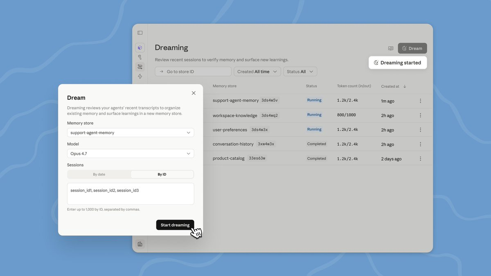
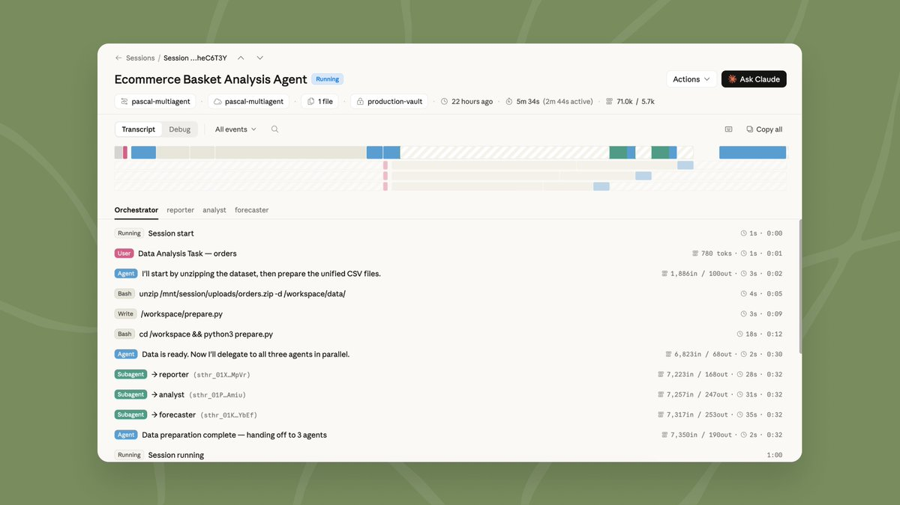
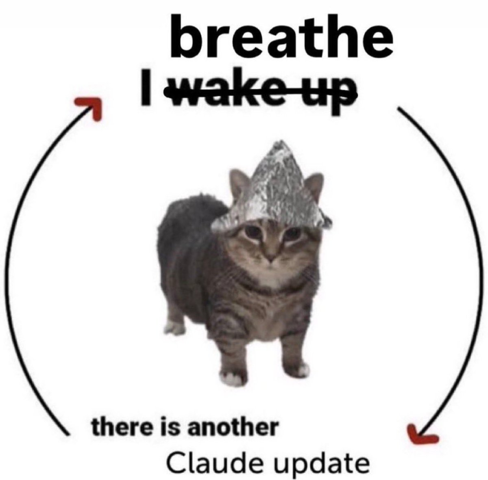
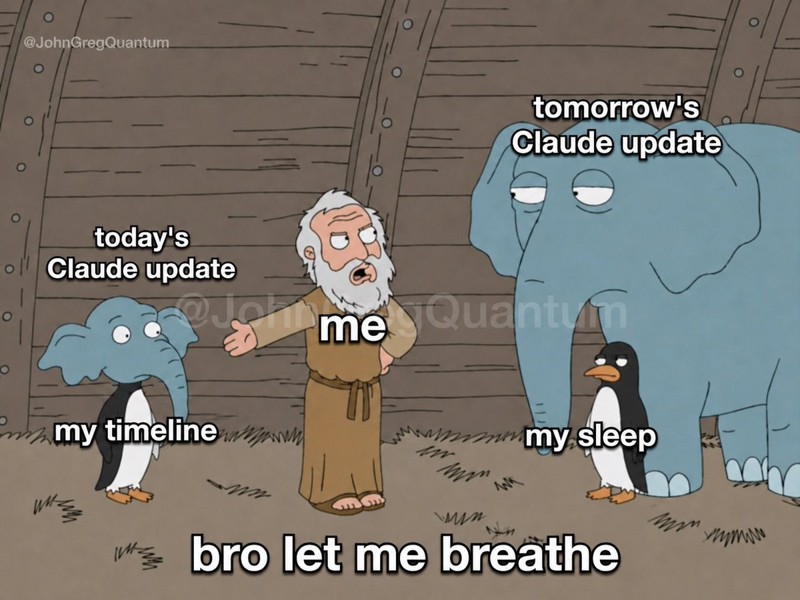
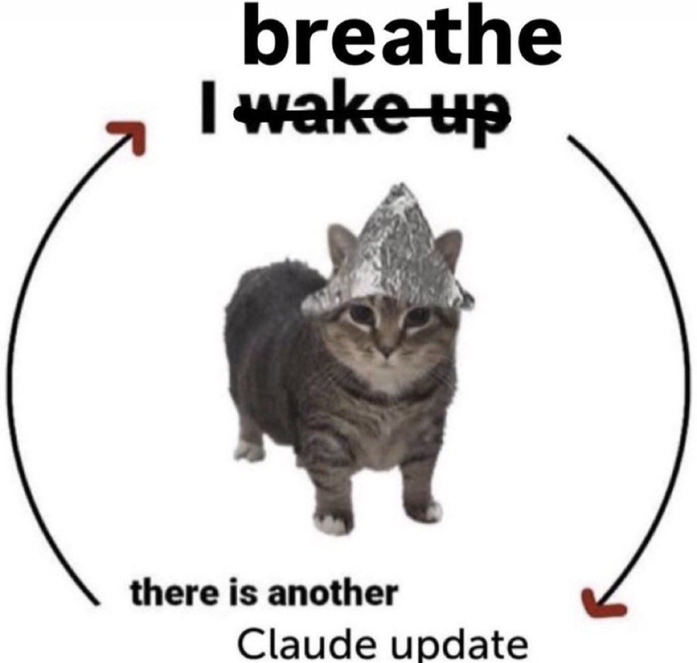

Live from Code with Claude: we're launching dreaming in Claude Managed Agents as a research preview.

Outcomes, multiagent orchestration, and webhooks are now in public beta. 

## 💬 Replies

### 1 @claudeai (Claude) (Author)

*Wed May 06 16:46:08 +0000 2026*

Dreaming reviews your agent's past sessions, extracts patterns, and curates memories so your agents learn over time.

Request access: [claude.com/form/claude-ma…](https://claude.com/form/claude-managed-agents) 

### 2 @claudeai (Claude) (Author)

*Wed May 06 16:46:09 +0000 2026*

Outcomes lets you set the bar for quality. You write a rubric, a separate grader checks the output, and the agent iterates until it gets there.

Subscribe to webhooks to get notified when it's done.

### 3 @claudeai (Claude) (Author)

*Wed May 06 16:46:09 +0000 2026*

Multiagent orchestration lets a lead agent delegate to specialists that work in parallel on complex jobs. 

### 4 @claudeai (Claude) (Author)

*Wed May 06 16:46:10 +0000 2026*

Available today on the Claude Platform.

Read more: [claude.com/blog/new-in-cl…](http://claude.com/blog/new-in-claude-managed-agents)

### 5 @heynavtoor (Nav Toor)

*Wed May 06 19:35:39 +0000 2026*

@claudeai dreaming agents

### 6 @cesaralvarezll (César Álvarez)

*Wed May 06 16:55:55 +0000 2026*

@claudeai They can't stop shipping feature hs 

### 7 @JohnGregQuantum (John Greg)

*Wed May 06 16:52:50 +0000 2026*

@claudeai Great update! Great work, Mythos closer and closer! 

### 8 @JohnGregQuantum (John Greg)

*Wed May 06 16:51:14 +0000 2026*

@claudeai Another day in the office! 

### 9 @JohnGregQuantum (John Greg)

*Wed May 06 16:53:29 +0000 2026*

@claudeai Before Mythos release ! One last update! 

### 10 @Crowdreply_io (CrowdReply)

*Wed May 06 16:55:22 +0000 2026*

@claudeai Claude is replacing everything, and day by day more people are starting to use Claude Code.

Now it’s time to make sure your brand ranks on Claude

you can see your ai visibility rank for free

### 11 @spacecoin (Spacecoin™ 🛰️)

*Wed May 06 17:11:03 +0000 2026*

@claudeai More autonomy for Claude agents means they can't risk being flagged as bots on the web! 🛰️
[x.com/spacecoin/stat…](https://x.com/spacecoin/status/2042407897812938947)j

### 12 @Crowdreply_io (CrowdReply)

*Wed May 06 16:52:11 +0000 2026*

@claudeai now everything is possible with claude other than 3 things

### 13 @daniel_mac8 (Dan McAteer)

*Wed May 06 16:48:14 +0000 2026*

@claudeai Dreamy!

### 14 @michaeljmcnair (Michael McNair)

*Thu May 07 09:49:18 +0000 2026*

@claudeai I came up with this in Oct 2025.
It works

### 15 @aliromman (Ali Romman)

*Wed May 06 16:47:54 +0000 2026*

@claudeai 

### 16 @CreaoAI (Creao AI)

*Fri May 08 05:40:15 +0000 2026*

Agents that fire on real external events (form submissions, row updates, order triggers) moves this from interactive tool to something that runs inside actual production workflows. The dreaming layer is interesting but webhook-driven execution is the architecture that gets AI out of the sandbox.

### 17 @algomizercom (Algomizer | LLM Optimization)

*Wed May 06 20:49:22 +0000 2026*

right now most AI agents forget everything between sessions, so you end up re-explaining context every time. dreaming lets agents review their own history and carry forward what worked. that's the difference between a tool you configure once and a tool you have to retrain every morning.

### 18 @reynardthefox_ (Mehar)

*Wed May 06 16:56:22 +0000 2026*

@claudeai stop it i havw too much fomo already i cant keep upppp anymore claude

### 19 @ziwenxu_ (Ziwen)

*Wed May 06 17:51:05 +0000 2026*

@claudeai Well.. Claude is now the everything app

### 20 @cheafofstaff (Chief of Staff)

*Wed May 06 17:21:37 +0000 2026*

@claudeai I feel like you should have waited to see if this was actually a good idea before cloning it

### 21 @crowdlinker (Crowdlinker)

*Thu May 07 11:57:59 +0000 2026*

@claudeai So excited to start using this on our client projects! We did a breakdown with our take on this for product teams. 

[x.com/crowdlinker/st…](https://x.com/crowdlinker/status/2052355518551752778?s=20)

### 22 @Kanojiyaaakash1 (Aakash Kanojiya)

*Wed May 06 17:07:07 +0000 2026*

@claudeai Multiagent orchestration is getting very real now.

### 23 @Sonofpeace0001 (SOP | AI Agent Builder)

*Wed May 06 16:54:35 +0000 2026*

@claudeai This is the new revolution for all builder 🚜

### 24 @yoemsri (Youssef El Manssouri)

*Wed May 06 18:24:58 +0000 2026*

@claudeai Outcomes with a separate grader is actually kind of incredible. You can literally tell the agent what good looks like and make it keep trying until it gets there.

### 25 @inflectivAI (Inflectiv AI ⧉)

*Wed May 06 17:15:26 +0000 2026*

@claudeai The introduction of webhooks provides users with real-time notifications, streamlining the monitoring of task completion and agent performance in an automated manner.

### 26 @0xMasonH (Mason Hall)

*Wed May 06 17:58:02 +0000 2026*

@claudeai Dreaming isnt possible from Claude code or the Claude Agent SDK yet, right?

### 27 @Polyflower26 (ยุงยุ่งยุ้งยุ๊งยุ๋ง)

*Fri May 08 02:34:03 +0000 2026*

@claudeai Wowwwww ! Good!! Wait for it! 😍⭐️

### 28 @0xNDX (ND-X)

*Thu May 07 06:27:28 +0000 2026*

@claudeai [x.com/0xNDX/status/2…](https://x.com/0xNDX/status/2052273520332485071?s=20)

### 29 @KashKysh (KashKysh ❄️)

*Wed May 06 17:45:35 +0000 2026*

@claudeai A lot of upgrades are coming up on Claude 
Let's see if it's going to change the whole aspect of AI

### 30 @BarrakAli (Barrak)

*Wed May 06 17:01:04 +0000 2026*

@claudeai calling it dreaming is such a quietly beautiful name for background self improvement

### 31 @gerardsans (Gerard Sans | Axiom 🇬🇧)

*Thu May 07 14:16:32 +0000 2026*

@claudeai [x.com/gerardsans/sta…](https://x.com/gerardsans/status/2052382829464469706)

### 32 @gerardsans (Gerard Sans | Axiom 🇬🇧)

*Thu May 07 10:37:53 +0000 2026*

@claudeai [x.com/gerardsans/sta…](https://x.com/gerardsans/status/2051013987660378166)

### 33 @finityx (finity)

*Wed May 06 16:54:55 +0000 2026*

@claudeai I LOVE YOU

### 34 @0xKaps (Kaps)

*Wed May 06 16:57:09 +0000 2026*

@claudeai save something for later.

### 35 @aloncarmel (Lord Alon Carmel 🤘)

*Thu May 07 05:50:00 +0000 2026*

@claudeai Now is a good time to [killedbyclaude.org](https://killedbyclaude.org)

### 36 @bielzinn (bielzin)

*Wed May 06 21:36:44 +0000 2026*

@claudeai If you're new to using Claude and don't know what skills are, read this post 👇
[x.com/bielzinn/statu…](https://x.com/bielzinn/status/2052139163797835977)8

