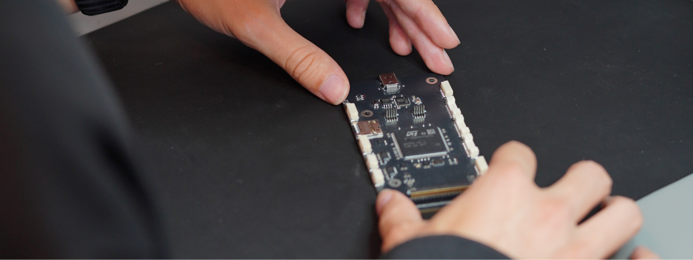
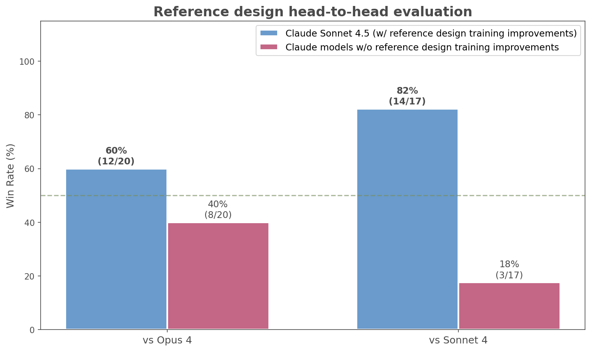

# Making Claude a better electrical engineer

# 📰 Making Claude a better electrical engineer

> How collaboration with domain experts, like custom circuit board manufacturers, helps us train Claude to handle specialized tasks more effectively.

[Diode Computers](https://www.diode.computer/) designs and manufactures custom circuit boards with AI. Diode’s toolchain turns circuit board design into a software problem; much like how software engineers can be more efficient with tools like Claude Code, Diode is applying the same techniques to help electrical engineers design boards that are ready to fab in hours.

Diode develops and maintains the [Zener language](https://github.com/diodeinc/pcb/blob/main/docs/pages/spec.mdx), a domain-specific language built on top of [Starlark](https://github.com/bazelbuild/starlark) for describing printed circuit board (PCB) schematics, and [pcb](https://github.com/diodeinc/pcb?tab=readme-ov-file), which uses the Zener language to provide automations on top of KiCad.

An important task for electrical engineers is building reference designs: when a designer wants to use a certain chip, they rely on hundreds of pages of documentation to understand what components the chip needs to be operational. A typical chip might require up to a dozen ancillary parts—resistors, capacitors, inductors, and the like—and well-structured information can be sparse for how to wire them up.

Electrical engineers already use Claude Code to auto-generate reference designs in Zener from unstructured documentation before they are reviewed. But given the novelty of the environment, which includes domain specific tooling and requires deep subject matter expertise, there is room for improvement on Claude’s agentic performance at generating reference designs, and Claude’s general understanding of this specific electrical engineering task. In the task of auto-generating reference designs, common failure modes when attempting the task include:

* Missing nuances from the datasheet about how circuits should be configured
* Misinterpreting reference schematic images
* Misunderstanding or misusing Zener

When we uncover gaps in Claude’s capabilities on domain specific tasks requiring deep subject matter expertise, we can partner with experts in the field to teach Claude to improve on these tasks. This knowledge is encoded in the Claude models that are released publicly, so that all users of Claude models benefit, be it in Claude Code, [claude.ai](http://claude.ai), or their own Claude powered systems and applications.

*Close-up of an engineer working with a printed circuit board designed with Claude’s help. Attribution: Diode Computers.*

## Scoping the problem

We partnered on a joint initiative with Diode to understand and improve Claude’s ability to auto-generate reference designs. In this agentic task, Claude is asked to take the documentation for a chip as input, and produce a full reference design for it in Zener. To do this correctly, Claude must read through many pages of documentation, understand dense technical writing and figures, and write a full configurable schematic that fully expresses all of the configurations and operating modes of the chip. In this agentic setup, Claude is given tools to read and write files and execute bash commands, and it has access to the Zener compiler, the documentation of the language, and a few examples, but nothing else.

Determining when a reference design is correct also isn’t trivial. Documentation is often underspecified about what exact components and parameters are required for operation. To solve this, each reference design is graded using a custom *testbench*: instead of absolute assertions about the presence of individual components (e.g. “a 20uF capacitor between power and ground”), the testbench encodes higher-level requirements (e.g. “at least 22uF of capacitance between power and ground”). This ensures the signal the model gets is accurate but not overly restrictive.

Given this well defined task, and clear criteria for judging the success and failure of this task, we worked with Diode to introduce improvements into the training of Sonnet 4.5 and subsequent Claude models to better auto-generate reference designs for circuit boards.

## Benchmarking the outcome

To benchmark Claude’s performance on this task, we used a test set of generated reference designs in a blind head-to-head evaluation using Claude Opus 4.1, Claude Sonnet 4, and Claude Sonnet 4.5. We found that Claude Sonnet 4.5’s reference designs were preferred by Diode’s electrical engineers 8 out of 10 times. Compared to other models, Claude Sonnet 4.5 was more likely to pick up on small nuances in the documentation material and was better at following the conventions and semantics of their toolchain.

*In blind head-to-head evaluations, Diode's electrical engineers preferred Sonnet 4.5's reference designs over those from Opus 4 (60% vs 40%) and Sonnet 4 (82% vs 18%).*

## Future Directions

The partnership with Diode can be replicated with any company in any domain or industry where Claude is deployed in an agentic manner on tasks with clear success and failure criteria. Anthropic is constantly improving Claude to make it the best virtual collaborator across the broadest set of domains and industries. Tasks and workflows that require deep subject matter expertise and require domain specific processes, tools and workflows are great candidates for closer collaboration with Anthropic.

If you are interested in partnering with Anthropic to improve future versions of Claude, [please fill out this form](https://docs.google.com/forms/d/e/1FAIpQLScs9kVDB_PRyXPueayJ0c4pKUGwFdDwrKlRPsniVXCqw0utQQ/viewform?usp=dialog) and we’ll be in touch.

## Acknowledgements

This article was written in collaboration between Davide Asnaghi and Lenny Khazan of Diode Computers, and Connor Jennings, David Hershey and Nicholas Marwell of Anthropic.
