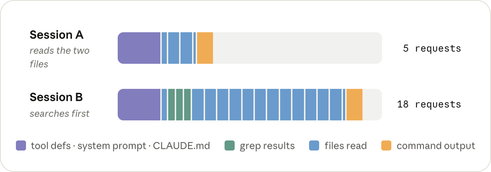

# Maximizing the value of your Claude Code sessions

# 📰 Maximizing the value of your Claude Code sessions

> How to run efficient sessions that get the most value from every token.

## TL;DR

* **Run `/clear`between tasks.** This prevents prior irrelevant context from being sent back to the model, which can reduce token usage.
* **Set your model and effort level before you start.** Changing either one mid-conversation can bust your prompt cache, which can increase token cost.
* **@-mention files instead of naming them.** The file gets attached to your message directly, which saves a Read call, or a search if Claude has to go find it.
* **Add quiet flags to noisy commands, or run them in a subagent.** Command output is added to the conversation just like a file, and stays there for the rest of the session.
* **Run** **`/context`** **once in a fresh session.** It shows what's loaded (`CLAUDE.md`, MCP tool definitions), so you can cut out anything unnecessary.
* **`/compact`** **before you take a break from your keyboard.** The prompt cache expires after an hour, and summarizing a conversation is much cheaper while it's still cached.

## Maximizing value

Until pretty recently, the tools you wrote code with were a flat fee (or free). Your editor cost the same whether you fixed one test or fifty that afternoon, so an individual task didn't really have a price of its own.

With agentic coding tools like Claude Code, it does. The same completed task can also cost different amounts depending on how you use it.

In one session, Claude reads the test and the file it covers, makes the edit, and is done in a handful of turns. In another, it greps around the repo first, reads a dozen files on its way to the same two, and every one of those turns also drags along everything else that's been read into the conversation since this morning.

It's the same fix, but you spent a different number of tokens on it, and the whole time the model was also having to think about ten files it didn't need.

Being efficient with tokens doesn't mean using fewer of them overall. It means making sure the ones you do use go towards the thing you actually asked for.

So let's look at what decides the price of a token, then what decides how many of them a session sends, and along the way, what that means for how you run a session.

## **What decides the price of a token**

You're billed per token, but what you're actually paying for is inference: the time it takes a GPU (or a TPU, or whatever the model happens to be running on) to run the model over your tokens.

Three things decide how much of that time a token takes: which model you're running, whether it's an input token (going in) or an output token (coming out), and whether it was cached.

### Model ###

A bigger model does more work on both input and output tokens. Which model is worth it for which kind of work is a topic on its own, and we covered it in [*Choosing a Claude model and effort level in Claude Code*](https://claude.com/blog/claude-model-and-effort-level-in-claude-code).

For this post, all you need to know is that everything else we're about to cover gets multiplied by the model's price: use a larger model when the problem is genuinely hard or ambiguous, and a smaller one when the work is routine.

*Curves are for illustration purposes only. They do not represent real benchmark data.*
