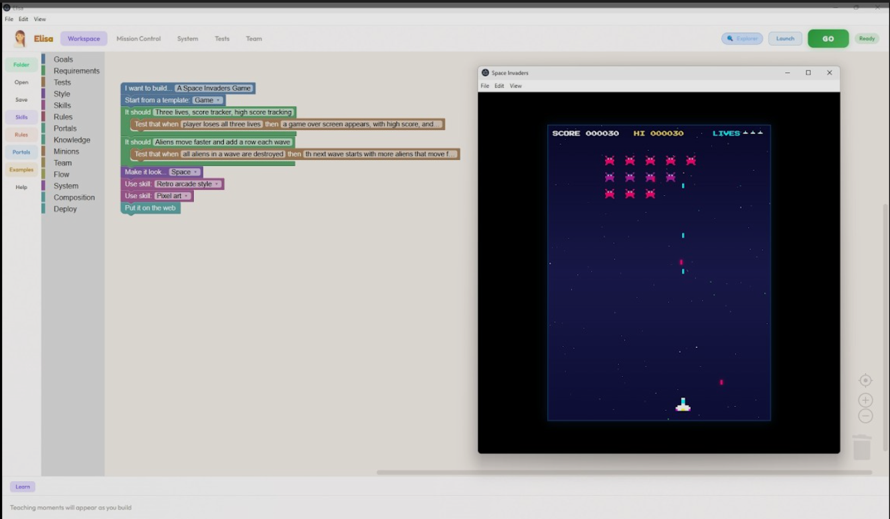
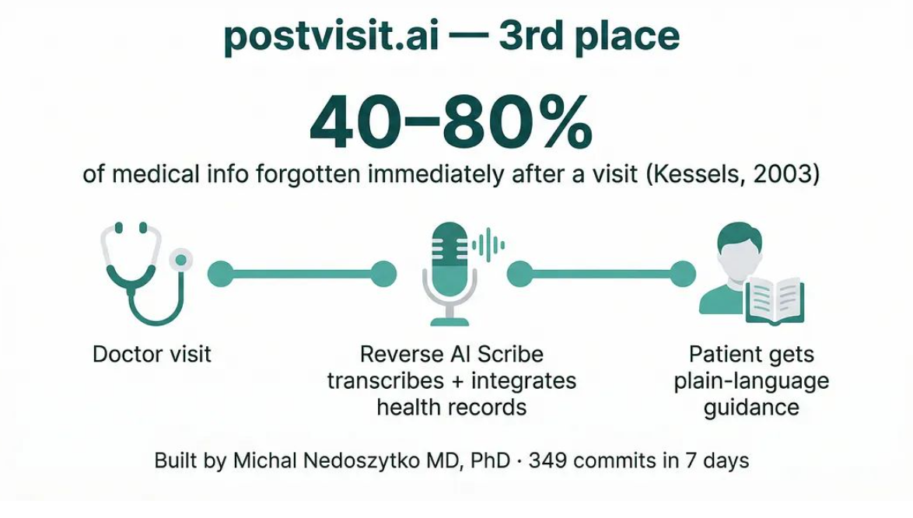
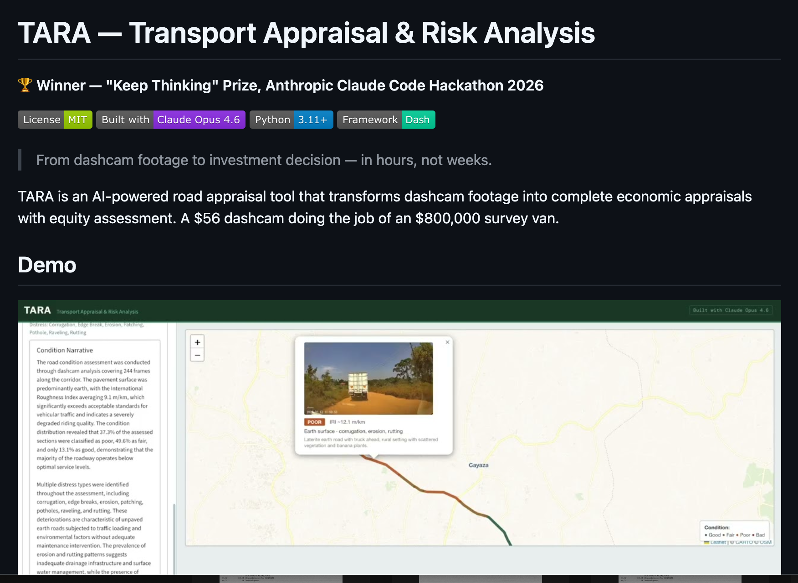
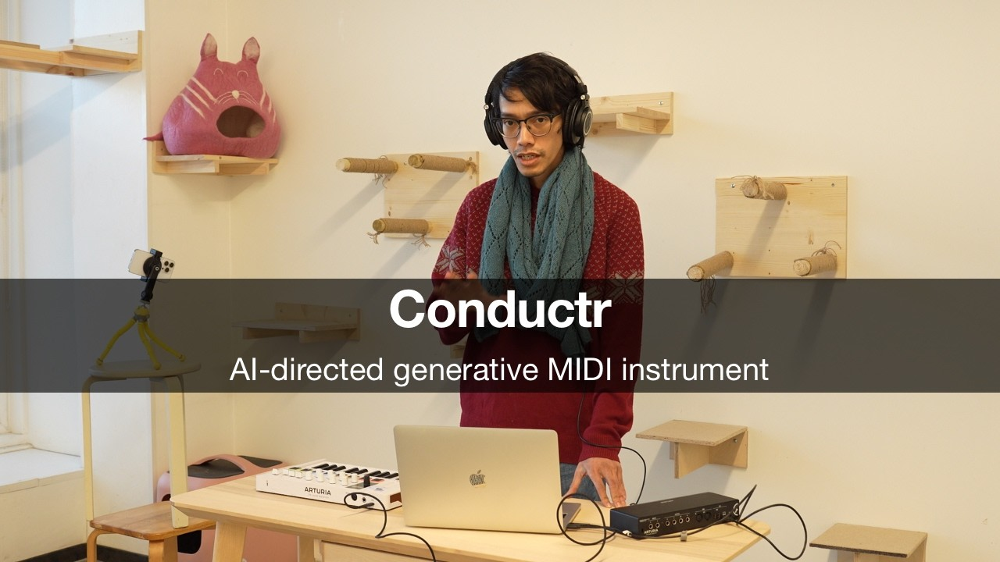

# Meet the winners of our Built with Opus 4.6 Claude Code hackathon

# 📰 Meet the winners of our Built with Opus 4.6 Claude Code hackathon

> From a cardiologist to an electronic musician, get to the know the winners of our Built with Opus 4.6 hackathon.

Last week, we announced [the *Built with Opus 4.7* virtual Claude Code hackathon](https://cerebralvalley.ai/e/built-with-4-7-hackathon), inviting the community to build with [our latest](https://www.anthropic.com/news/claude-opus-4-7) Opus model. As with our previous hackathon featuring Opus 4.6, we’re partnering with Cerebral Valley to select 500 participants and give each $500 API credits and one week to build with Claude Code. Judges from the Claude team will then pick six winners and award them from a total prize pool of $100,000 in Claude API credits for project development.

The winners of our Opus 4.6 hackathon, our first in this series, included a personal injury lawyer, a cardiologist, a roads and infrastructure specialist, an electronic musician, and one professional software engineer. They tackled projects to improve housing, healthcare, infrastructure, music, and education. And four out of five winners were not professional developers.

We hope their projects will inspire you to build something meaningful.

## First place: [CrossBeam](https://www.youtube.com/watch?v=jHwBkFSvyk0), Mike Brown

*Image courtesy of Mike Brown.*

California's housing permits have a 90%+ rejection rate on first submission, with an average six-month delay that costs homeowners $30,000. Most of the time the problem is bureaucratic: missing signatures, incorrect code citation numbers, incomplete forms.

“Everyone thinks California has a housing crisis. We don't. We have a permit crisis,” says Mike Brown, a personal injury lawyer. Getting the permits required to build a new dwelling can take longer than the construction itself. Mike’s hackathon project, [CrossBeam](https://github.com/mikeOnBreeze/cc-crossbeam), uses AI to help break California’s permitting bottleneck.

With CrossBeam, builders drag and drop their blueprints and correction letters into the tool; parallel sub-agents parse the documents, build a spatial index, and assign targeted agents to each discrete correction. Twenty minutes later, the builder has a precise action plan for approval. On the other side of the desk, CrossBeam lets municipalities batch-process submitted permits and generate draft correction letters automatically.

Buena Park, a city in Southern California which needs to permit more than 8,900 housing units by 2029 but permitted only about 120 in 2024, is looking at adopting Crossbeam to speed the permitting process not just for builders, but also the administrators who review the piles of paperwork.

“If we can solve for both sides of California's permit crisis,” Mike says, “we might actually be able to solve California's housing crisis.”

Mike built CrossBeam using a workflow of prompting Claude Code and then having Claude create the tests. “It’s crazy to me that I ended up winning this contest, and I didn't write a single line of code,” he says. “I didn't even read a line of code.”

[*Check out CrossBeam on GitHub.*](https://github.com/mikeOnBreeze/cc-crossbeam)

## Second place: [Elisa](https://www.youtube.com/watch?v=rsUaz_QAK6o), Jon McBee

*Image courtesy of Jon McBee.*

When Jon McBee’s 12-year-old daughter needed to program microcontrollers for her seventh-grade science fair project, he wanted her to have access to the same tool he uses every day as a software engineer: Claude Code. But a terminal interface isn't designed for a middle schooler — so he built one that is.

Elisa is a block-based visual integrated development environment (IDE) where users can design software by snapping together primitives (goals, requirements, agents, skills, rules, portals, deployments) while AI writes the real code behind the scenes. Users write a spec in a visual language, a meta-planner decomposes it into a task graph, and agents handle the rest. A built-in teaching engine surfaces age-appropriate explanations of the programming concepts being used, turning every build into a lesson. Jon’s daughter used it to flash code onto a microcontroller for her project without writing a single line of code.

With Claude Code, Jon built Elisa in 30 hours, making 76 commits with more than 39,000 lines of code and more than 1,500 tests. "I know systems architecture. I know how to integrate hardware. I know how to define and test software," he says. "Claude Code helped me turn all that knowledge into a shippable product in only six days."

Educators have reached out about using Elisa in classrooms and Jon is working to fund that effort with the $30,000 in Claude API credits he received for second place. He believes software creators will soon stop writing source code entirely, working instead with well-defined tests and specifications. *Elisa* wraps that idea in a kid-friendly visual interface. "I named this project after my daughter," Jon says, "because she's exactly who it's for."

[*Check out Elisa on GitHub.*](https://github.com/zoidbergclawd/elisa)

## Third place: [PostVisit.ai](https://youtu.be/V29UCOii2jE), Michał Nedoszytko

*Image courtesy of Michał Nedoszytko.*

Michał Nedoszytko is a Brussels-based cardiologist who has spent 20 years building healthcare software alongside his medical practice. His previous project, Previsit.AI, is an AI patient intake system deployed in Belgium, Greece, and Poland. But the product he has really wanted to build for the past two years is its counterpart: what happens after the appointment. "I've done thousands of procedures in the cath lab," he says. "But the real struggle happens the moment you leave the room."

PostVisit is a suite of tools that explains diagnoses in plain language, analyzes visit notes and AI-scribe transcripts, and surfaces relevant clinical evidence from scientific resources and full health records with physician oversight. Patients get a clearer picture of their own care, and physicians get visibility into how their patients are doing between appointments. The assistant is built around privacy, security, and clinical best practices.

To build PostVisit, Michał took himself on a hackathon road trip, building while en route from Brussels to San Francisco. “On the road is where my best ideas come to life,” he says. One week and a few thousand miles later, he had the product he'd been imagining for years. "Medicine is based on evidence," he says. "And now, by combining health records, evidence, and visit data, the patient has complete control and understanding of what happens after the visit."

[*Learn more at postvisit.ai.*](http://postvisit.ai)

## "Keep Thinking" Prize: [TARA](https://www.youtube.com/watch?v=GFCrXehS1DE), Kyeyune Kazibwe

*Image courtesy of Kyeyune Kazibwe.*

Uganda has far more road infrastructure needs than budget to address them, and traditional feasibility studies don't help: they cost $1–4 million, take nine to 14 months, and focus on economic projections without accounting for the communities the roads are meant to serve. Kyeyune Kazibwe, who at the time worked at Uganda's Ministry of Works and Transport, built TARA to change how those decisions get made.

TARA turns dashcam road footage into a complete investment appraisal. The tool uses Opus 4.6's vision capabilities to analyze every frame and identify surface conditions, distress patterns, and roadside activity including pedestrians, cyclists, and market stalls. The system segments the road into condition sections, auto-populates intervention costs, and generates a full economic appraisal including NPV, cash flow projections, and sensitivity analysis. It also produces an equity score, assessing who actually benefits from the investment, factoring in nearby facilities and areas of high concern identified during the drive.

For the hackathon, Kyeyune uploaded actual dashcam footage from Kira - Matugga Road, currently under construction in Uganda. “One click generates a complete PDF report: condition assessment, economic analysis, equity findings, sensitivity interpretation, all in one document," he says. "This process used to take weeks. TARA does it in five hours."

[Check out *TARA on GitHub.*](https://github.com/Kye256/tara-transport-assessment)

## Special Prize — Creative Exploration: [Conductr](https://www.youtube.com/watch?v=X6CqJoyj0kI), Asep Bagja Priandana

*Image courtesy of Asep Bagja Priandana.*

Asep Bagja Priandana built Conductr to turn Claude into a live virtual bandmate. The browser-based MIDI instrument listens as you play chords on a controller, analyzes your performance, and generates four tracks—drums, bass, melody, and harmony—in real time. Type *"make it funky"* or *"build to a climax,"* and the arrangement changes mid-jam.

The technical challenge, he said, was keeping the music uninterrupted. A C engine compiled to WebAssembly generates notes every 15 milliseconds, so the AI's decisions reshape the arrangement without interrupting the flow. Latency is, as Asep puts it, "musically invisible."

Conductr runs on about 4,800 lines of JavaScript and WebAssembly: a lean build for an instrument that listens, thinks, and plays alongside you in real time.

[*Check out Conductr on GitHub.*](https://github.com/nanassound/conductr)

Stay tuned for updates on our winners from the Built with Opus 4.7 hackathon.

[***Learn***](http://claude.com/community) ***about our Claude Community programs, including meetups, hackathons, and more.***

‍
