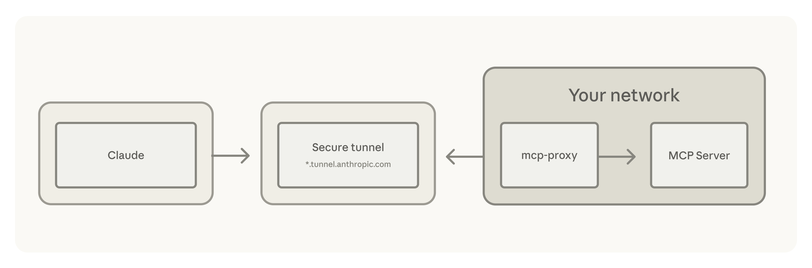

# New in Claude Managed Agents: self-hosted sandboxes and MCP tunnels

> Claude Managed Agents can now operate in a sandbox you control and connect to your private Model Context Protocol (MCP) servers

Starting today, [Claude Managed Agents](https://claude.com/blog/claude-managed-agents) can operate in a sandbox you control and connect to your private Model Context Protocol (MCP) servers. Both the sandbox where an agent executes tools and the services it reaches run within the established boundaries of your enterprise, under your security and runtime controls.

The sandbox runs on your own infrastructure, or with managed providers like [Cloudflare](https://developers.cloudflare.com/sandbox/claude-managed-agents/), [Daytona](https://www.daytona.io/docs/en/guides/claude/claude-managed-agents), [Modal](https://github.com/modal-labs/claude-managed-agents-modal-sandbox/tree/main), or [Vercel](https://vercel.com/kb/guide/run-claude-managed-agent-tools-with-vercel-sandbox) to handle the compute and isolation for you.

On the Claude Platform, [self-hosted sandboxes](https://platform.claude.com/docs/en/managed-agents/self-hosted-sandboxes) is available in public beta and MCP tunnels in research preview ([request access](https://claude.com/form/claude-managed-agents)).

## **Self-hosted sandboxes: keep agent execution within your perimeter**

A self-hosted sandbox lets a Claude Managed Agent execute tools on infrastructure you control or with a managed sandbox provider. Code execution, sensitive files, packages, services, and data stay within your enterprise perimeter, under your security and runtime controls.

With self-hosted sandboxes, you keep sensitive files, packages, and services in your own infrastructure or with a managed sandbox provider. The [agent loop](https://www.anthropic.com/engineering/managed-agents) that handles orchestration, context management, and error recovery stays on Anthropic’s infrastructure, while tool execution moves to your own configured environment.

Inside your perimeter, network policies, audit logging, and security tooling are already in place, and files and repositories don't leave. You also control the compute: resource sizing and the runtime image are set on your side, so agents running compute-heavy work such as long builds or image generation get the CPU, memory, and capacity the task needs.

## **Choose your sandbox client**

Bring any sandbox client you want, or start with one of our supported providers:

* [**Cloudflare**](https://developers.cloudflare.com/sandbox/claude-managed-agents/) runs sandboxes at scale using microVMs and lighter weight isolates. Outbound network requests are in your control with zero-trust secrets injection, customizable proxies to audit, reroute, or modify egress, and the ability to connect to internal services over Cloudflare's network. [**Amplitude**](https://amplitude.com/blog/design-agent) is building Design Agent, an internal tool for on-brand production UI and marketing design, on Managed Agents and Cloudflare for tighter observability and control.
* [**Daytona**](https://www.daytona.io/docs/en/guides/claude/claude-managed-agents) sandboxes are full composable computers, long-running and stateful. The same primitive runs a quick burst or an agent that works for hours. The sandbox stays accessible while a session runs over SSH or an authenticated preview URL, or can be paused and restored with full state preserved. [**Clay’s**](http://clay.com/) GTM engineering agent, Sculptor, builds, tests, and monitors workflows autonomously on Managed Agents and Daytona.
* [**Modal**](https://modal.com/blog/introducing-claude-managed-agents-with-modal-sandboxes) is a cloud platform built for AI workloads, where sandboxes share the same foundation as Modal's functions, storage, and networking primitives, giving you everything you need to build production AI systems. Modal's custom container runtime delivers sub-second startup on any image, scales to hundreds of thousands of concurrent sandboxes, and gives you CPU and GPU resources on demand.
* [**Vercel**](https://vercel.com/kb/guide/run-claude-managed-agent-tools-with-vercel-sandbox) sandboxes combine VM security, VPC peering, and bring your own cloud with millisecond startup time. Managed Agents handles the model, tools, and session state, while the Vercel Sandbox firewall injects credentials at the network boundary so they never enter the sandbox. [**Rogo**](https://rogo.ai/), an AI platform for institutional finance, is building an analyst agent on Managed Agents and Vercel Sandbox to handle their proprietary data securely.

## **MCP tunnels: Connect to services within your private network**

[MCP tunnels](http://platform.claude.com/docs/en/agents-and-tools/mcp-tunnels/overview) connect Claude Managed Agents to Model Context Protocol (MCP) servers inside your private network without exposing them to the public internet. Internal databases, private APIs, knowledge bases, and ticketing systems become tools your agents can call. A lightweight gateway you deploy makes a single outbound connection, no inbound firewall rules, no public endpoints, and traffic encrypted end to end.

MCP tunnels is supported in Managed Agents and the Messages API. MCP tunnels is managed from workspace settings within the [Claude Console](https://platform.claude.com/) by organization admins.

