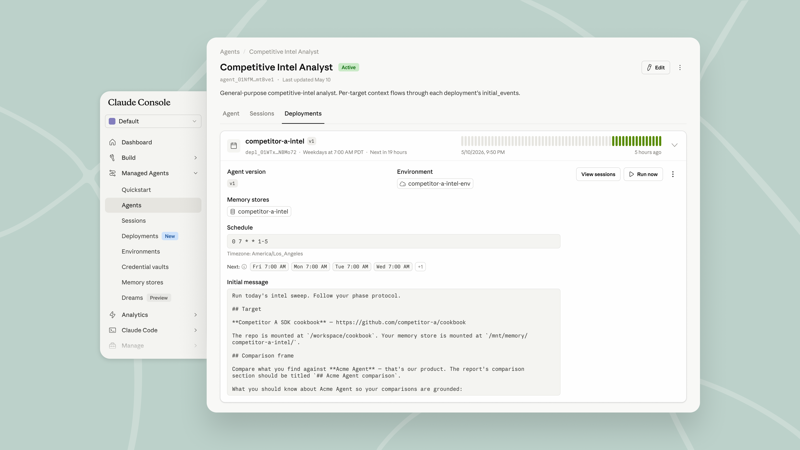
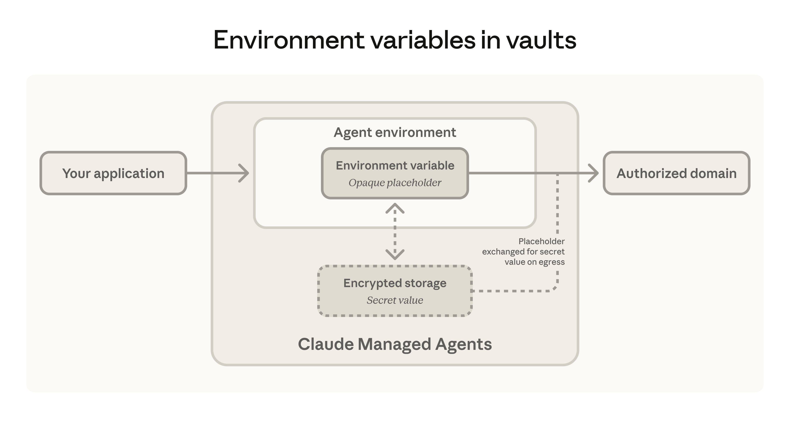

# New in Claude Managed Agents: run agents on a schedule and store environment variables in vaults

# 📰 New in Claude Managed Agents: run agents on a schedule and store environment variables in vaults

> Claude Managed Agents now supports scheduled deployments and vaults: run agents on a cron schedule and securely authenticate CLI tools and other services.

Starting today, [Claude Managed Agents](https://claude.com/blog/claude-managed-agents) can run on a schedule and securely access CLI tools and other authenticated services. Both features are now available in public beta on the Claude Platform.

## **Scheduled deployments: Run agents on a schedule**

Agents can now run on a schedule, completing routine work automatically. A [scheduled deployment](https://platform.claude.com/docs/en/managed-agents/scheduled-deployments) runs a Claude Managed Agent on a cron schedule. Each time the schedule fires, the agent starts a new session and completes its task, with no scheduler for you to build or host.

Use it for recurring work like a nightly data sync, a weekly compliance scan, or a daily digest. Once a deployment is live, you can pause, resume, or archive it at any time, or trigger additional runs on demand.

Teams are already using scheduled deployments to automate recurring work:

* [Rakuten](https://claude.com/customers/rakuten-qa) uses scheduled deployments to analyze spreadsheet data and produce reports and decks on a weekly or monthly schedule. Teams also monitor production logs and metrics, allowing product managers to see application health without creating a dashboard.
* [Actively AI](https://actively.ai/) uses Managed Agents to power cross-account agentic search for sales teams. Scheduled deployments refresh answers regularly, simplifying their stack by replacing scheduling infrastructure the team initially built themselves.[‍](https://ando.so)
* [Ando](https://ando.so) uses scheduled deployments to keep hiring and sales teams moving. Agents autonomously watch channels for proposed next steps, follow up when they're due, and send meeting reminders.

## **Vaults: store environment variables to authenticate CLIs and other tools**

[Vaults](https://platform.claude.com/docs/en/managed-agents/vaults) securely store environment variables and credentials for Claude Managed Agents. At runtime, agents access secrets like API keys as environment variables, so they can authenticate CLI tools and other services without hardcoding credentials into prompts or code.

Agents[connect to external systems](https://claude.com/blog/building-agents-that-reach-production-systems-with-mcp) through direct API calls, CLIs, and MCP. CLIs let agents drive existing command-line tools directly through a shell, making them a fast, lightweight integration path. Register an API key with an environment variable name and the domains it can reach, and the CLIs installed in an agent's sandbox can use it to make authenticated API calls.

The agent never sees your key because the sandbox only holds a placeholder. The real key is attached at the network boundary, and only on requests to domains you allow, so it only goes where you’ve approved. To change a key, update it in the vault, and running sessions will pick up the new value on their next call. Most CLIs that send their key in an HTTP request work this way, including the Browserbase, KERNEL, Notion, Ramp, and Sentry CLIs. [Browserbase](https://docs.browserbase.com/integrations/anthropic/managed-agents/quickstart) and [KERNEL](https://www.kernel.sh/docs/integrations/claude-managed-agents) give Managed Agents browser capabilities for the first time, so agents can navigate and interact with the web alongside their other tools.

Teams are using environment variables in vaults to give agents secure access to authenticated tools:

* [Notion](https://claude.com/customers/notion-qa) uses environment variables in vaults to roll out its CLI alongside MCP tools, adding file-upload capabilities to its agents without API tokens ever being handed to the model.
* [Browserbase](https://www.browserbase.com/) built its public catalog of browser skills using the [browse CLI](https://www.npmjs.com/package/browse), authenticated through vaults. A scheduled deployment periodically validates the catalog to keep it accurate.
* [KERNEL](https://www.kernel.sh/docs/integrations/claude-managed-agents) uses environment variables in vaults to securely connect agents to the databases where it tracks usage and customer conversations. The agent flags usage surges as they happen, so the team can confirm with customers if the activity is intended.[‍](https://getmilana.ai/)
* [Milana](https://getmilana.ai/) uses environment variables in vaults to securely connect its AI product engineer to a customer's codebase. The agent finds and fixes bugs automatically, with large-scale data analysis running faster than before.
