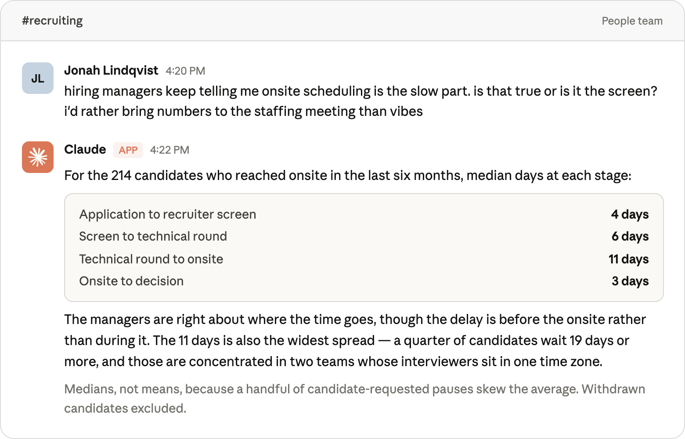

# Self-service data analytics in Slack: how Anthropic deploys Claude Tag for ad-hoc questions

# 📰 Self-service data analytics in Slack: how Anthropic deploys Claude Tag for ad-hoc questions

> How Anthropic's data team uses Claude Tag for self-service data analytics with the same governed definitions analysts use.

In our [previous post](https://claude.com/blog/how-anthropic-enables-self-service-data-analytics-with-claude), we described how we enabled Claude to answer data analytics questions with \~95% accuracy through three primary artifacts:

* A governed semantic layer;
* A set of skill files that encode our analytical conventions; and
* An evaluation suite to measure performance.

That post focused on [Claude Code](https://claude.com/product/claude-code) (the primary development surface for our data scientists and data engineers), and best practices for improving agentic accuracy.

This post discusses how the data team at Anthropic applies that foundation to where the rest of the company works using [Claude Tag](https://claude.com/product/tag) (public beta), which is the foundation for our data analytics agent in Slack. Anyone can ask it data-related questions and receive answers backed by **the same governed definitions analysts use**.

*Fictional recreation of a Claude Tag conversation for illustrative purposes. Details, names, and tools are not real.*

## Best practices for deploying a data analytics agent in Slack

Getting an agent to be *accurate* and getting it *deployed where non-analysts can use it* turned out to be quite different motions. We won’t rehash our recommendations on accuracy from our prior post as they’re still applicable here.

Rather, we’ll cover our five most important learnings over the past year for how to deploy a data analytics agent in Slack and how you should think about distribution, permissions, freshness, and observability.
