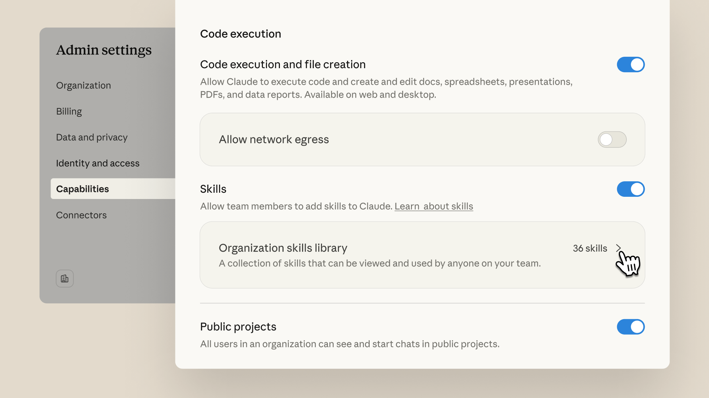

# Skills for organizations, partners, the ecosystem

# 📰 Skills for organizations, partners, the ecosystem

> In October, we introduced skills—a way to teach Claude repeatable workflows tailored to how you work. Today we're making skills easier to deploy, discover, and build: organization-wide management for admins; a directory of partner-built skills from Notion, Canva, Figma, Atlassian, and others; and an open standard so skills work across AI platforms.

In October, we introduced [skills](https://claude.com/blog/skills)—a way to teach Claude repeatable workflows tailored to how you work. Today we're making skills easier to deploy, discover, and build: organization-wide management for admins; a directory of partner-built skills from Notion, Canva, Figma, Atlassian, and others; and an open standard so skills work across AI platforms.

## **Manage skills across your organization**

Claude Team and Enterprise plan admins can now provision skills centrally from admin settings. Admin-provisioned skills are enabled by default for all users. Users can still toggle individual skills off if they choose. This gives organizations consistent, approved workflows across teams while letting individual users customize their experience.

## **Discover, create, and edit new skills**

Creating skills is now simpler. Describe what you want and Claude helps build it, or write instructions directly. For complex workflows, upload skill folders or use the skill-creator. Claude can also help you edit existing skills, and new previews show full contents so you can understand exactly what a skill does before enabling it.

## **Skills directory**

A growing collection of partner-built skills is now available at [claude.com/connectors](https://claude.com/connectors).

Admins can provision these partner skills across their organization, giving teams immediate access to workflows for tools they already use without any custom development.
