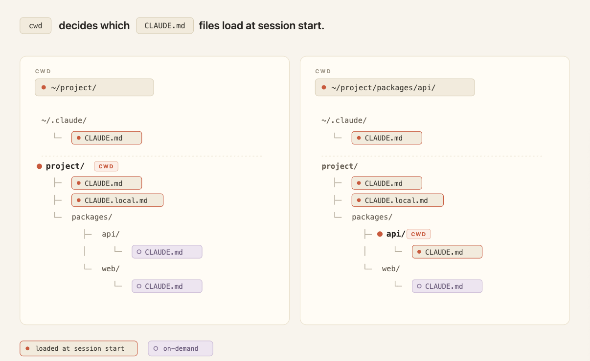

# Steering Claude Code: when to use CLAUDE.md, skills, hooks, and subagents

# 📰 Steering Claude Code: when to use CLAUDE.md, skills, hooks, and subagents

> Seven ways to steer Claude Code—CLAUDE.md files, rules, skills, subagents, hooks, and more—and when to use each, based on context cost and authority.

Claude is built to work the way you work, and in Claude Code you can customize it.

There are seven methods for instructing Claude's behavior: CLAUDE.md files, rules, [**skills**](https://code.claude.com/docs/en/skills), [**subagents**](https://code.claude.com/docs/en/sub-agents), [**hooks**](https://code.claude.com/docs/en/hooks-guide), output styles, and appending the system prompt.

Each method controls:

* When an instruction loads into context;
* Whether it persists through long sessions (compaction behavior); and
* How much authority it carries.

The table below provides a quick summary of key differences across each method while the post provides additional detail and decision framework for determining where each of your Claude instructions belongs.

|          Method           |                                        When it's loaded                                         |                                   Compaction behavior                                    |                                         Context cost                                         |                                                                When to use                                                                |
|---------------------------|-------------------------------------------------------------------------------------------------|------------------------------------------------------------------------------------------|----------------------------------------------------------------------------------------------|-------------------------------------------------------------------------------------------------------------------------------------------|
|     CLAUDE.md (root)      |                     Session start; stays in context for the entire session                      |Memoized. Read once and cached for the session; cache cleared and re-read after compaction|                    High. Every line costs tokens whether relevant or not                     |                           Build commands, directory layout, monorepo structure, coding conventions, team norms                            |
| CLAUDE.md (subdirectory)  |                   On-demand, when Claude reads a file under that subdirectory                   |                      Lost until that subdirectory is touched again                       |         Low. Only consumes context when the relevant subdirectory is being worked on         |                                                  Conventions specific to a subdirectory                                                   |
|           Rules           |     Session start (user-level rules) or only when matching files are touched (path-scoped)      |                                Re-injected on compaction                                 |                             Medium. Always-on unless path-scoped                             |                         Specific constraints or conventions (e.g., all API handlers must validate input with Zod)                         |
|          Skills           |        Name and description at session start; full body loads when the skill is invoked         |          Invoked skills re-injected up to a shared budget; oldest dropped first          |Low. Full body loads only when invoked; subject to a shared token budget across invoked skills|                                            Procedural workflows (deploy or release checklists)                                            |
|         Subagents         |Name, description, and tool list at session start; body loads only when called via the Agent tool|        Only the final message (summary plus metadata) returns to the main session        |     Low. Zero cost in main context until called; runs in its own isolated context window     |Running work in parallel or side tasks that should run in isolation and return only a summary (deep search, log analysis, dependency audit)|
|           Hooks           |                                    Fire on lifecycle events                                     |                                Bypass compaction entirely                                |Low. Configuration lives outside main context; some output may return (e.g., blocking errors) |          Deterministic automation: run linters, post to Slack on completion, block commands, back up chat history on PreCompact           |
|       Output styles       |                         Session start; injected into the system prompt                          |                                     Never compacted                                      |             High. Occupies context window, but overwrites default system prompt              |                                      Significant role changes (code assistant to general assistant)                                       |
|Appending the system prompt|                               Session start; passed as a CLI flag                               |                     Never compacted; applies only to that invocation                     |                      Moderate. Cached after first request in a session                       |                                               Tone, response length, formatting preferences                                               |

## The seven methods for delivering instructions

There are seven ways to customize Claude Code's behavior: CLAUDE.md files for always-on project context, rules for hard constraints, skills for reusable procedures, subagents for delegated work, hooks for deterministic automation, and output styles or system-prompt appends for global changes.

Each method trades context cost against authority. These methods influence Claude's behavior while two separate dials, [which model and effort level you choose](https://claude.com/blog/claude-model-and-effort-level-in-claude-code), control how capable it is and how hard it works.

### CLAUDE.md files ###

CLAUDE.md is a markdown file at the root of your project. It loads into context at session start and stays there for the entire session.

Build commands, directory layout, monorepo structure, coding conventions, and team norms all fit naturally here.

There are two types, and they load differently:

* **Always loaded**: The first type is a root CLAUDE.md file, either in a shared repository and/or saved locally for your personal preferences specific to a project. All these files load at session start, and won’t get lost or degraded across long sessions. When Claude Code compacts the conversation, it re-reads these files.
* **On-demand:** CLAUDE.md files in subdirectories below the folder where you initialized the session. For example, `app/api/CLAUDE.md` loads when Claude reads a file under`app/api`, not at session start. It shares the compaction behavior of path-scoped rules: gone until that subdirectory is touched again.

*All subdirectory CLAUDE.md files below the cwd load when Claude reads a file within that directory.*

In a shared repository, CLAUDE.md grows the way any unowned config file does: every team appends its own instructions and nothing gets deleted. The cost compounds at scale.

Every line loads into every session for every engineer working in the repo, whether it's relevant to their task or not. This consumes tokens and dilutes adherence to the instructions that actually matter. As the file grows, push team-specific conventions into path-scoped rules and procedures into skills, where they load only when relevant.

**Tip:** Keep CLAUDE.md under 200 lines, give it an owner, and review changes to it like code. The content itself should follow the same rules as any prompt: [writing effective prompts](https://claude.com/blog/best-practices-for-prompt-engineering) means being explicit, explaining the why behind constraints, and showing examples.

Think of this file as giving Claude an overview of your codebase, or as an index pointing to other files where Claude can find more information as needed.

In monorepos, give each team's directory its own subdirectory CLAUDE.md so teams only load their own conventions, and developers can use the claudeMdExcludes setting to skip files from teams whose code they never touch.

For standards that must apply to every repository in the organization — security policies, compliance requirements — a centrally managed CLAUDE.md can be deployed to developer machines via MDM or config management, and it can't be excluded by individual settings.

More on setting up CLAUDE.md in our blog post, [CLAUDE.md files: Customizing Claude Code for your codebase](https://claude.com/blog/using-claude-md-files).
