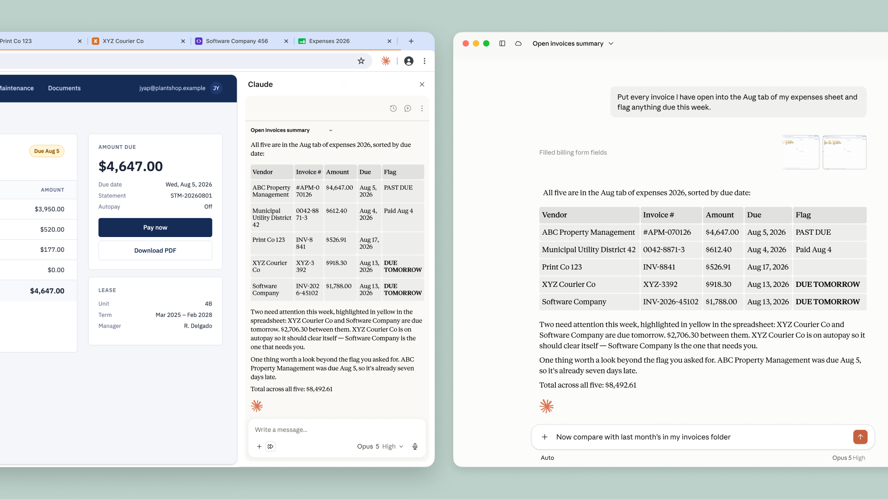

# The Claude in Chrome side panel is now Claude Cowork

# 📰 The Claude in Chrome side panel is now Claude Cowork

> Give Claude a task in your browser, work across tabs, and continue the conversation in the desktop, mobile, and web apps.

The [Claude in Chrome](https://claude.com/blog/claude-for-chrome) side panel is now a [Claude Cowork](https://claude.com/product/cowork) session. Conversations are saved to your history, your skills and connectors work in the browser, and a task you start in a tab can be finished on the Claude desktop, web, and mobile apps. It’s available on Max and Team plans today, and is rolling out to Pro users over the coming weeks.

Claude in Chrome is a browser extension that lets Claude see the page you're on and take actions in it, including clicking links, typing text, navigating between pages, and filling out forms, using your existing logins.

Many of the tools you use every day [connect directly to Claude](http://claude.com/connectors), but others don't, such as internal dashboards, legacy systems, and vendor portals. With Claude in Chrome, Claude can work in these apps through the browser.

Until now, a session in the side panel was separate from those in the Claude apps, so context and conversations didn't carry between them. Now, the side panel runs the same Claude Cowork session you use on desktop, web, and mobile for longer, multi-step work. Because sessions live with your account rather than a single device, you can start work in a browser and pick it up later somewhere else.

As an example, say you're putting together a budget spreadsheet and need to pull in invoices from several vendor portals. Now, you can ask Claude in Chrome to collect the amounts and dates, and it will open the tabs, read each invoice, and build the spreadsheet. Then, you can pick the session up in the desktop app to add files from your computer, or import last month's budget and ask what's changed, allowing you to maintain context across surfaces as you work.

## Understanding the risks

Claude in Chrome carries the same risks as any AI agent that acts in a browser, chiefly [prompt injection](https://www.anthropic.com/research/prompt-injection-defenses). Malicious actors hide instructions in web content, such as a web page, an email, or a document. These instructions may not be visible to you, but they can redirect Claude to take actions you never intended.

[Since the pilot](https://claude.com/blog/claude-for-chrome), we’ve added a check on Claude’s own actions. Use “automatically approve” and Claude works through a task without stopping for permission at every step. Before anything consequential, like submitting a form, sending a message, or downloading a file, a separate check reviews the action against what you originally asked for and blocks anything that doesn’t match. That creates fewer interruptions while maintaining oversight.

Claude still asks before certain irreversible or costly actions, like making a purchase or sharing personal data. While these measures meaningfully reduce the risk, they cannot eliminate it. Prompt injection is a moving target, so we keep hunting for new attacks and building what we learn into each model we release. We recommend starting on sites you trust, and our [safety guide](https://support.claude.com/en/articles/12902428-use-claude-in-chrome-safely) has more best practices.

## Getting started

To start using Claude in Chrome, install it from the[Chrome Web Store](https://chromewebstore.google.com/detail/claude/fcoeoabgfenejglbffodgkkbkcdhcgfn), sign in, and open the side panel. The new side panel is available on Max and Team plans today, and is rolling out to Pro users over the coming weeks. On Enterprise plans, Claude in Chrome is off by default. Admins can turn it on and limit it to approved domains. See the [admin setup guide](https://support.claude.com/en/articles/13065128-claude-in-chrome-admin-controls#h_bdb63199e1).

You’ll still need to use the Claude desktop app to work with files on your computer or with other applications. Claude in Chrome doesn’t run on other Chromium browsers or on mobile yet.
