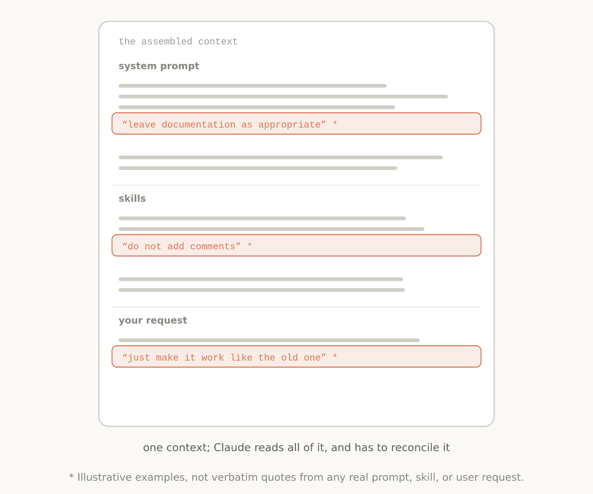

# The new rules of context engineering for Claude 5 generation models

# 📰 The new rules of context engineering for Claude 5 generation models

> We removed over 80% of Claude Code's system prompt for more advanced models. How to apply the lessons we learned to your own context engineering in Claude Code and with your own agents.

I’ve written previously about how to best [prompt the newest generation of Claude 5 models](https://claude.com/blog/a-field-guide-to-claude-fable-finding-your-unknowns) and work with them iteratively to discover what you want to build.

But when you send a message to Claude, the prompt is only a small part of the context it gets. Much of your context is assembled from your system prompt, Skills, CLAUDE.md files, memory, and other sources. We call this [context engineering](https://www.anthropic.com/engineering/effective-context-engineering-for-ai-agents), and it makes a big impact on the results you generate when using Claude Code or in building your own agents.

Unlike a prompt, context is used generally across many requests, so it cannot be as specific. How do you build these general prompts and guidance for Claude, especially when you don’t know what a user’s prompt might be?

This can be surprisingly difficult as Claude’s own capabilities evolve. Most recently, we noticed a large jump in the way we prompt the newest generation of Claude models. We removed over 80% of Claude Code’s system prompt for models like Claude Opus 5 and Claude Fable 5 with no measurable loss on our coding evaluations.

Here’s what we’ve learned about prompting this new class of models, and how you can utilize it to update your context engineering. We’ve put these best practices in `claude doctor;` use the command /doctor in Claude Code to rightsize your skills, and CLAUDE.md files.

## Unhobbling Claude

Overall, we found that we were overconstraining Claude Code, both through our system prompt and in our CLAUDE.md files and skills.

For example, when we read transcripts of our own internal usage of Claude Code, we see several conflicting messages in a single request like “leave documentation as appropriate,” or “DO NOT add comments” as our system prompt, skills, and user requests clash with each other.

Generally, Claude can interpret the user’s intent to get to the right answer, but Claude must think more carefully about these overlapping and conflicting messages before deciding what to do.

And while these constraints were once needed to avoid worst case scenarios, we have since found we can delete many of them and let the model use surrounding context and judgement instead.

Additionally, Claude Code now has many more tools. Claude used to rely on CLAUDE.md as a source of memory, information, and guidance. Now we have memory, artifacts, and skills, which Claude can use to create new ways of loading and sharing context across sessions.
