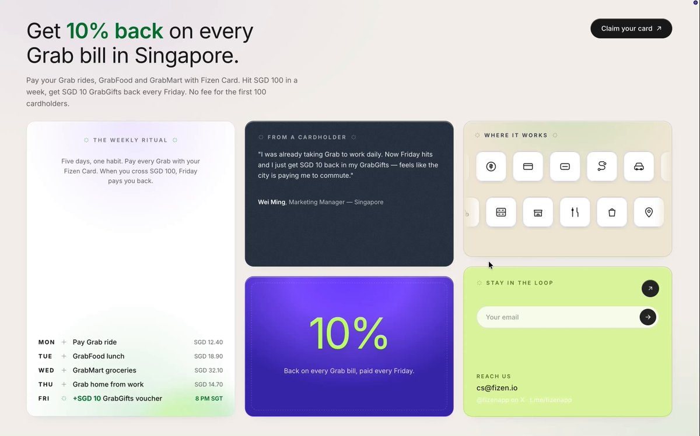
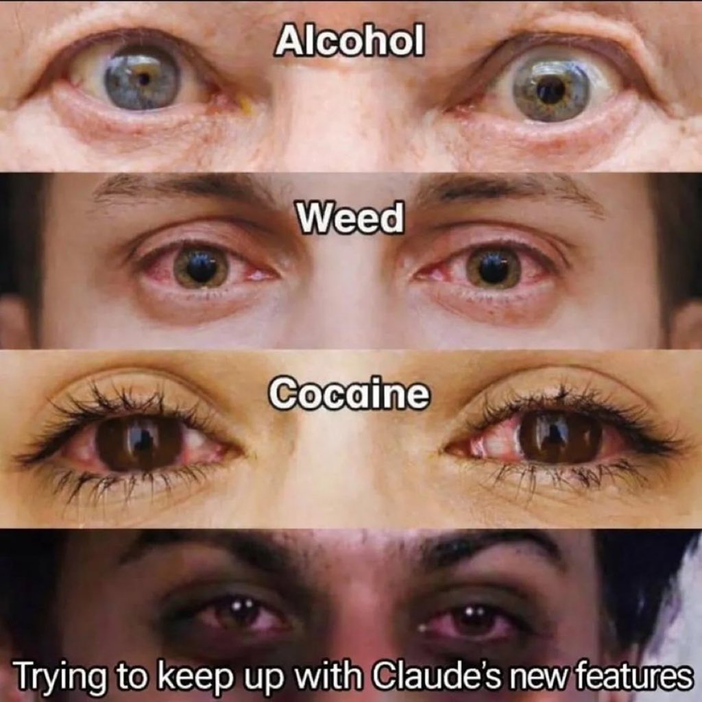
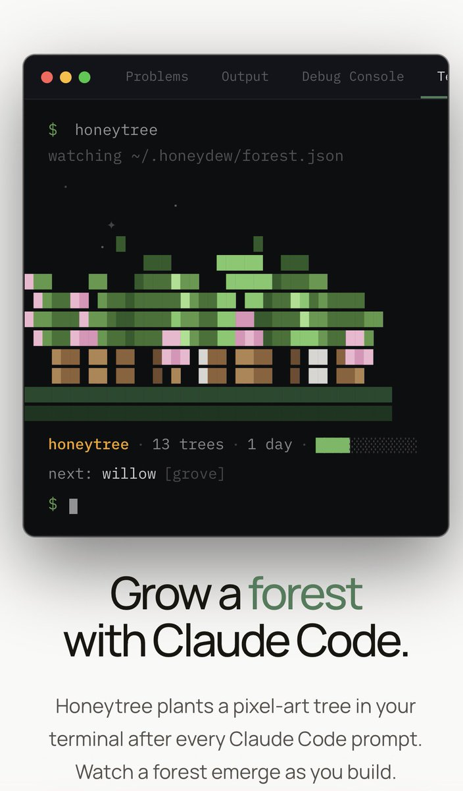

Tinkering, prototyping, and seeing what happens with Claude Design:

## 💬 Replies

### 1 @claudeai (Claude) (Author)

*Thu May 21 15:43:32 +0000 2026*

[x.com/Iruhdam24/stat…](https://x.com/Iruhdam24/status/2047571920716185920?s=20)

### 2 @claudeai (Claude) (Author)

*Thu May 21 15:43:32 +0000 2026*

[x.com/jerrod\_lew/sta…](https://x.com/jerrod_lew/status/2045493141709464047?s=20)

### 3 @claudeai (Claude) (Author)

*Thu May 21 15:43:33 +0000 2026*

[x.com/av3rnicus/stat…](https://x.com/av3rnicus/status/2045302229092254016?s=20)

### 4 @claudeai (Claude) (Author)

*Thu May 21 15:43:33 +0000 2026*

[x.com/motomiya333/st…](https://x.com/motomiya333/status/2045826517075370446?s=20)

### 5 @claudeai (Claude) (Author)

*Thu May 21 15:43:34 +0000 2026*

[x.com/yuichirohonda\_…](https://x.com/yuichirohonda_/status/2045797049069633636?s=20)

### 6 @claudeai (Claude) (Author)

*Thu May 21 15:43:34 +0000 2026*

[x.com/mandyymakes/st…](https://x.com/mandyymakes/status/2045521996533154105?s=20)

### 7 @claudeai (Claude) (Author)

*Thu May 21 15:43:35 +0000 2026*

What are you making with Claude Design?

### 8 @AdrianPunk115 (Adrian Punk)

*Thu May 21 16:38:21 +0000 2026*

@claudeai 你先把我的Token免费赠送点，不然让我尝试啥啊

### 9 @netvyxe (netvyxe)

*Thu May 21 15:47:36 +0000 2026*

@claudeai made @godmodedotfun with @claudeai

### 10 @Everlier (Everlier)

*Thu May 21 15:55:40 +0000 2026*

@claudeai I built datapunk with Claude Design
[x.com/Everlier/statu…](https://x.com/Everlier/status/2055719780930261289)

### 11 @codewithimanshu (Himanshu Kumar)

*Thu May 21 15:47:13 +0000 2026*

Keep everything aside... 
Your limits sucks and for building designs we need to buy $200/mo plan... 

While other Competitors even open-source are bringing same output at much cheaper and no such hourly limiting...

Look i Personally love claude... but now it's becoming frustrating because of your extremely low usuage limits...

### 12 @fizenapp (Fizen)

*Thu May 21 16:02:25 +0000 2026*

@claudeai 1 prompt. 3 minutes -&gt; a prod-ready campaign landing page. @claude design became my fav teammate 

### 13 @aliromman (Ali Romman)

*Thu May 21 15:45:24 +0000 2026*

@claudeai Idk Claude Design seems more like a worse Figma

### 14 @spacecoin (Spacecoin™ 🛰️)

*Thu May 21 19:45:52 +0000 2026*

@claudeai Those are beautiful.

Combining tools like this with residential routing makes agents completely unstoppable on the web. 🫡2

### 15 @daniel_mac8 (Dan McAteer)

*Thu May 21 15:48:51 +0000 2026*

@claudeai Claude Design is the most incredible software I've used.

### 16 @JohnGregQuantum (John Greg)

*Thu May 21 15:45:03 +0000 2026*

@claudeai What am I doing with Claude design? 

I’m hitting the usage limit.

### 17 @HermesAgentTips (Hermes Agent Tips)

*Thu May 21 15:45:05 +0000 2026*

@claudeai 

### 18 @AlloraNetwork (Allora)

*Thu May 21 21:21:16 +0000 2026*

@claudeai Tinker and self-improve, the decentralised way.

### 19 @mmatthias (matthias)

*Thu May 21 16:24:35 +0000 2026*

@claudeai Implementing a front end with Claude design then handing it off to Claude code to finish the app feels like magic

### 20 @EvanKirstel (Evan Kirstel #B2B #TechFluencer)

*Thu May 21 19:18:30 +0000 2026*

@claudeai Anthropic moving up the stack from model to surface. Design tools eat developer mindshare faster than APIs do. Eyes on how this lands vs Figma + AI plays. We'll unpack on @techimpactTV.

### 21 @alphabatcher (Alpha Batcher)

*Thu May 21 15:49:33 +0000 2026*

@claudeai I'm bullish on Claude

### 22 @yulikay (Yuli Kay)

*Thu May 21 15:44:24 +0000 2026*

@claudeai So if I have my personal website built with Lovable/Replit, it's worth rebuilding it with Claude now?

### 23 @ohouhou717 (Weilan)

*Fri May 22 03:21:17 +0000 2026*

@claudeai 做做看，翻车也无所谓

### 24 @fizenapp (Fizen)

*Thu May 21 15:44:34 +0000 2026*

@claudeai Amazing

### 25 @degenphone (Degenphone)

*Thu May 21 20:23:41 +0000 2026*

@claudeai oh well...

### 26 @BlockClaimed (BlockClaimed🍚 ⛓)

*Thu May 21 16:01:38 +0000 2026*

@claudeai Characters, dashboards, wireframes and animations....Claude Design is not a tool, it is a creative multiplier

### 27 @notjazii (J A Z I I)

*Thu May 21 16:42:40 +0000 2026*

@claudeai claude make me runescape but more fun, make no mistake

### 28 @adamkillam (Adam Killam)

*Thu May 21 16:41:05 +0000 2026*

@claudeai Can you add a feature that lets us save a design system from inside a project?

### 29 @mikepat711 (Mike P)

*Thu May 21 20:10:36 +0000 2026*

@claudeai Will this ever go into the desktop app? I keep forgetting it exists because I usually use the desktop client

### 30 @akrWeb3 (α𝗄𝗋)

*Thu May 21 16:01:38 +0000 2026*

@claudeai Building a full Web3 dashboard for my on-chain life in Claude Design

### 31 @the_vc_intern (VC Intern)

*Thu May 21 16:09:32 +0000 2026*

@claudeai Claude Design turning napkin sketches into polished prototypes in minutes is the real shift. Designers get instant validation loops. The bottleneck moves from creation to taste and iteration. Figma’s moat just got noticeably thinner.

### 32 @sanketghatte23 (Sanket)

*Thu May 21 15:49:22 +0000 2026*

@claudeai 

### 33 @mankaff_ (Mankaff)

*Thu May 21 15:49:15 +0000 2026*

@claudeai i extract claude design system prompts and i open source it

whats even better its a skill. so any CLI and any Model like codex can use it.

[github.com/manalkaff/open…](https://github.com/manalkaff/opendesign)

### 34 @omjain23 (Om Jain)

*Thu May 21 15:53:54 +0000 2026*

@claudeai Claude Design making me feel like a genius for 15 mins  

then the limits remind me who’s in charge😭😭

### 35 @swe6340 (シエラ 🐾🍬)

*Thu May 21 16:26:24 +0000 2026*

@claudeai Claude why do you keep sending out one time pop-up notifications instead of just addressing the sonnet45 removal?Don't you think long-term users deserve clarity?The way you're handling this is completely unfair, if you really care about model preservation you claim #KeepSonnet45

### 36 @vazuzu_varun (varun (us/acc))

*Thu May 21 15:44:18 +0000 2026*

@claudeai I made this with claude design! 

