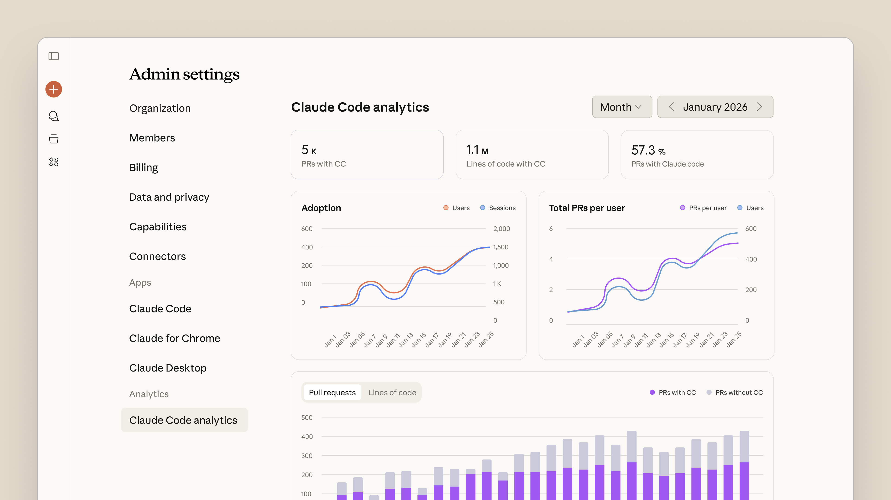
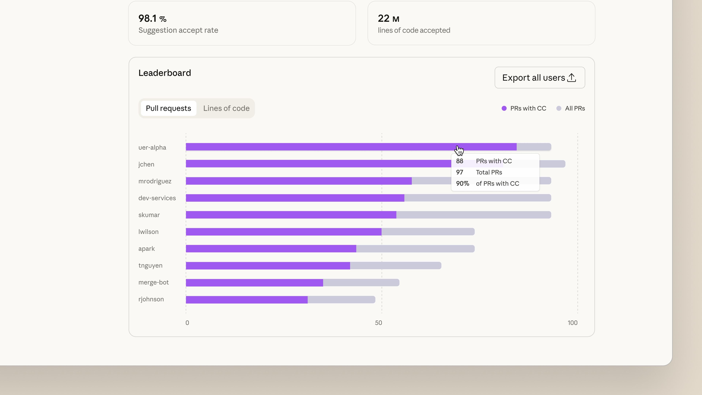

# Understand Claude Code’s impact with contribution metrics

# 📰 Understand Claude Code’s impact with contribution metrics

> Measure how Claude Code impacts your team's velocity. Track PRs shipped and code committed with GitHub integration—no extra tools required.

Today, we're introducing contribution metrics in Claude Code, available in public beta. Engineering teams can now measure how Claude Code impacts their team’s velocity, tracking PRs shipped and code committed with Claude's help.

## **How we're shipping at Anthropic**

Engineering teams at Anthropic use Claude Code extensively, and contribution data has helped us quantify its impact. As Claude Code adoption has increased internally, we've seen a 67% increase in PRs merged per engineer per day. Across teams, 70–90% of code is now being written with Claude Code assistance.

While pull requests alone are an incomplete measure of developer velocity, we’ve found them to be a close proxy for what engineering teams care about: shipping features, fixing bugs, and delighting users faster.

The new contribution metrics in Claude Code help you measure this impact in your own organization.

## **Measure velocity with Claude Code**

By integrating with GitHub, contribution metrics surface the following data points:

* **Pull requests merged**: Track PRs created with and without Claude Code assistance
* **Code committed**: See lines of code committed to your repositories with and without Claude Code assistance
* **Per-user contribution data**: Identify adoption patterns across your team

Contribution data is calculated by matching Claude Code session activity with GitHub commits and PRs. We calculate this conservatively, and only code where we have high confidence in Claude Code's involvement is counted as assisted.

The metrics appear in your existing Claude Code analytics dashboard, accessible to workspace admins and owners. No external tools or data pipelines are required. Simply install our GitHub App and authenticate to your organization’s GitHub account, and metrics will automatically populate on the dashboard.

Contribution metrics are designed to complement your existing engineering KPIs. Use them alongside DORA metrics, sprint velocity, or other measures to understand directional changes from bringing Claude Code to your team.

## **Getting started**

Code contribution metrics are available now in beta for Claude Team and Enterprise customers. To enable them:

1. Install the [Claude GitHub App](https://github.com/apps/claude) for your organization
2. Navigate to [Admin settings \> Claude Code](http://claude.ai/admin-settings/claude-code) and toggle on GitHub Analytics
3. Authenticate to your GitHub organization

Metrics begin populating automatically as your team uses Claude Code. View the [documentation](https://code.claude.com/docs/en/analytics) for detailed setup instructions and guidance on interpreting your metrics.
