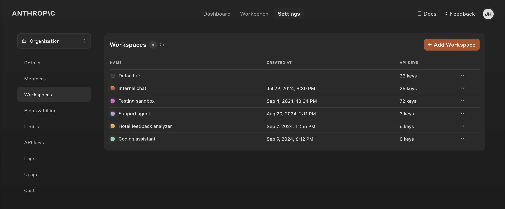

# Workspaces in the Anthropic API Console

# 📰 Workspaces in the Anthropic API Console

> Workspaces make it easier for developers to manage multiple Claude deployments at once.

We're introducing Workspaces in the Anthropic API Console to help developers efficiently manage multiple Claude deployments. Workspaces are unique environments that enable you to organize resources, streamline access controls, and set custom spend and rate limits on a more granular level.

## Managing multiple deployments

For developers using Claude across different environments—like development, staging, and production—and different use cases, Workspaces provide an abstraction layer for your overall organization and individual API keys.

**With Workspaces, you can:**

* **Set granular spend limits**: Implement monthly spend limits on a per-workspace basis, giving you fine-grained control over your API usage costs.
* **Group related resources**: Organize API keys, usage data, and settings into logical groups that align with your projects or environments.
* **Manage rate limits**: Adjust rate limits for each workspace independently, while staying within the overall organization rate limits, to better manage the load across various deployments.
* **Streamline access control**: Improve account security by assigning user permissions at the workspace level.
* **Monitor usage efficiently**: Gain insights into API usage and costs broken down by workspace, making it easier to track and optimize your resource allocation.

## Getting started

Workspaces are now available to all Anthropic API users in our Console. To get started, you can create a Workspace with a workspace-scoped API key [here](https://console.anthropic.com/settings/workspaces). To learn more, explore our detailed guides in our [Help Center](https://support.anthropic.com/en/articles/9796807-creating-and-managing-workspaces).
