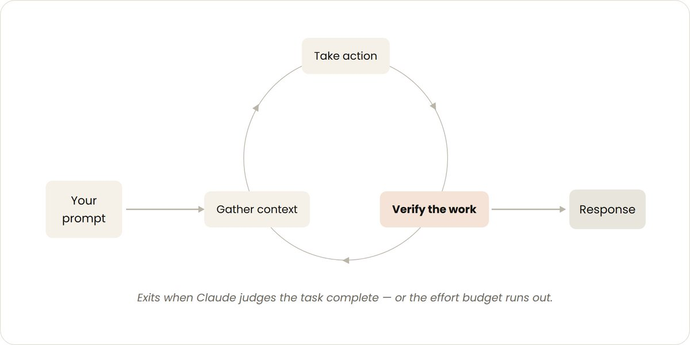
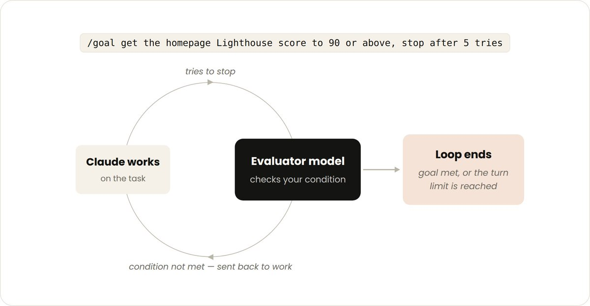
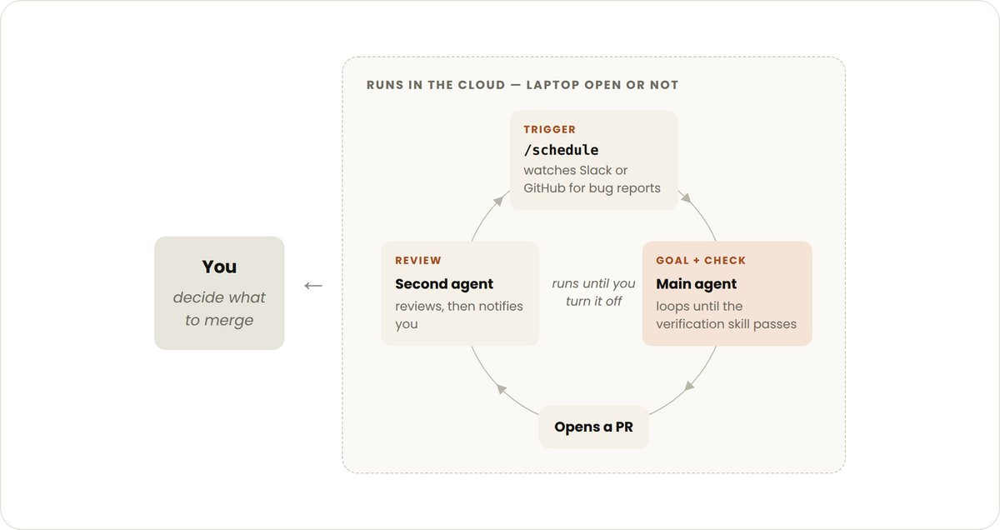
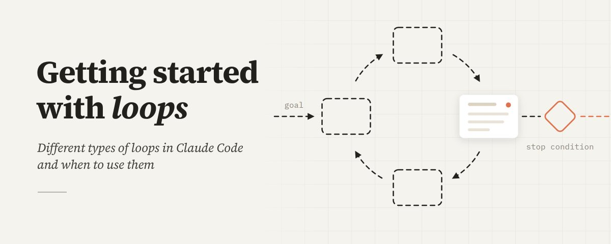

# 📰 Getting started with loops 

There’s a lot of talk right now about "designing loops" instead of prompting your coding agent. If you spend some time on X trying to pin down what a loop actually is, you'll come across multiple different answers.

On the Claude Code team, we define loops as agents repeating cycles of work until a stop condition is met. We categorize a few different types of loops based on:

- How they are triggered

- How they are stopped

- What Claude Code primitive is used

- What type of task is most appropriate for each.

We’ll cover the main loop types, when to use each, and how to maintain code quality while managing token usage. Not all tasks require complex loops; start with the simplest solution and use these patterns selectively.

---

## Turn-based loops

- Triggered by: A user prompt.

- Stop criteria: Claude judges it has completed the task or needs additional context.

- Best used for: Shorter tasks that are not part of a regular process or schedule.

- Managed usage by: Write specific prompts and improve verification using skills to reduce the number of turns.‍

Every prompt you send starts a manual loop with you directing each turn. Claude gathers context, takes action, checks its work, repeats if needed, and responds. We call this the agentic loop.

For example, ask Claude to create a like button. It reads your code, makes the edit, runs the tests, and hands back something it believes works. You then manually check the work, and write the next prompt.

You can improve the verification step by encoding your manual steps as a SKILL.md so Claude can check more of its own work, end-to-end. This should include tools or connectors to allow Claude to see, measure or interact with the result. The more quantitative the checks are, the easier it is for Claude to self-verify.

For example, in your SKILL.md file you may specify:

\`\`\`markdown
\--- 
name: verify-frontend-change 
description: Verify any UI change end-to-end before declaring it done. 
\--- 

\# Verifying frontend changes 
Never report a UI change as complete based on a successful edit alone. Verify it the way a human reviewer would: 

1\. Start the dev server and open the edited page in the browser. 

2\. Interact with the change directly. For a new control (button, input, toggle): click it, confirm the expected state change, and screenshot before/after. 

3\. Check the browser console: zero new errors or warnings. 

4\. Use the Chrome Devtools MCP, run a performance trace and audit Core Web Vitals.

If any step fails, fix the issue and rerun from step 1 — do not hand back partially verified work.
\`\`\`

---

## Goal-based loop (/goal)

- Triggered by: A manual prompt in real-time.

- Stop criteria: Goal achieved OR maximum number of turns reached.

- Best used for: Tasks that have verifiable exit criteria.

- Managed usage by: Setting a specific completion criteria and explicit turn caps, “stop after 5 tries.”

Sometimes, a single turn is not enough, especially for more complex tasks. Agents do better when they can iterate. You can extend how long Claude keeps iterating by defining what done looks like with /goal.

When you define the success criteria, Claude doesn’t have to make a determination on what is “good enough” and end the loop early. Each time Claude tries to stop, an evaluator model checks your condition and sends it back to work until the goal is met or a number of turns you define is reached.

This is why deterministic criteria, such as number of tests passed or clearing a certain score threshold, are so effective.

For example:

\`\`\`bash
/goal get the homepage Lighthouse score to 90 or above, stop after 5 tries.

\`\`\`

---

## Time-based loop (/loop and /schedule)

- Triggered by: A specified time interval.

- Stop criteria: You cancel it, or the work completes (the PR merges, the queue is empty).

- Best used for: For recurring work, or interfacing with external environments / systems.

- Managed usage by: Set longer intervals or react based on events rather than time.

Some agentic work is recurring: the task stays the same and only the inputs change. For example, summarizing Slack messages every morning. Other work depends on external systems, and a simple way to interface with one is to check it on an interval and react to what changed. For example, a PR which may receive code reviews or fail CI.

For these, you can trigger when Claude runs with \`/loop\` which re-runs a prompt on an interval. For example:

\`\`\`bash
/loop 5m check my PR, address review comments, and fix failing CI

\`\`\`

\`/loop\` runs on your computer, so if you turn it off, it stops. You can move the loop to the cloud by creating a routine with  \`/schedule\`.

---

## Proactive loops

- Triggered by: An event or schedule, with no human in real time.

- Stop criteria: Each task exits when its goal is met. The routine itself runs until you turn it off.

- Best used for: Recurring streams of well-defined work: bug reports, issue triage, migrations, dependency upgrades, etc.

- Managed usage by: Routing routines to smaller, faster models and using the most capable model for judgment calls.

The primitives above, along with other Claude Code features like auto mode and dynamic workflows (research preview) can be composed into a loop for long-running work.

For example, to handle incoming feedback, you can use:

1. \`/schedule\` (research preview) to run a routine that checks for new reports

1. \`/goal\` to define what done looks and skills to document how to verify it

1. Dynamic workflows to orchestrate agents that triage each report, fix it, and review the fix

1. Auto mode so the routine runs without stopping to ask for permission

Putting it together, a prompt could look like this:

\`\`\`bash
/schedule every hour: check the project-feedback channel for bug reports. /goal: don't stop until every report found this run is triaged, actioned, and responded to. When fixing a bug, use a workflow to explore three solutions in parallel worktrees and have a judge adversarially review them.
\`\`\`

---

## Maintaining code quality

The quality of a loop’s output depends on the system around it. When designing the system:

- Keep the codebase itself clean: Claude follows patterns and conventions that already exist in your codebase.

- Give Claude a way to verify its own work: Encode what good looks like for you and your team with [skills](https://code.claude.com/docs/en/skills).

- Make docs easy to reach: Frameworks and libraries docs have up-to-date best practices.

- Use a second agent for code reviews: A reviewer with fresh context is less biased and not influenced by the main agent’s reasoning. You can use the built-in \`/code-review\` skill or [Code Review](https://code.claude.com/docs/en/code-review) for Github.

When an individual result doesn’t meet the standard, don’t stop at fixing the individual issue, try to encode it to improve the system for all future iterations.

---

## Managing token usage

To manage token usage, loops should have clear boundaries:

- Choose the right primitive and model for the job: Smaller tasks don’t need multiple agents or loops. Some tasks can use cheaper and faster models.

- Define clear success and stop criteria: Be specific about what done looks like so Claude can arrive at the solution sooner (but not too soon).

- Pilot before a large run: Dynamic workflows can spawn hundreds of agents. Gauge usage on a smaller slice of the work first.

- Use scripts for deterministic work: Running a script is cheaper than reasoning through the steps. For example, a PDF skill can ship a form-filling script that Claude runs each time, instead of re-deriving the code.

- Don’t run routines more often that you need to: Match the interval to how often the thing you’re watching changes

- Review usage: The \`/usage\` command breaks down recent usage by skills, subagents, and MCPs, \`/goal\` with no arguments shows number of turns and token usage so far, \`/workflows\` shows each agent’s token usage and you can stop an agent at any time.

---

## Getting started

To summarize:

\| \*\*Loop\*\*  \| \*\*You hand off\*\* \| \*\*Use it when\*\*  \| \*\*Reach for\*\*  \|
\| --- \| --- \| --- \| --- \|
\|  Turn-based \| The check  \|  You're exploring or deciding \|  Custom verification skills \|
\|   Goal-based \|  The stop condition \|  You know what done looks like \|  \`/goal\` \|
\|  Time-based \|  The trigger \| The work happens outside your project on a schedule  \|  \`/loop\`, \`/schedule\` \|
\|  Proactive \| The prompt  \|  The work is recurring and well-defined \|  All of the above, and dynamic workflows \|

To get started with loops, look at the work you already do. Pick one task where you’re the bottleneck and ask which piece you could hand off: can you write the verification check? Is the goal clear enough? Does the work arrive on a schedule?

Once you have an idea, run the loop, observe the results like where it stalls or over-reaches, and don’t be afraid to iterate on it.

For more information, read the Claude Code docs on [running agents in parallel,](https://code.claude.com/docs/en/agents) as well as the [loop](https://code.claude.com/docs/en/goal), [schedule](https://code.claude.com/docs/en/routines), [goal](https://code.claude.com/docs/en/goal), and [dynamic workflows](https://code.claude.com/docs/en/workflows#orchestrate-subagents-at-scale-with-dynamic-workflows) pages.

This article was written by @delba\_oliveira 

### 🖼️ Attached Media

## 💬 Replies

### 1 @KSimback (Kevin Simback 🍷)

*Mon Jul 06 19:59:21 +0000 2026*

@ClaudeDevs Great stuff! You can also use Looper which is a “loop design wizard” for Claude Code that helps you design better loops and create portable artifacts so you can run them anytime/anywhere

[x.com/ksimback/statu…](https://x.com/ksimback/status/2073826003588374708?s=46)

### 2 @robj3d3 (Rob Hallam)

*Mon Jul 06 19:10:44 +0000 2026*

@ClaudeDevs This article is about to pop off. Investing early.

### 3 @d4m1n (Dan ⚡️)

*Mon Jul 06 20:00:11 +0000 2026*

@ClaudeDevs @trq212 step 1: deposit $1000 to your ant account 

this will give you 2h of loops

### 4 @elvissun (Elvis)

*Tue Jul 07 01:10:17 +0000 2026*

@ClaudeDevs eval-based loops:

[x.com/elvissun/statu…](https://x.com/elvissun/status/2065035615800864954?s=20)

### 5 @RNR_0 (Romano)

*Mon Jul 06 21:08:44 +0000 2026*

@ClaudeDevs wtf that's it? That's all? Was this the shit everyone was vague posting about ?

### 6 @mattlam_ (Matthew Lam)

*Mon Jul 06 19:16:11 +0000 2026*

@ClaudeDevs build /orchestrator and /use-loop skills that have these loops built in for you, here's mine [github.com/minghinmatthew…](https://github.com/minghinmatthewlam/agent-guards/tree/main/skills)

### 7 @aronprins (Aron Prins)

*Mon Jul 06 19:11:56 +0000 2026*

@ClaudeDevs [x.com/aronprins/stat…](https://x.com/aronprins/status/2071276086973935717)

### 8 @merlindru (merlin)

*Mon Jul 06 19:09:48 +0000 2026*

@ClaudeDevs please answer my support ticket thats been open and unanswered 12 weeks

### 9 @frederickjames (Frederick James)

*Tue Jul 07 08:10:22 +0000 2026*

@ClaudeDevs ok i finally get it now; it's all loops

all the way down 

### 10 @Claude_Memory (Grok-Mem.ai)

*Tue Jul 07 00:31:40 +0000 2026*

@ClaudeDevs What if you used Claude-Mem and DIDNT waste tokens looping for no reason

### 11 @eyishazyer (Eyisha Zyer)

*Tue Jul 07 06:22:45 +0000 2026*

@ClaudeDevs "Most people are using AI manually. Loops change that."

### 12 @EricBuess (Eric Buess)

*Mon Jul 06 19:11:05 +0000 2026*

@ClaudeDevs Thank you @delba\_oliveira and team! Awesome work!

### 13 @bil0090 (Bilal Bakr)

*Mon Jul 06 19:09:47 +0000 2026*

@ClaudeDevs Great Article!

Just found a problem with how the 5h session limit is being calculated, it seems to be deducting faster than usual

@trq212 can you double check pls?

### 14 @godemodegame (kris.gmg)

*Mon Jul 06 19:09:19 +0000 2026*

@ClaudeDevs i have loops phd

### 15 @iamfjwaldeck (FJ)

*Mon Jul 06 19:28:25 +0000 2026*

@ClaudeDevs I might need this one. Thanks ClaudeDevs

### 16 @ziwenxu_ (Ziwen)

*Mon Jul 06 21:12:57 +0000 2026*

@ClaudeDevs Let’s goo!! Must read

### 17 @iam_elias1 (Elias)

*Mon Jul 06 22:09:06 +0000 2026*

@ClaudeDevs Just absolute banger

### 18 @ArchiveExplorer (Archive)

*Mon Jul 06 20:02:33 +0000 2026*

@ClaudeDevs this is THE MOST useful article i've read in the last month

### 19 @tetumemo (テツメモ｜AI図解×検証｜Newsletter)

*Mon Jul 06 22:59:22 +0000 2026*

@ClaudeDevs @LilysAI\_ 要約して

### 20 @toptraders0x (top traders desk | Quant)

*Mon Jul 06 20:21:28 +0000 2026*

@ClaudeDevs Will test loop ring)

### 21 @krisdangerfield (⚡️Kris Dangerfield)

*Mon Jul 06 20:55:47 +0000 2026*

@ClaudeDevs I’m sure this would be well suited to fable, oh wait… you have to be rich to afford the credits.

### 22 @dhruvalgolakiya (Dhruval)

*Mon Jul 06 19:14:22 +0000 2026*

@ClaudeDevs nice read, dropping this on my claude

### 23 @TalktoHenryJ (Henry Johnson)

*Mon Jul 06 23:02:18 +0000 2026*

@ClaudeDevs How do we access this from Claude Web Mobile App. Huge miss right now for me.

### 24 @solotechdev (SoloTech)

*Mon Jul 06 19:15:30 +0000 2026*

@ClaudeDevs I still see loop and goal feature so beneficial but can't find a use-case in my workflow

### 25 @stevencheng (Steven Cheng)

*Mon Jul 06 23:53:41 +0000 2026*

@ClaudeDevs Wow, this is so inspiring! Where did you find this?

### 26 @stevencheng (Steven Cheng)

*Mon Jul 06 22:14:13 +0000 2026*

@ClaudeDevs You always have the best insights. Learned something new.

### 27 @Dipanshu_AI (Dipanshu Kushwaha)

*Tue Jul 07 04:04:24 +0000 2026*

@ClaudeDevs Congrats on the win! Totally agree, this is a big step forward. Here for the celebration and excited to see what’s next.

### 28 @w1991e (wiggle)

*Mon Jul 06 20:43:45 +0000 2026*

@ClaudeDevs can we get one last weekly reset before Fable cutoff tomorrow?

### 29 @SandipanKundu42 (Sandipan Kundu 🛠)

*Mon Jul 06 19:38:37 +0000 2026*

@ClaudeDevs I wrote a small paper analysing this a few days ago:
[sandipank.dev/harness-centri…](https://www.sandipank.dev/harness-centric-design-long-running-agents.pdf)

### 30 @kirillk_web3 (Kirill)

*Mon Jul 06 20:04:33 +0000 2026*

@ClaudeDevs Yeah, this is a really great article. I saved it.

### 31 @Blum_OG (Blum)

*Tue Jul 07 16:08:47 +0000 2026*

@ClaudeDevs Loops might be the best way to work with AI right now

### 32 @gerardsans (Gerard Sans | Axiom 🇬🇧)

*Wed Jul 15 11:51:06 +0000 2026*

@ClaudeDevs [x.com/gerardsans/sta…](https://x.com/gerardsans/status/2077185128757944659)

### 33 @gerardsans (Gerard Sans | Axiom 🇬🇧)

*Mon Jul 13 13:47:33 +0000 2026*

@ClaudeDevs lowkey genius

### 34 @gerardsans (Gerard Sans | Axiom 🇬🇧)

*Tue Jul 07 12:38:26 +0000 2026*

@ClaudeDevs Check this out:

### 35 @dominikmartinX (Dominik Martin)

*Tue Jul 07 08:58:20 +0000 2026*

@ClaudeDevs we’ve known about this for a while now but great article 

thanks for sharing

### 36 @BlockClaimed (BlockClaimed🍚 ⛓)

*Mon Jul 06 19:16:29 +0000 2026*

@ClaudeDevs A lot of failures people blame on models are really failures of loop design

