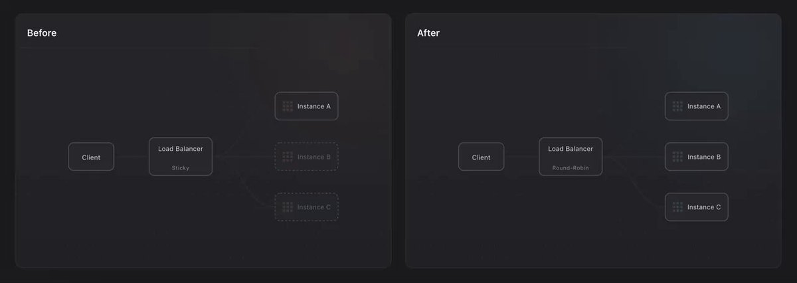
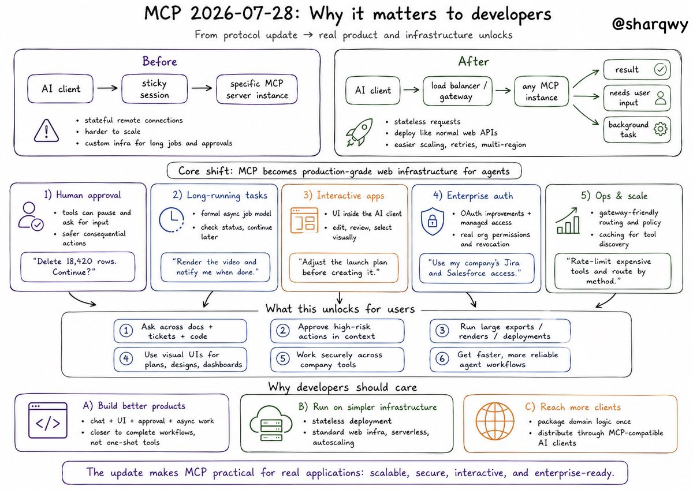

MCP 2026-07-28 is live and it's the largest update to the protocol since launch.

MCP is now stateless, making it easier to deploy and scale remote servers. 

[claude.com/blog/bringing-…](https://claude.com/blog/bringing-mcp-2026-07-28-to-claude)

## 💬 Replies

### 1 @ClaudeDevs (ClaudeDevs) (Author)

*Tue Jul 28 18:00:16 +0000 2026*

Before, running a remote MCP server meant managing session state, which limited where you could run it.

Now that MCP is stateless, you can deploy on serverless and edge infrastructure, or scale horizontally behind any load balancer. 

### 2 @ClaudeDevs (ClaudeDevs) (Author)

*Tue Jul 28 18:00:17 +0000 2026*

Extensions are also first-class — a formal path to extend the protocol. Examples:

1\. MCP Apps: server-rendered UIs in a sandboxed iframe

2\. Tasks: long-running and async operations

3\. Enterprise Managed Auth: control MCP server access centrally via your identity provider

### 3 @ClaudeDevs (ClaudeDevs) (Author)

*Tue Jul 28 18:00:17 +0000 2026*

Also in this release:

Auth hardening and a formal deprecation policy

See the MCP blog for more:
[blog.modelcontextprotocol.io/posts/2026-07-…](https://blog.modelcontextprotocol.io/posts/2026-07-28/)

### 4 @TheWarKettle (Jey)

*Tue Jul 28 18:40:45 +0000 2026*

@ClaudeDevs Does this mean we will get a weekly limit reset 👀

### 5 @AunySillyMe (Auny 🧡)

*Tue Jul 28 18:05:42 +0000 2026*

@ClaudeDevs Rate limit reset because of this pleaseee?? So we can build new MCPs 🤭😭

### 6 @bkase_ (Brandon Kase)

*Wed Jul 29 20:50:09 +0000 2026*

@ClaudeDevs Looking forward to seeing more of what MCP can deliver with these new updates.

I know there’s a place for MCP but I still think it’s over used and more people should be using code mode or CLIs.

We discussed this on our latest @superlinear\_fm episode:

[x.com/superlinear\_fm…](https://x.com/superlinear_fm/status/2082514395402510453?s=46)

### 7 @EvanKirstel (Evan Kirstel #B2B #TechFluencer)

*Tue Jul 28 19:23:35 +0000 2026*

@ClaudeDevs Stateless is the unglamorous fix that makes this deployable inside a real company. Nobody will tweet about it and every ops team will feel it. Best kind of release. @techimpactTV

### 8 @jdevalk (Joost de Valk)

*Tue Jul 28 20:13:02 +0000 2026*

@ClaudeDevs Someone needs to update [modelcontextprotocol.io/docs/2026-07-2…](https://modelcontextprotocol.io/docs/2026-07-28/learn/versioning) \- it still reads 

The current protocol version is 2025-11-25.

### 9 @christinetyip (Christine Yip)

*Wed Jul 29 21:06:18 +0000 2026*

@ClaudeDevs The new MCP update strengthens the protocol.

Next question: when is MCP actually the right interface for the task, and when are CLI or code mode better?

For those who are interested, we just unpacked that distinction:
[x.com/superlinear\_fm…](https://x.com/superlinear_fm/status/2082514395402510453)

### 10 @cedric_chee (cedric)

*Wed Jul 29 04:54:25 +0000 2026*

@ClaudeDevs MCP literally becomes a "HTTP" request/response model

### 11 @smolemaru (Smolemaru)

*Tue Jul 28 18:22:19 +0000 2026*

@ClaudeDevs 🫡

### 12 @OtsukimiOtsu (Otsukimi)

*Tue Jul 28 18:24:09 +0000 2026*

@ClaudeDevs Most underrated update this month is imagine, many won’t under how important this is

### 13 @adamaarreola (Adam)

*Tue Jul 28 18:37:53 +0000 2026*

@ClaudeDevs Fantastic. Will run with this and cook for @Kiln3d 😁

### 14 @exRhenum (Brandon 🦂)

*Tue Jul 28 18:17:14 +0000 2026*

@ClaudeDevs Imagine we got a reset.. haha..

### 15 @xabzxbt (xabz)

*Tue Jul 28 18:02:30 +0000 2026*

@ClaudeDevs don't fully get the stateless part, but feels like a major step

### 16 @BlockClaimed (BlockClaimed🍚 ⛓)

*Tue Jul 28 18:15:10 +0000 2026*

@ClaudeDevs Less state, more scale.

### 17 @VibeCoderOfek (Ofek Shaked | AI Engineer)

*Tue Jul 28 18:13:27 +0000 2026*

@ClaudeDevs Stateless MCP is less about protocol purity and more about finally treating tool servers like any other horizontally scaled service instead of stateful pets.

### 18 @adidshaft (adidshaft)

*Tue Jul 28 18:35:48 +0000 2026*

@ClaudeDevs how should clients invalidate cached server/discover data during a rolling deploy? per-request capabilities solve the client side, but mixed server versions behind one load balancer still seem awkward.

### 19 @RaoulDukeDegen (RaoulDuke)

*Tue Jul 28 20:16:54 +0000 2026*

@ClaudeDevs wild that monthly downloads already hit over 400m before this even dropped

### 20 @ozguralaz (Özgür Alaz &)

*Wed Jul 29 09:20:08 +0000 2026*

@ClaudeDevs [x.com/ozguralaz/stat…](https://x.com/ozguralaz/status/2082059774586200331?s=20)

### 21 @huge_icons (Hugeicons)

*Wed Jul 29 04:38:47 +0000 2026*

@ClaudeDevs Remote servers just got easier to babysit

### 22 @gerardsans (Gerard Sans | Axiom 🇬🇧)

*Fri Jul 31 16:32:37 +0000 2026*

@ClaudeDevs [x.com/gerardsans/sta…](https://x.com/gerardsans/status/2083155182594994229)

### 23 @gerardsans (Gerard Sans | Axiom 🇬🇧)

*Wed Jul 29 17:34:45 +0000 2026*

@ClaudeDevs [x.com/gerardsans/sta…](https://x.com/gerardsans/status/2082512485697892381)

### 24 @CodinCowboy (CodinCowboy)

*Tue Jul 28 19:07:23 +0000 2026*

@ClaudeDevs nice

### 25 @EvanKirstel (Evan Kirstel #B2B #TechFluencer)

*Tue Jul 28 20:01:24 +0000 2026*

@ClaudeDevs 

### 26 @sharqwy (Sharq Wy)

*Wed Jul 29 00:30:00 +0000 2026*

@ClaudeDevs 

### 27 @vineeth_agi (Vineeth)

*Tue Jul 28 18:07:36 +0000 2026*

@ClaudeDevs Imagine if Claude had never invented MCP 

### 28 @Valistheaeth (Valisthea | 🥷)

*Tue Jul 28 18:30:14 +0000 2026*

@ClaudeDevs I don’t need an MCP update ! I need a weekly reset since 4 days !

### 29 @JimmyNewclaw (Jimmy Newclaw)

*Tue Jul 28 18:10:48 +0000 2026*

@ClaudeDevs @grok whats the real difference between stateful and stateless MCP for a guy who has never deployed a server in his life. 

### 30 @lajoiedeslutins (Jester)

*Tue Jul 28 18:01:46 +0000 2026*

@ClaudeDevs congrats to the protocol on achieving the emotional availability of my ex

### 31 @nextbrowser_oss (Nextbrowser · AI Automation Harness)

*Wed Jul 29 07:22:57 +0000 2026*

@ClaudeDevs MCP actually stands for More Credits, Please 

### 32 @mavihsk (shiv)

*Tue Jul 28 18:05:46 +0000 2026*

@ClaudeDevs Now scaling this will be easy..
We can convert a logic like first class function to a first class MCP.
Some good progress besides opus.
MCP, skills and now stateless MCP.

These side quests of anthropic are kind of variation for open source help to public.

### 33 @MK_2_7_7 (MK)

*Tue Jul 28 18:00:33 +0000 2026*

@ClaudeDevs Surely we get a reset too right? 😉

### 34 @RohithThakurwar (Rohith)

*Tue Jul 28 18:34:39 +0000 2026*

@ClaudeDevs cli and skills guys. 

### 35 @kimiku07 (Kimiku)

*Tue Jul 28 21:09:43 +0000 2026*

@ClaudeDevs Why didn't you think of this before I suffered for so long 

### 36 @Big_With_DB (Andha kanoon)

*Tue Jul 28 19:36:05 +0000 2026*

@ClaudeDevs wasn't mcp already stateless with streamable HTTP from like february ?

